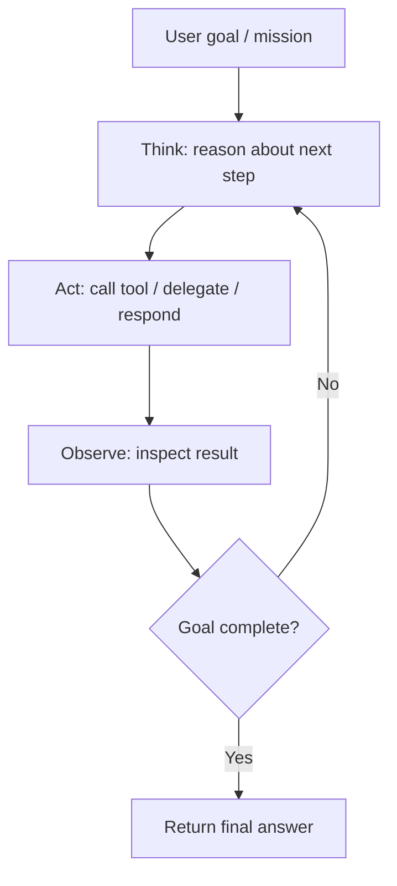

# Day 1 Documentation — Introduction to Agents

> A GitHub-ready study document for **Day 1** of Kaggle’s **5-Day AI Agents Intensive Course with Google**.

---

## Table of Contents

- [1. Day 1 Goal](#1-day-1-goal)
- [2. What Day 1 Includes](#2-what-day-1-includes)
- [3. What an AI Agent Actually Is](#3-what-an-ai-agent-actually-is)
- [4. The Core Architecture of an Agent](#4-the-core-architecture-of-an-agent)
- [5. The Agent Operational Loop](#5-the-agent-operational-loop)
- [6. Day 1a — From Prompt to Action](#6-day-1a--from-prompt-to-action)
- [7. Day 1b — Multi-Agent Systems & Workflow Patterns](#7-day-1b--multi-agent-systems--workflow-patterns)
- [8. The Day 1 Taxonomy of Agentic Systems](#8-the-day-1-taxonomy-of-agentic-systems)
- [9. Agent Ops, Evaluation, and Production Mindset](#9-agent-ops-evaluation-and-production-mindset)
- [10. Security and Governance Themes Introduced on Day 1](#10-security-and-governance-themes-introduced-on-day-1)
- [11. Key ADK Concepts Used on Day 1](#11-key-adk-concepts-used-on-day-1)
- [12. Pattern Selection Guide](#12-pattern-selection-guide)
- [13. Common Mistakes to Avoid](#13-common-mistakes-to-avoid)
- [14. Day 1 Revision Checklist](#14-day-1-revision-checklist)
- [15. Short Glossary](#15-short-glossary)
- [16. Suggested Resources Reviewed](#16-suggested-resources-reviewed)

---

## 1. Day 1 Goal

Day 1 is the **foundation day** of the course.

Its job is to move you from a plain “prompt in, answer out” mental model to a true **agentic system** mental model:

- an agent can **reason**
- an agent can **use tools**
- an agent can **decide the next step**
- an agent can **coordinate work**
- an agent can be designed as a **single agent** or a **team of agents**

By the end of Day 1, you should be able to explain:

1. how an **AI agent** differs from a normal LLM app  
2. why agents are built from **model + tools + orchestration**  
3. how to build a simple tool-using agent with **ADK**
4. how and when to use **multi-agent systems**
5. the difference between **LLM-managed orchestration** and **deterministic workflow orchestration**

---

## 2. What Day 1 Includes

Day 1 is built around three kinds of material:

### Concept resources
- the **Day 1 course guide**
- the **“Introduction to Agents” whitepaper**
- the **whitepaper companion podcast**

### Hands-on resources
- **Day 1a — From Prompt to Action**
- **Day 1b — Multi-Agent Systems & Workflow Patterns**

### Reference resources
- **ADK documentation**
- **Google Search tool docs**
- **ADK Web Interface docs**
- security and governance material relevant to agent design

A good study sequence is:

1. read/listen to the concept material  
2. run the notebooks yourself  
3. rewrite the ideas in your own words  
4. connect the code back to the architecture

---

## 3. What an AI Agent Actually Is

A central Day 1 idea is that an agent is **not** just “an LLM with a fancy prompt.”

A normal LLM application often behaves like this:

- user asks something
- model answers from its training and current prompt
- application returns output

That is useful, but limited.

An **AI agent** is a complete application that can:

- interpret a goal
- plan steps
- use tools or external systems
- observe results
- continue until the task is complete

In simple words:

> A model *knows* things.  
> An agent can *do* things.

This is the mindset shift Day 1 wants you to internalize.

### Agent vs non-agent

| Type | Typical behavior | Limitation |
|---|---|---|
| Plain LLM app | Generates text from a prompt | Cannot directly act on the world |
| Tool-using agent | Uses APIs, search, functions, or other systems | Needs careful tool and permission design |
| Multi-agent system | Delegates work to specialists | Needs orchestration and observability |

### The autonomy point

A major Day 1 message is **autonomy with boundaries**.

An agent becomes useful because it can figure out the next step **without needing a human to micromanage every action**. But that same autonomy increases complexity, risk, and the need for better design, monitoring, and control.

---

## 4. The Core Architecture of an Agent

Day 1 frames agent architecture around three core components:

### 1. Model
This is the reasoning engine, often the LLM.

The model:
- interprets user intent
- reasons about the task
- decides what to do next
- generates responses
- decides whether to call a tool or another agent

### 2. Tools
Tools let the agent reach outside the model.

Examples:
- web search
- a calendar API
- a database query
- a Python function
- another specialized agent
- file operations
- internal business systems

Without tools, the agent is limited to what is in its model context and training data.

### 3. Orchestration
Orchestration manages the flow of work.

It decides:
- what runs first
- whether tools are called
- whether work happens sequentially or in parallel
- whether a loop continues
- how outputs move between steps
- when the task is complete

### A useful mental model

- **Model** = brain  
- **Tools** = hands  
- **Orchestration** = manager / workflow engine  

That is the simplest way to understand Day 1.

---

## 5. The Agent Operational Loop

A core Day 1 idea from the whitepaper is the repeated loop of:

1. **Think**
2. **Act**
3. **Observe**
4. **Repeat until goal is complete**

You can think of it like this:

### Why this loop matters

This loop is what makes the system agentic.

A plain chat model may produce one answer and stop.

An agent can instead do this:

- recognize it lacks information
- search for it
- inspect the result
- make a new plan
- continue
- deliver a better final answer

### Example

User asks:  
**“What was the final score of the Yankees game last night?”**

A plain model may guess or refuse.

A tool-using agent can:
- realize the answer depends on current information
- call a search tool
- observe the returned result
- produce a grounded answer

That one transition—from static answering to tool-backed reasoning—is exactly what **Day 1a** teaches.

---

## 6. Day 1a — From Prompt to Action

Day 1a is the first notebook and the first real hands-on exercise.

Its purpose is to show how a simple agent becomes action-capable by adding a tool.

### 6.1 What the notebook teaches

This notebook teaches you to:

- set up the environment
- authenticate with a Gemini API key
- import core ADK components
- create a simple agent
- attach the **Google Search** tool
- run the agent with an **InMemoryRunner**
- inspect behavior in the **ADK Web UI**

### 6.2 Setup flow

Before running the notebook, the course expects you to:

- verify your Kaggle account
- make your own editable copy of the notebook
- add `GOOGLE_API_KEY` to Kaggle Secrets
- attach that secret to the notebook

This setup matters because the notebook uses the Gemini API.

### 6.2.1 Practical notebook notes

The course notebooks also imply a few good working habits:

- run cells **one at a time**
- avoid **Run all** when the notebook warns against it
- expect occasional transient API or rate-limit issues
- use retry logic instead of assuming every failure is a code bug

This matters because early agent experiments often fail for operational reasons, not conceptual ones.

### 6.3 Main ADK pieces introduced

Day 1a introduces a small but important set of primitives:

- `Agent`
- `Gemini`
- `InMemoryRunner`
- `google_search`
- retry configuration via `HttpRetryOptions`

### 6.4 What the first agent looks like conceptually

The agent in Day 1a has:

- a **name**
- a **model**
- a **description**
- an **instruction**
- one tool: **Google Search**

That means it is not just a model call.  
It is a minimal agent with explicit behavior and a controlled capability surface.

### 6.5 Why instructions matter so much

One of the most important technical lessons on Day 1 is that tools are not enough.

You also need to tell the model:

- what its job is
- what constraints it should follow
- when it should use a tool
- why the tool exists
- how to present the result

A good instruction does not just say “you have a tool.”

A good instruction says something closer to:

- use search for current or uncertain information
- prefer grounded answers
- synthesize findings clearly

This is a core ADK principle and a core agent-design principle.

### 6.6 What the `google_search` tool adds

The search tool turns the model into a **connected problem-solver**.

Now the agent can:
- access current information
- reduce hallucination risk on time-sensitive questions
- ground its answer in external results
- act when it detects uncertainty

This is the exact moment where “prompting” becomes “agentic behavior.”

### 6.7 What the runner does

The notebook uses an **InMemoryRunner**.

The runner is the execution layer that:
- manages the conversation
- sends messages to the agent
- handles the agent response cycle
- supports fast prototyping

You can think of the runner as the runtime shell around the agent.

### 6.8 Why `run_debug()` is useful

The notebook uses a debugging-oriented execution flow.

That matters because when learning agents, the final answer is not enough.  
You need to see:

- what tool got called
- when it got called
- why it was chosen
- what came back
- how the final response was formed

Debuggable agents are teachable agents.

### 6.9 What you are meant to notice in Day 1a

The notebook explicitly teaches that the agent used search because:

1. it knew the tool was available  
2. its instructions told it to use search when information is current or uncertain  

That is a very important design lesson.

Agent behavior is shaped by **capabilities + instructions + runtime context**.

### 6.10 ADK Web UI

The notebook then shows the ADK web interface.

This is useful for:
- chatting with the agent
- testing prompts
- seeing traces and steps
- debugging behavior

But it is for **development only**, not production.

### 6.10.1 Safety note for shared environments

If you expose an authenticated local proxy or temporary notebook URL, treat it like a credential.  
Do not casually share agent debug links, tokens, or notebook-exposed endpoints.

That is a small detail in practice, but it reflects a very large Day 1 principle:  
**agent tooling and agent interfaces are part of your security surface.**

### 6.11 What Day 1a is really trying to teach

The notebook is not just about “making search work.”

It is teaching four deeper ideas:

#### A. An agent is a designed system
You deliberately define:
- purpose
- model
- tools
- instructions

#### B. Tools are what make action possible
The agent can do more than answer from memory.

#### C. Runtimes matter
An agent is not just a class definition. It needs a runner and execution environment.

#### D. Observability matters early
Even the first notebook pushes you to inspect traces, not just outputs.

### 6.12 Practical takeaway from Day 1a

After finishing Day 1a, you should be able to answer:

- Why did the agent decide to search?
- What part of the system actually performs orchestration?
- What is the difference between a prompt and an instruction-guided tool-using agent?
- Why is debugging essential for agents?

---

## 7. Day 1b — Multi-Agent Systems & Workflow Patterns

If Day 1a teaches **action**, Day 1b teaches **coordination**.

This notebook introduces the idea that a single all-purpose agent is often the wrong architecture.

### 7.1 Why not use one giant “do-it-all” agent?

The notebook directly raises the “do-it-all agent” problem.

As tasks become more complex, a monolithic agent tends to become:

- harder to instruct
- harder to debug
- harder to maintain
- harder to evaluate
- less reliable

This is why multi-agent systems matter.

### 7.2 What a multi-agent system is

A multi-agent system is a system where multiple specialized agents collaborate.

Instead of one super-agent doing everything, you may create:

- a researcher
- a summarizer
- an editor
- a reviewer
- a planner
- a coordinator

This is similar to a human team with specialized roles.

### 7.3 Core patterns introduced in Day 1b

Day 1b introduces four orchestration styles:

1. **LLM as manager**
2. **Sequential workflow**
3. **Parallel workflow**
4. **Loop workflow**

These are some of the most important practical patterns in the whole course.

---

### 7.4 Pattern 1 — LLM as manager

The notebook first shows an LLM-controlled coordinator pattern.

Example idea:
- a **ResearchAgent** gathers facts
- a **SummarizerAgent** produces the final summary
- a root coordinator decides which sub-agent to call and when

In ADK, sub-agents can be wrapped using **`AgentTool`**, which lets one agent invoke another agent like a tool.

#### Strength
- flexible
- natural-language orchestration
- easy to prototype
- useful when the route is dynamic

#### Trade-off
Because the orchestration decision is model-driven, the ordering can be less predictable than a fixed workflow.

That is a major Day 1 lesson:
> flexibility and determinism are different design choices.

---

### 7.5 Pattern 2 — Sequential workflow

This is the assembly-line pattern.

Typical example:
1. Outline agent
2. Writer agent
3. Editor agent

Each step runs in order.  
The output of one step becomes input to the next.

#### Best when
- order matters
- each step depends on the previous step
- you want predictable execution

#### Why it is valuable
This pattern is simpler to inspect and reason about than free-form LLM orchestration.

#### Important ADK concept: `output_key`
Day 1b uses `output_key` to save an agent’s output into shared session state so later steps can reference it.

That gives you controlled state passing between workflow stages.

---

### 7.6 Pattern 3 — Parallel workflow

This is the fan-out / fan-in pattern.

Example:
- Tech researcher
- Health researcher
- Finance researcher
- Aggregator agent combines all three

All independent subtasks run concurrently, then their outputs are merged.

#### Best when
- tasks are independent
- latency matters
- you want broader coverage quickly

#### Main benefit
You reduce unnecessary waiting.

#### Design note
Parallelism only helps when subtasks truly do not depend on one another.

---

### 7.7 Pattern 4 — Loop workflow

This is the iterative improvement pattern.

Example:
- writer creates draft
- critic reviews it
- refiner improves it
- repeat until approved or max iterations reached

The notebook includes a small but important idea:  
a **function tool** can be used to signal termination of the loop.

#### Best when
- quality improves through iteration
- review/refinement is natural
- you want a bounded self-correction cycle

#### Main risk
Without limits, loops can become expensive, slow, or unstable.

That is why bounded loops and explicit exit conditions matter.

---

### 7.8 The deeper lesson from Day 1b

Day 1b is not mainly about memorizing class names.

It is about architectural thinking:

- not every agent should be monolithic
- not every workflow should be LLM-driven
- not every task should be sequential
- not every improvement cycle should be open-ended

Architecture is about choosing the right pattern for the job.

---

## 8. The Day 1 Taxonomy of Agentic Systems

The Day 1 whitepaper and companion material frame agent systems as a capability ladder.

A helpful way to remember it is:

### Level 0 — Core reasoning system
A plain model with no tool access and no real interaction with the world.

- strong at explanation and reasoning
- weak at live-world tasks
- cannot verify or act externally

### Level 1 — Connected problem-solver
A model connected to tools.

- can search
- can query APIs
- can access live data
- can perform bounded external actions

This is the level Day 1a introduces directly.

### Level 2 — Strategic problem-solver
A more capable agent that plans multi-step tasks and manages context carefully.

This is where **context engineering** becomes central.

The agent does not just call tools.  
It decides what information should be carried into the next step and what should be ignored.

### Level 3 — Collaborative multi-agent system
A team of specialist agents that coordinate with each other.

This is the level Day 1b starts moving toward.

### Level 4 — Self-evolving system
A much more advanced system that can identify missing capabilities and create or extend tools/agents to fill those gaps.

This is not the level you build in Day 1, but Day 1 introduces the conceptual frontier.

### Why this taxonomy is useful

It helps you ask the right question:

> “What level of agentic capability do I actually need?”

A lot of bad system design comes from building Level 3 complexity for a Level 1 problem.

---

## 9. Agent Ops, Evaluation, and Production Mindset

A subtle but important feature of Day 1 is that it is already pointing beyond notebooks.

The whitepaper and companion material introduce **Agent Ops** as the operational discipline required for stochastic agent systems.

### Why normal software testing is not enough

Traditional software can often be tested with strict expected outputs.

Agents are different because:
- outputs are probabilistic
- tool selection can vary
- intermediate reasoning matters
- success is often qualitative, not binary

So agent development needs:
- trace inspection
- scenario testing
- evaluation criteria
- observability
- regression testing for behavior, not just exact text

### What Day 1 wants you to notice

Even though Day 4 goes deep into evaluation, Day 1 already plants the idea that:

- good agent development is not “prompt and pray”
- reliability needs structure
- production success is about more than benchmark scores
- orchestration and governance matter as much as the model

### Model selection lesson

The whitepaper emphasizes that you should not choose a model just because it has the best generic benchmark.

Instead, choose based on:
- your task
- your tool usage needs
- latency requirements
- cost constraints
- reliability in your actual workflow

That is a real production mindset.

---

## 10. Security and Governance Themes Introduced on Day 1

Day 1 is not only about capability.  
It is also about **control**.

### 10.1 Why agents introduce new risk

Once an agent can:
- access live data
- call tools
- act autonomously
- process external content

it can also:
- take wrong actions
- leak sensitive data
- misinterpret instructions
- get manipulated through prompt injection
- overreach its permissions

### 10.2 Three simple principles to remember

A very strong Day 1 safety framing is:

#### 1. Agents must have clear human controllers
There must be accountable humans behind an agent’s actions.

#### 2. Agent powers must be limited
A research agent should not automatically have payment or deletion powers.

#### 3. Actions and plans should be observable
You need logs, traces, and visibility into what the agent did and why.

### 10.3 Prompt injection awareness

A big Day 1 idea is that agents often process mixed inputs:
- system instructions
- user requests
- memory
- tool outputs
- web content
- retrieved documents

If the system does not clearly separate trusted and untrusted inputs, external content can distort behavior.

This is one reason agent design is more than prompt writing.

### 10.4 A practical Day 1 security mindset

When you build agents, always ask:

- What can this agent access?
- What should require user confirmation?
- Which tool calls are low-risk vs high-risk?
- Can the user inspect what happened?
- Can permissions be revoked?
- Can untrusted tool outputs alter behavior?

---

## 11. Key ADK Concepts Used on Day 1

Day 1 introduces several ADK building blocks.

### `Agent` / `LlmAgent`
The reasoning unit that uses an LLM to decide what to do.

### `instruction`
The behavior contract for the agent.

A good instruction explains:
- role
- goal
- constraints
- tool use guidance
- output format expectations

### `google_search`
A tool that lets the agent query Google Search for current information.

### `InMemoryRunner`
A simple runtime used for fast prototyping and local execution.

### `AgentTool`
Wraps one agent so another agent can call it as a tool.

This is how agent teams can be composed.

### `FunctionTool`
Wraps a Python function as a tool.

Useful for custom logic, control signals, validation, and loop exits.

### `SequentialAgent`
Runs sub-agents in fixed order.

### `ParallelAgent`
Runs independent sub-agents concurrently.

### `LoopAgent`
Repeats a workflow until an exit condition or iteration bound is reached.

### `output_key`
Stores an agent’s final text output in session state so later steps can use it.

This is a very practical mechanism for chaining work.

### ADK Web
Useful for browser-based testing and debugging, but not for production deployment.

---

## 12. Pattern Selection Guide

Use this quick rule set:

| Situation | Best pattern | Why |
|---|---|---|
| Need flexible routing between specialist agents | LLM as manager | Best when the path depends on the task |
| Need predictable pipeline execution | Sequential | Clear order, easy debugging |
| Need independent sub-tasks done quickly | Parallel | Reduces latency |
| Need review-and-refine cycles | Loop | Supports iterative quality improvement |

### Simple decision cheat sheet

Choose **LLM-managed orchestration** when:
- the problem is dynamic
- routing is task-dependent
- you can tolerate some non-determinism

Choose **workflow agents** when:
- you want predictability
- you need stable execution paths
- debugging simplicity matters

---

## 13. Common Mistakes to Avoid

### Mistake 1: Treating an agent like a prompt template
An agent is a system, not just a prompt.

### Mistake 2: Giving tools without instruction guidance
If you do not explain when and why tools should be used, results become inconsistent.

### Mistake 3: Building one giant agent too early
Specialists are often easier to manage than an all-purpose generalist.

### Mistake 4: Using an LLM manager where a deterministic workflow is better
Not all orchestration should be model-driven.

### Mistake 5: Forgetting state passing
If outputs are not intentionally stored and passed, workflows become fragile.

### Mistake 6: Leaving loops unbounded
Iteration without limits increases cost and unpredictability.

### Mistake 7: Ignoring observability
If you cannot inspect actions, you cannot debug reliability or safety.

### Mistake 8: Over-permissioning agents
An agent should only have the powers needed for its role.

---

## 14. Day 1 Revision Checklist

Use this checklist before moving to Day 2.

### You understand Day 1 if you can explain:

- [ ] the difference between a plain LLM app and an AI agent
- [ ] the three core components: model, tools, orchestration
- [ ] the Think → Act → Observe loop
- [ ] why instructions matter for tool use
- [ ] why search is useful for current/uncertain information
- [ ] what the runner does
- [ ] why ADK Web is useful during development
- [ ] why monolithic agents become hard to manage
- [ ] when to use manager, sequential, parallel, or loop patterns
- [ ] what `AgentTool` does
- [ ] what `FunctionTool` does
- [ ] what `output_key` does
- [ ] why observability and safety already matter on Day 1

### You are ready for Day 2 if you can do this:

- [ ] build a single tool-using agent
- [ ] describe a multi-agent system in plain language
- [ ] choose one workflow pattern for a given task
- [ ] explain how tool permissions affect risk

---

## 15. Short Glossary

**Agent**  
A goal-oriented application that reasons, acts, and observes.

**Model**  
The reasoning engine, usually an LLM.

**Tool**  
An external capability such as search, API access, code execution, or another agent.

**Orchestration**  
The logic that coordinates execution across steps, tools, and agents.

**Runner**  
The runtime component that executes the agent and manages the conversation cycle.

**Instruction**  
The main behavior guide for an agent.

**Context engineering**  
Actively selecting and structuring the right information for each reasoning step.

**Multi-agent system**  
A system of specialized agents working together.

**Sequential workflow**  
A fixed order pipeline.

**Parallel workflow**  
Multiple independent branches running at once.

**Loop workflow**  
A repeated refinement or evaluation cycle.

**Agent Ops**  
The operational discipline for testing, observing, evaluating, and maintaining agent systems.

**Observability**  
The ability to inspect what the agent did, what tools it called, and how it progressed.

---

## 16. Suggested Resources Reviewed

This documentation was prepared from the Day 1 resource set and closely related references, including:

- Kaggle **5-Day AI Agents Intensive Course** guide
- Kaggle **Introduction to Agents** whitepaper
- Day 1 whitepaper companion podcast
- Kaggle notebook **Day 1a — From Prompt to Action**
- Kaggle notebook **Day 1b — Multi-Agent Systems & Workflow Patterns**
- ADK documentation:
  - LLM agents
  - workflow agents
  - Google Search tool
  - web interface
- Google security guidance for AI agents

---

## Final Summary

Day 1 teaches the first principle of agent engineering:

> **An agent is not just a model. It is a system that combines reasoning, tools, and orchestration to achieve a goal.**

The practical path of Day 1 is:

1. build one agent that can take action  
2. learn why specialists beat monoliths  
3. understand workflow patterns  
4. start thinking like an architect, not just a prompt writer  
5. treat reliability, observability, and safety as first-class concerns from the beginning

If you leave Day 1 with that mental model, you understood the day correctly.
