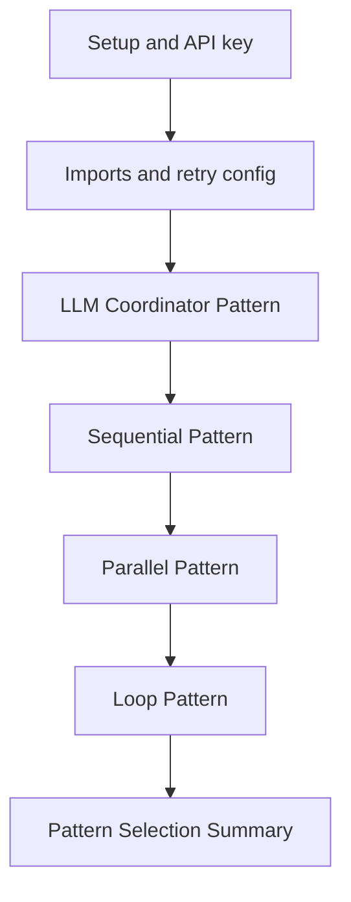
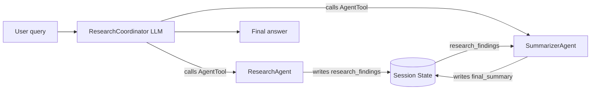
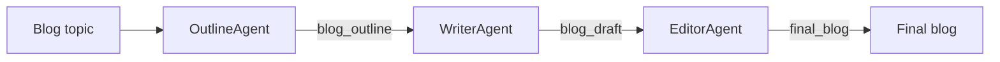
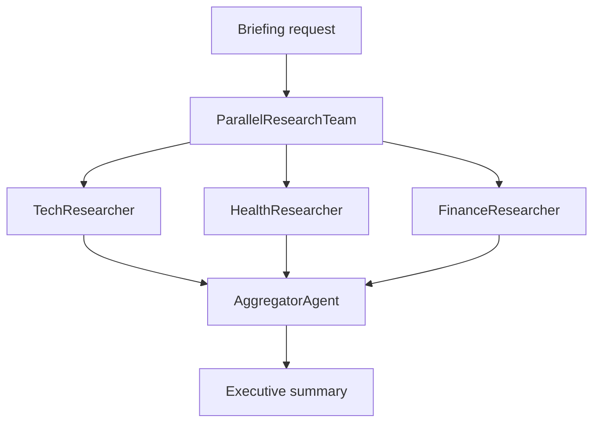
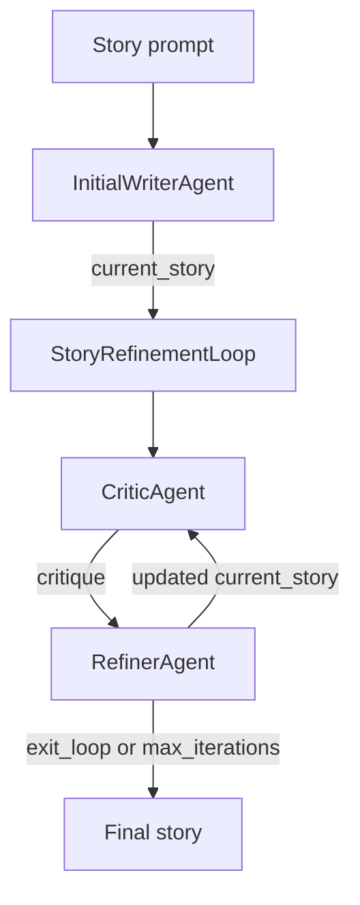

# Day 1b — Multi-Agent Systems & Workflow Patterns

Cell-by-cell documentation for `agentic-ai-day-1b-agent-architectures.ipynb` from the Kaggle 5-Day Agents course.

> This document is written for a GitHub `README.md` or companion documentation file. It explains the notebook flow, every cell's purpose, every executable code cell in detail, and the main ADK concepts demonstrated.

## 1. Notebook Goal

Day 1b moves from a single action-taking agent to **multi-agent systems**. The notebook shows how to split complex work across specialist agents and coordinate them using four orchestration styles:

| Pattern | Main idea | Notebook example | Best for |
|---|---|---|---|
| LLM coordinator with `AgentTool` | A manager LLM chooses which specialist agents to call | Research + summarization | Flexible, dynamic workflows |
| `SequentialAgent` | Run sub-agents in a fixed order | Blog outline → draft → edit | Pipelines where order matters |
| `ParallelAgent` | Run independent sub-agents concurrently | Tech + health + finance research | Independent tasks where speed matters |
| `LoopAgent` | Repeat sub-agents until a condition or max iteration limit | Story critique/refinement | Iterative improvement |

The notebook also demonstrates `output_key` and `{state_key}` templating for passing information between agents through ADK session state.

## 2. Prerequisites

- A Kaggle notebook environment, or a local Python environment with `google-adk` installed.
- A Gemini API key saved as a Kaggle Secret named `GOOGLE_API_KEY`.
- Basic comfort with Python classes, functions, and async notebook execution using `await`.
- Run the notebook from top to bottom; later cells depend on objects created earlier.

## 3. Official Concepts Referenced

- [ADK LLM Agents](https://adk.dev/agents/llm-agents/) — LLM-powered agents use instructions, context, and tools to decide how to proceed.
- [ADK Multi-Agent Systems](https://adk.dev/agents/multi-agents/) — explains sub-agents and explicit invocation through `AgentTool`.
- [ADK Workflow Agents](https://adk.dev/agents/workflow-agents/) — deterministic orchestration with sequential, parallel, and loop workflows.
- [Sequential Agents](https://adk.dev/agents/workflow-agents/sequential-agents/) — fixed-order execution.
- [Parallel Agents](https://adk.dev/agents/workflow-agents/parallel-agents/) — concurrent execution for independent sub-agents.
- [Loop Agents](https://adk.dev/agents/workflow-agents/loop-agents/) — repeated execution with a stop condition or iteration limit.
- [Function Tools](https://adk.dev/tools-custom/function-tools/) — Python functions exposed as tools.
- [ADK State](https://adk.dev/sessions/state/) — shared state, `output_key`, and `{key}` templating.

## 4. High-Level Architecture



## 5. Complete Cell Map

| Cell | Type | What it does |
|---:|---|---|
| 0 | Markdown | Copyright notice. |
| 1 | Markdown | Notebook title, course context, and learning objectives for multi-agent systems. |
| 2 | Markdown | Setup note: Kaggle already includes `google-adk`; local installs can use `pip install google-adk`. |
| 3 | Markdown | Instructions for creating a Gemini API key and adding it to Kaggle Secrets as `GOOGLE_API_KEY`. |
| 4 | Code | Loads the Gemini API key from Kaggle Secrets and exposes it as an environment variable. |
| 5 | Markdown | Introduces the ADK and Google GenAI imports needed in the notebook. |
| 6 | Code | Imports ADK agent classes, Gemini model wrapper, runner, tools, and retry types. |
| 7 | Markdown | Explains why retry configuration is useful for LLM API calls. |
| 8 | Code | Creates HTTP retry options for rate limits and transient server errors. |
| 9 | Markdown | Starts Section 2: why multi-agent systems are useful. |
| 10 | Markdown | Explains the limitation of one monolithic agent and introduces specialist-agent teams. |
| 11 | Markdown | Architecture image: single agent versus multi-agent team. |
| 12 | Markdown | Introduces the first example: research and summarization with two specialist agents. |
| 13 | Code | Defines `ResearchAgent`, a search-enabled specialist that stores findings in state. |
| 14 | Code | Defines `SummarizerAgent`, which reads `research_findings` and writes `final_summary`. |
| 15 | Markdown | Introduces the root coordinator and links to instruction guidance. |
| 16 | Code | Defines `ResearchCoordinator`, an LLM manager that calls sub-agents through `AgentTool`. |
| 17 | Markdown | Explains that `AgentTool` wraps agents as tools, then prepares for a test run. |
| 18 | Code | Runs the coordinator with `InMemoryRunner.run_debug()` on a blockchain question. |
| 19 | Markdown | Shows a sample rendered output from the coordinator workflow. |
| 20 | Markdown | Reflects on the first multi-agent system and warns that LLM-controlled ordering can be unpredictable. |
| 21 | Markdown | Starts Section 3: sequential workflows as fixed pipelines. |
| 22 | Markdown | Architecture image: sequential blog post pipeline. |
| 23 | Markdown | Introduces the blog example with outline, writer, and editor agents. |
| 24 | Code | Defines `OutlineAgent`, which creates and stores a blog outline. |
| 25 | Code | Defines `WriterAgent`, which uses the outline to write a draft. |
| 26 | Code | Defines `EditorAgent`, which uses the draft to produce a polished final blog. |
| 27 | Markdown | Introduces the `SequentialAgent` composition. |
| 28 | Code | Builds `BlogPipeline` as a deterministic sequence of outline → write → edit. |
| 29 | Markdown | Prepares to run the blog pipeline. |
| 30 | Code | Runs the sequential blog pipeline on a blockchain-benefits prompt. |
| 31 | Markdown | Shows a sample rendered output from the sequential pipeline. |
| 32 | Markdown | Transitions from sequential workflows to parallel workflows. |
| 33 | Markdown | Starts Section 4: parallel workflows for independent tasks. |
| 34 | Markdown | Architecture image: parallel agent workflow. |
| 35 | Markdown | Introduces the multi-topic research example. |
| 36 | Code | Defines `TechResearcher`, a Google Search agent for AI/ML trends. |
| 37 | Code | Defines `HealthResearcher`, a Google Search agent for medical breakthroughs. |
| 38 | Code | Defines `FinanceResearcher`, a Google Search agent for fintech trends. |
| 39 | Code | Defines `AggregatorAgent`, which combines the three research outputs. |
| 40 | Markdown | Explains nesting a `ParallelAgent` inside a `SequentialAgent`. |
| 41 | Code | Creates `ParallelResearchTeam` and wraps it with `ResearchSystem` for aggregation. |
| 42 | Markdown | Prepares to run the parallel research system. |
| 43 | Code | Runs the parallel research system with a daily executive briefing prompt. |
| 44 | Markdown | Shows a sample rendered output from the parallel research system. |
| 45 | Markdown | Transitions from parallel workflows to loop workflows. |
| 46 | Markdown | Starts Section 5: loop workflows for iterative refinement. |
| 47 | Markdown | Architecture image: loop agent workflow. |
| 48 | Markdown | Introduces the story-writing refinement example. |
| 49 | Code | Defines `InitialWriterAgent`, which writes the first story draft. |
| 50 | Code | Defines `CriticAgent`, which approves or critiques the current story. |
| 51 | Markdown | Explains why the loop needs an explicit stopping signal. |
| 52 | Code | Defines the `exit_loop()` function used as the loop-exit tool. |
| 53 | Markdown | Explains wrapping the Python function in a `FunctionTool`. |
| 54 | Code | Defines `RefinerAgent`, which either refines the story or calls `exit_loop`. |
| 55 | Markdown | Introduces the composition of loop and sequential agents. |
| 56 | Code | Creates `StoryRefinementLoop` and the overall `StoryPipeline`. |
| 57 | Markdown | Prepares to run the story pipeline. |
| 58 | Code | Runs the story pipeline with a lighthouse-map prompt. |
| 59 | Markdown | Shows a sample rendered output from the story-refinement loop. |
| 60 | Markdown | Summarizes the loop-agent implementation. |
| 61 | Markdown | Starts Section 6: choosing the right workflow pattern. |
| 62 | Markdown | Decision-tree image for pattern selection. |
| 63 | Markdown | Quick reference table for LLM-based, sequential, parallel, and loop patterns. |
| 64 | Markdown | Final congratulations, takeaways, learn-more links, and next steps. |
| 65 | Markdown | Author credit. |

## 6. Detailed Explanation of Executable Code Cells

> Cell numbers below use the notebook's zero-based cell index. For example, **Cell 4** means notebook cell index 4, not execution count 4.

### Cell 4 — Load the Gemini API key from Kaggle Secrets

**Purpose:** Authenticate the notebook so ADK/Gemini calls can reach the Gemini API.

**Code:**

```python
import os
from kaggle_secrets import UserSecretsClient

try:
    GOOGLE_API_KEY = UserSecretsClient().get_secret("GOOGLE_API_KEY")
    os.environ["GOOGLE_API_KEY"] = GOOGLE_API_KEY
    print("✅ Gemini API key setup complete.")
except Exception as e:
    print(
        f"🔑 Authentication Error: Please make sure you have added 'GOOGLE_API_KEY' to your Kaggle secrets. Details: {e}"
    )
```

**How it works:**
- `UserSecretsClient().get_secret("GOOGLE_API_KEY")` reads the secret attached to the Kaggle notebook.
- `os.environ["GOOGLE_API_KEY"] = GOOGLE_API_KEY` makes the key available to libraries that read credentials from the environment.
- The `try/except` block gives a human-readable error if the secret is missing or not attached to the notebook.

**Expected result:** On success, the cell prints `✅ Gemini API key setup complete.`

**Notes:**
- A common failure is creating the secret but forgetting to enable/attach it to the notebook from the Kaggle Secrets panel.

### Cell 6 — Import ADK components and Gemini helper classes

**Purpose:** Bring in every class and tool used by the rest of the notebook.

**Code:**

```python
from google.adk.agents import Agent, SequentialAgent, ParallelAgent, LoopAgent
from google.adk.models.google_llm import Gemini
from google.adk.runners import InMemoryRunner
from google.adk.tools import AgentTool, FunctionTool, google_search
from google.genai import types

print("✅ ADK components imported successfully.")
```

**How it works:**
- `Agent` creates LLM-powered agents with instructions, tools, and optional state output keys.
- `SequentialAgent`, `ParallelAgent`, and `LoopAgent` are workflow agents used later for deterministic orchestration.
- `Gemini` wraps the selected Gemini model for each agent.
- `InMemoryRunner` runs the agent locally in memory for notebook debugging.
- `AgentTool` exposes an agent as a callable tool for another agent.
- `FunctionTool` exposes a Python function as a callable tool.
- `google_search` gives selected agents access to Google Search grounding.
- `types` provides `HttpRetryOptions` for retry configuration.

**Expected result:** The cell prints `✅ ADK components imported successfully.`

**Notes:**
- This cell must run before any agent definitions; otherwise names like `Agent` or `Gemini` will be undefined.

### Cell 8 — Configure retry behavior for model calls

**Purpose:** Reduce notebook failures caused by temporary rate limits or transient Gemini/API errors.

**Code:**

```python
retry_config=types.HttpRetryOptions(
    attempts=5,  # Maximum retry attempts
    exp_base=7,  # Delay multiplier
    initial_delay=1,
    http_status_codes=[429, 500, 503, 504], # Retry on these HTTP errors
)
print("Configuration process has been completed.")
```

**How it works:**
- `attempts=5` allows up to five tries.
- `initial_delay=1` starts retry delays at one second.
- `exp_base=7` increases the delay exponentially.
- `http_status_codes=[429, 500, 503, 504]` retries common rate-limit and temporary server errors.

**Expected result:** The cell prints `Configuration process has been completed.`

**Notes:**
- The same `retry_config` object is reused in every `Gemini(...)` model wrapper throughout the notebook.

### Cell 13 — Create `ResearchAgent`

**Purpose:** Define a specialist agent whose only job is to search the web and return cited research findings.

**Code:**

```python
# Research Agent: Its job is to use the google_search tool and present findings.
research_agent = Agent(
    name="ResearchAgent",
    model=Gemini(
        model="gemini-2.5-flash-lite",
        retry_options=retry_config
    ),
    instruction="""You are a specialized research agent. Your only job is to use the
    google_search tool to find 2-3 pieces of relevant information on the given topic and present the findings with citations.""",
    tools=[google_search],
    output_key="research_findings",  # The result of this agent will be stored in the session state with this key.
)

print("✅ research_agent created.")
```

**How it works:**
- `name="ResearchAgent"` identifies the agent in logs and tool calls.
- `model=Gemini(model="gemini-2.5-flash-lite", retry_options=retry_config)` selects the model and applies the retry policy.
- `instruction=...` narrows the agent to a single responsibility: use Google Search and return 2–3 relevant findings with citations.
- `tools=[google_search]` gives this agent search capability.
- `output_key="research_findings"` stores the agent's final text in session state for later agents.

**Expected result:** The cell creates `research_agent` and prints `✅ research_agent created.`

**Notes:**
- This is the first example of the notebook's specialist-agent pattern: one focused responsibility per agent.

### Cell 14 — Create `SummarizerAgent`

**Purpose:** Define a second specialist that reads the research output and turns it into a concise summary.

**Code:**

```python
# Summarizer Agent: Its job is to summarize the text it receives.
summarizer_agent = Agent(
    name="SummarizerAgent",
    model=Gemini(
        model="gemini-2.5-flash-lite",
        retry_options=retry_config
    ),
    # The instruction is modified to request a bulleted list for a clear output format.
    instruction="""Read the provided research findings: {research_findings}
Create a concise summary as a bulleted list with 3-5 key points.""",
    output_key="final_summary",
)

print("✅ summarizer_agent created.")
```

**How it works:**
- `{research_findings}` is a state placeholder. ADK replaces it with the value stored by `ResearchAgent` before sending the instruction to the model.
- This agent has no tools because its job is language transformation, not external retrieval.
- `output_key="final_summary"` stores the final bullet summary in state.

**Expected result:** The cell creates `summarizer_agent` and prints `✅ summarizer_agent created.`

**Notes:**
- The cell demonstrates state handoff: one agent writes `research_findings`; another agent reads it.

### Cell 16 — Create the LLM-based root coordinator

**Purpose:** Build a manager agent that decides to call the research and summarizer agents as tools.

**Code:**

```python
# Root Coordinator: Orchestrates the workflow by calling the sub-agents as tools.
root_agent = Agent(
    name="ResearchCoordinator",
    model=Gemini(
        model="gemini-2.5-flash-lite",
        retry_options=retry_config
    ),
    # This instruction tells the root agent HOW to use its tools (which are the other agents).
    instruction="""You are a research coordinator. Your goal is to answer the user's query by orchestrating a workflow.
1. First, you MUST call the `ResearchAgent` tool to find relevant information on the topic provided by the user.
2. Next, after receiving the research findings, you MUST call the `SummarizerAgent` tool to create a concise summary.
3. Finally, present the final summary clearly to the user as your response.""",
    # We wrap the sub-agents in `AgentTool` to make them callable tools for the root agent.
    tools=[AgentTool(research_agent), AgentTool(summarizer_agent)],
)

print("✅ root_agent created.")
```

**How it works:**
- `root_agent = Agent(...)` creates an LLM-powered coordinator called `ResearchCoordinator`.
- The instruction explicitly tells the coordinator to call `ResearchAgent` first, then `SummarizerAgent`, then present the final summary.
- `AgentTool(research_agent)` and `AgentTool(summarizer_agent)` expose the sub-agents as callable tools.
- Because this is an LLM coordinator, the order is requested through instructions rather than enforced by a deterministic workflow agent.

**Expected result:** The cell creates `root_agent` and prints `✅ root_agent created.`

**Notes:**
- This pattern is flexible, but it can be less predictable than `SequentialAgent` because the LLM is deciding how to follow the orchestration instructions.

### Cell 18 — Run the LLM-coordinated multi-agent workflow

**Purpose:** Test the first multi-agent system with a real user query.

**Code:**

```python
runner = InMemoryRunner(agent=root_agent)
response = await runner.run_debug(
    "What are the latest advancements in Blockchain technology?"
)
```

**How it works:**
- `runner = InMemoryRunner(agent=root_agent)` creates an in-memory debug runner for the current root agent.
- `await runner.run_debug(...)` sends the prompt to the root agent and prints the event trace in notebook-friendly form.
- The coordinator should call the research tool-agent, then the summarizer tool-agent, then respond.

**Expected result:** The output is a summary of recent blockchain advancements. Exact content may vary because the model and search results are dynamic.

**Notes:**
- The `response` variable receives the debug events/results, even though the notebook mainly uses the printed trace for learning.

### Cell 24 — Create `OutlineAgent`

**Purpose:** Create the first step in a deterministic blog-writing pipeline.

**Code:**

```python
# Outline Agent: Creates the initial blog post outline.
outline_agent = Agent(
    name="OutlineAgent",
    model=Gemini(
        model="gemini-2.5-flash-lite",
        retry_options=retry_config
    ),
    instruction="""Create a blog outline for the given topic with:
    1. A catchy headline
    2. An introduction hook
    3. 3-5 main sections with 2-3 bullet points for each
    4. A concluding thought""",
    output_key="blog_outline",  # The result of this agent will be stored in the session state with this key.
)

print("✅ outline_agent created.")
```

**How it works:**
- The agent receives the user's topic and produces a blog outline with a headline, hook, sections, bullets, and conclusion.
- `output_key="blog_outline"` saves the outline to session state.

**Expected result:** The cell creates `outline_agent` and prints `✅ outline_agent created.`

**Notes:**
- This is step 1 of a fixed assembly line: outline → draft → edit.

### Cell 25 — Create `WriterAgent`

**Purpose:** Create the second pipeline step: turn the outline into a short blog draft.

**Code:**

```python
# Writer Agent: Writes the full blog post based on the outline from the previous agent.
writer_agent = Agent(
    name="WriterAgent",
    model=Gemini(
        model="gemini-2.5-flash-lite",
        retry_options=retry_config
    ),
    # The `{blog_outline}` placeholder automatically injects the state value from the previous agent's output.
    instruction="""Following this outline strictly: {blog_outline}
    Write a brief, 200 to 300-word blog post with an engaging and informative tone.""",
    output_key="blog_draft",  # The result of this agent will be stored with this key.
)

print("✅ writer_agent created.")
```

**How it works:**
- `{blog_outline}` injects the output of `OutlineAgent` into the writer's instruction.
- The writer is constrained to produce a 200–300 word blog post.
- `output_key="blog_draft"` stores the draft for the editor.

**Expected result:** The cell creates `writer_agent` and prints `✅ writer_agent created.`

**Notes:**
- This cell shows how state placeholders make later pipeline steps depend on earlier outputs without manually passing variables.

### Cell 26 — Create `EditorAgent`

**Purpose:** Create the final blog pipeline step: polish the draft for grammar, flow, and clarity.

**Code:**

```python
# Editor Agent: Edits and polishes the draft from the writer agent.
editor_agent = Agent(
    name="EditorAgent",
    model=Gemini(
        model="gemini-2.5-flash-lite",
        retry_options=retry_config
    ),
    # This agent receives the `{blog_draft}` from the writer agent's output.
    instruction="""Edit this draft: {blog_draft}
    Your task is to polish the text by fixing any grammatical errors, improving the flow and sentence structure, and enhancing overall clarity.""",
    output_key="final_blog",  # This is the final output of the entire pipeline.
)

print("✅ editor_agent created.")
```

**How it works:**
- `{blog_draft}` injects the writer's previous output.
- The instruction asks for copy-editing and structural improvement.
- `output_key="final_blog"` stores the final polished blog post.

**Expected result:** The cell creates `editor_agent` and prints `✅ editor_agent created.`

**Notes:**
- This agent does not create new content from scratch; it improves an existing state value.

### Cell 28 — Compose the blog agents with `SequentialAgent`

**Purpose:** Guarantee that outline, writing, and editing run in the exact intended order.

**Code:**

```python
root_agent = SequentialAgent(
    name="BlogPipeline",
    sub_agents=[outline_agent, writer_agent, editor_agent],
)

print("✅ Sequential Agent created.")
```

**How it works:**
- `SequentialAgent(name="BlogPipeline", sub_agents=[outline_agent, writer_agent, editor_agent])` creates a deterministic workflow.
- The listed order is the execution order.
- `root_agent` is overwritten here. That is intentional in the notebook: each example redefines the current root system before running it.

**Expected result:** The cell creates a sequential root agent and prints `✅ Sequential Agent created.`

**Notes:**
- Unlike the previous LLM coordinator, `SequentialAgent` does not ask an LLM to decide the order; the order is hard-coded.

### Cell 30 — Run the sequential blog pipeline

**Purpose:** Test the deterministic blog pipeline.

**Code:**

```python
runner = InMemoryRunner(agent=root_agent)
response = await runner.run_debug(
    "Write a blog post about the benefits of using Blockchain technology"
)
```

**How it works:**
- A new `InMemoryRunner` is created for the current `root_agent`, which now points to `BlogPipeline`.
- `run_debug()` receives the blog topic and prints each step's response: outline, draft, then edited blog.

**Expected result:** The rendered output should show the three agents running in sequence.

**Notes:**
- The exact final blog varies across runs, but the step order should remain stable.

### Cell 36 — Create `TechResearcher`

**Purpose:** Define the first independent branch in the parallel research workflow.

**Code:**

```python
# Tech Researcher: Focuses on AI and ML trends.
tech_researcher = Agent(
    name="TechResearcher",
    model=Gemini(
        model="gemini-2.5-flash-lite",
        retry_options=retry_config
    ),
    instruction="""Research the latest AI/ML trends. Include 3 key developments,
the main companies involved, and the potential impact. Keep the report very concise (100 words).""",
    tools=[google_search],
    output_key="tech_research",  # The result of this agent will be stored in the session state with this key.
)

print("✅ tech_researcher created.")
```

**How it works:**
- The agent searches for AI/ML trends using `google_search`.
- Its prompt asks for three key developments, companies involved, and impact.
- `output_key="tech_research"` stores its result for the later aggregator.

**Expected result:** The cell creates `tech_researcher` and prints `✅ tech_researcher created.`

**Notes:**
- This agent does not depend on the health or finance researchers, so it can run in parallel with them.

### Cell 37 — Create `HealthResearcher`

**Purpose:** Define the second independent branch in the parallel research workflow.

**Code:**

```python
# Health Researcher: Focuses on medical breakthroughs.
health_researcher = Agent(
    name="HealthResearcher",
    model=Gemini(
        model="gemini-2.5-flash-lite",
        retry_options=retry_config
    ),
    instruction="""Research recent medical breakthroughs. Include 3 significant advances,
their practical applications, and estimated timelines. Keep the report concise (100 words).""",
    tools=[google_search],
    output_key="health_research",  # The result will be stored with this key.
)

print("✅ health_researcher created.")
```

**How it works:**
- The agent searches for recent medical breakthroughs.
- Its prompt asks for significant advances, applications, and timelines.
- `output_key="health_research"` stores the result for aggregation.

**Expected result:** The cell creates `health_researcher` and prints `✅ health_researcher created.`

**Notes:**
- Its independence from the other topic researchers is what makes it suitable for `ParallelAgent`.

### Cell 38 — Create `FinanceResearcher`

**Purpose:** Define the third independent branch in the parallel research workflow.

**Code:**

```python
# Finance Researcher: Focuses on fintech trends.
finance_researcher = Agent(
    name="FinanceResearcher",
    model=Gemini(
        model="gemini-2.5-flash-lite",
        retry_options=retry_config
    ),
    instruction="""Research current fintech trends. Include 3 key trends,
their market implications, and the future outlook. Keep the report concise (100 words).""",
    tools=[google_search],
    output_key="finance_research",  # The result will be stored with this key.
)

print("✅ finance_researcher created.")
```

**How it works:**
- The agent searches for current fintech trends.
- Its prompt asks for key trends, market implications, and future outlook.
- `output_key="finance_research"` stores the result for aggregation.

**Expected result:** The cell creates `finance_researcher` and prints `✅ finance_researcher created.`

**Notes:**
- Like the other researchers, it is a search-enabled specialist with a single domain focus.

### Cell 39 — Create `AggregatorAgent`

**Purpose:** Combine the three independent research reports into one executive summary.

**Code:**

```python
# The AggregatorAgent runs *after* the parallel step to synthesize the results.
aggregator_agent = Agent(
    name="AggregatorAgent",
    model=Gemini(
        model="gemini-2.5-flash-lite",
        retry_options=retry_config
    ),
    # It uses placeholders to inject the outputs from the parallel agents, which are now in the session state.
    instruction="""Combine these three research findings into a single executive summary:

    **Technology Trends:**
    {tech_research}
    
    **Health Breakthroughs:**
    {health_research}
    
    **Finance Innovations:**
    {finance_research}
    
    Your summary should highlight common themes, surprising connections, and the most important key takeaways from all three reports. The final summary should be around 200 words.""",
    output_key="executive_summary",  # This will be the final output of the entire system.
)

print("✅ aggregator_agent created.")
```

**How it works:**
- The instruction includes `{tech_research}`, `{health_research}`, and `{finance_research}` placeholders.
- Those placeholders are filled from session state after the parallel researchers complete.
- `output_key="executive_summary"` stores the final synthesized result.

**Expected result:** The cell creates `aggregator_agent` and prints `✅ aggregator_agent created.`

**Notes:**
- This agent must run after the parallel researchers, because it depends on their state outputs.

### Cell 41 — Compose the parallel research team and final aggregator

**Purpose:** Run independent research branches concurrently, then aggregate the results in a fixed second step.

**Code:**

```python
# The ParallelAgent runs all its sub-agents simultaneously.
parallel_research_team = ParallelAgent(
    name="ParallelResearchTeam",
    sub_agents=[tech_researcher, health_researcher, finance_researcher],
)

# This SequentialAgent defines the high-level workflow: run the parallel team first, then run the aggregator.
root_agent = SequentialAgent(
    name="ResearchSystem",
    sub_agents=[parallel_research_team, aggregator_agent],
)

print("✅ Parallel and Sequential Agents created.")
```

**How it works:**
- `ParallelAgent(name="ParallelResearchTeam", sub_agents=[...])` launches the three topic researchers concurrently.
- `SequentialAgent(name="ResearchSystem", sub_agents=[parallel_research_team, aggregator_agent])` ensures aggregation happens only after the parallel step finishes.
- `root_agent` is overwritten again to point to this new research system.

**Expected result:** The cell creates both workflow agents and prints `✅ Parallel and Sequential Agents created.`

**Notes:**
- This nested workflow is a common pattern: parallel fan-out first, sequential fan-in second.

### Cell 43 — Run the parallel research workflow

**Purpose:** Test the fan-out/fan-in research system.

**Code:**

```python
runner = InMemoryRunner(agent=root_agent)
response = await runner.run_debug(
    "Run the daily executive briefing on Tech, Health, and Finance"
)
```

**How it works:**
- `InMemoryRunner(agent=root_agent)` now runs `ResearchSystem`.
- `run_debug()` sends a broad executive briefing prompt.
- The expected trace is three researcher outputs followed by one aggregator output.

**Expected result:** The output should contain technology, health, and finance research plus a combined executive summary.

**Notes:**
- Because the research branches use Google Search, exact findings will vary over time.

### Cell 49 — Create `InitialWriterAgent`

**Purpose:** Generate the first story draft before entering the refinement loop.

**Code:**

```python
# This agent runs ONCE at the beginning to create the first draft.
initial_writer_agent = Agent(
    name="InitialWriterAgent",
    model=Gemini(
        model="gemini-2.5-flash-lite",
        retry_options=retry_config
    ),
    instruction="""Based on the user's prompt, write the first draft of a short story (around 100-150 words).
    Output only the story text, with no introduction or explanation.""",
    output_key="current_story",  # Stores the first draft in the state.
)

print("✅ initial_writer_agent created.")
```

**How it works:**
- The agent writes a 100–150 word story based on the user's prompt.
- It is instructed to output only the story text.
- `output_key="current_story"` stores the draft for the critic.

**Expected result:** The cell creates `initial_writer_agent` and prints `✅ initial_writer_agent created.`

**Notes:**
- This agent runs once, outside the loop, because the loop should refine an existing draft rather than start over every time.

### Cell 50 — Create `CriticAgent`

**Purpose:** Review the current story and decide whether it needs improvement.

**Code:**

```python
# This agent's only job is to provide feedback or the approval signal. It has no tools.
critic_agent = Agent(
    name="CriticAgent",
    model=Gemini(
        model="gemini-2.5-flash-lite",
        retry_options=retry_config
    ),
    instruction="""You are a constructive story critic. Review the story provided below.
    Story: {current_story}
    
    Evaluate the story's plot, characters, and pacing.
    - If the story is well-written and complete, you MUST respond with the exact phrase: "APPROVED"
    - Otherwise, provide 2-3 specific, actionable suggestions for improvement.""",
    output_key="critique",  # Stores the feedback in the state.
)

print("✅ critic_agent created.")
```

**How it works:**
- `{current_story}` injects the latest story draft.
- The critic evaluates plot, characters, and pacing.
- If the story is good enough, it must output exactly `APPROVED`; otherwise it returns actionable suggestions.
- `output_key="critique"` stores the review for the refiner.

**Expected result:** The cell creates `critic_agent` and prints `✅ critic_agent created.`

**Notes:**
- The exact approval phrase matters because the next agent uses it as a condition.

### Cell 52 — Define the `exit_loop()` function

**Purpose:** Create a callable function that represents the loop-exit signal.

**Code:**

```python
# This is the function that the RefinerAgent will call to exit the loop.
def exit_loop():
    """Call this function ONLY when the critique is 'APPROVED', indicating the story is finished and no more changes are needed."""
    return {"status": "approved", "message": "Story approved. Exiting refinement loop."}


print("✅ exit_loop function created.")
```

**How it works:**
- The function takes no arguments.
- Its docstring tells the model when to call it: only when the critique is `APPROVED`.
- It returns a JSON-serializable dictionary with status and message.

**Expected result:** The cell defines the function and prints `✅ exit_loop function created.`

**Notes:**
- In more explicit ADK loop-exit implementations, a tool may receive tool context and set an escalation/action flag. This notebook focuses on the conceptual pattern and also protects the loop with `max_iterations=2`.

### Cell 54 — Create `RefinerAgent` with a `FunctionTool`

**Purpose:** Make the loop's action agent: either revise the story or signal that the loop can exit.

**Code:**

```python
# This agent refines the story based on critique OR calls the exit_loop function.
refiner_agent = Agent(
    name="RefinerAgent",
    model=Gemini(
        model="gemini-2.5-flash-lite",
        retry_options=retry_config
    ),
    instruction="""You are a story refiner. You have a story draft and critique.
    
    Story Draft: {current_story}
    Critique: {critique}
    
    Your task is to analyze the critique.
    - IF the critique is EXACTLY "APPROVED", you MUST call the `exit_loop` function and nothing else.
    - OTHERWISE, rewrite the story draft to fully incorporate the feedback from the critique.""",
    output_key="current_story",  # It overwrites the story with the new, refined version.
    tools=[
        FunctionTool(exit_loop)
    ],  # The tool is now correctly initialized with the function reference.
)

print("✅ refiner_agent created.")
```

**How it works:**
- `{current_story}` gives the refiner the latest draft.
- `{critique}` gives it the critic's latest feedback.
- If the critique is exactly `APPROVED`, the instruction requires calling `exit_loop` and outputting nothing else.
- Otherwise, the agent rewrites the story to incorporate feedback.
- `output_key="current_story"` overwrites the previous draft with the refined version.
- `tools=[FunctionTool(exit_loop)]` exposes the Python function to the model as a tool.

**Expected result:** The cell creates `refiner_agent` and prints `✅ refiner_agent created.`

**Notes:**
- This is a key feedback-loop pattern: the same state key, `current_story`, is repeatedly improved.

### Cell 56 — Compose the story refinement loop and overall story pipeline

**Purpose:** Build a two-level workflow: write once, then critique/refine repeatedly.

**Code:**

```python
# The LoopAgent contains the agents that will run repeatedly: Critic -> Refiner.
story_refinement_loop = LoopAgent(
    name="StoryRefinementLoop",
    sub_agents=[critic_agent, refiner_agent],
    max_iterations=2,  # Prevents infinite loops
)

# The root agent is a SequentialAgent that defines the overall workflow: Initial Write -> Refinement Loop.
root_agent = SequentialAgent(
    name="StoryPipeline",
    sub_agents=[initial_writer_agent, story_refinement_loop],
)

print("✅ Loop and Sequential Agents created.")
```

**How it works:**
- `LoopAgent(name="StoryRefinementLoop", sub_agents=[critic_agent, refiner_agent], max_iterations=2)` runs critic → refiner up to two cycles.
- `max_iterations=2` prevents an infinite loop if approval never happens.
- `SequentialAgent(name="StoryPipeline", sub_agents=[initial_writer_agent, story_refinement_loop])` first creates the initial draft, then enters the loop.
- `root_agent` is overwritten one final time for this example.

**Expected result:** The cell creates the loop and sequential wrapper, then prints `✅ Loop and Sequential Agents created.`

**Notes:**
- The order inside the loop matters: critique must come before refinement.

### Cell 58 — Run the story refinement workflow

**Purpose:** Test the loop-based refinement pattern with a creative-writing prompt.

**Code:**

```python
runner = InMemoryRunner(agent=root_agent)
response = await runner.run_debug(
    "Write a short story about a lighthouse keeper who discovers a mysterious, glowing map"
)
```

**How it works:**
- `InMemoryRunner(agent=root_agent)` now runs `StoryPipeline`.
- `run_debug()` sends a story prompt about a lighthouse keeper and a glowing map.
- The expected trace is: initial draft → critique → refined draft → possible approval or another refinement cycle.

**Expected result:** The sample notebook output shows the critic approving the refined story with `APPROVED`.

**Notes:**
- LLM-generated creative content will vary. The important part is the control flow, not the exact wording.

## 7. Agent Inventory

| Agent / Object | Type | Tools | Reads from state | Writes to state | Role |
|---|---|---|---|---|---|
| `ResearchAgent` | `Agent` | `google_search` | User topic | `research_findings` | Search specialist |
| `SummarizerAgent` | `Agent` | None | `research_findings` | `final_summary` | Summary specialist |
| `ResearchCoordinator` | `Agent` | `AgentTool(ResearchAgent)`, `AgentTool(SummarizerAgent)` | User query | None directly | LLM manager/orchestrator |
| `OutlineAgent` | `Agent` | None | User topic | `blog_outline` | Blog outline creator |
| `WriterAgent` | `Agent` | None | `blog_outline` | `blog_draft` | Blog draft writer |
| `EditorAgent` | `Agent` | None | `blog_draft` | `final_blog` | Blog editor |
| `BlogPipeline` | `SequentialAgent` | Sub-agents | Shared session state | Shared session state | Fixed-order blog workflow |
| `TechResearcher` | `Agent` | `google_search` | User briefing request | `tech_research` | AI/ML research branch |
| `HealthResearcher` | `Agent` | `google_search` | User briefing request | `health_research` | Medical research branch |
| `FinanceResearcher` | `Agent` | `google_search` | User briefing request | `finance_research` | Fintech research branch |
| `AggregatorAgent` | `Agent` | None | `tech_research`, `health_research`, `finance_research` | `executive_summary` | Cross-topic synthesis |
| `ParallelResearchTeam` | `ParallelAgent` | Sub-agents | User briefing request | Branch outputs | Concurrent research fan-out |
| `ResearchSystem` | `SequentialAgent` | Sub-agents | Shared session state | `executive_summary` | Parallel research followed by aggregation |
| `InitialWriterAgent` | `Agent` | None | User story prompt | `current_story` | Creates initial story draft |
| `CriticAgent` | `Agent` | None | `current_story` | `critique` | Reviews story quality |
| `RefinerAgent` | `Agent` | `FunctionTool(exit_loop)` | `current_story`, `critique` | `current_story` | Revises story or exits loop |
| `StoryRefinementLoop` | `LoopAgent` | Sub-agents | `current_story`, `critique` | Updated story/critique | Repeated critique/refinement |
| `StoryPipeline` | `SequentialAgent` | Sub-agents | User story prompt | `current_story`, `critique` | Initial write followed by loop refinement |

## 8. State Keys Used in the Notebook

| State key | Written by | Read by | Meaning |
|---|---|---|---|
| `research_findings` | `ResearchAgent` | `SummarizerAgent` | Search findings for the user's topic. |
| `final_summary` | `SummarizerAgent` | Coordinator/final response | Concise research summary. |
| `blog_outline` | `OutlineAgent` | `WriterAgent` | Structured blog outline. |
| `blog_draft` | `WriterAgent` | `EditorAgent` | Draft blog post. |
| `final_blog` | `EditorAgent` | Final output | Edited final blog. |
| `tech_research` | `TechResearcher` | `AggregatorAgent` | Technology trend research. |
| `health_research` | `HealthResearcher` | `AggregatorAgent` | Medical breakthrough research. |
| `finance_research` | `FinanceResearcher` | `AggregatorAgent` | Fintech trend research. |
| `executive_summary` | `AggregatorAgent` | Final output | Combined briefing. |
| `current_story` | `InitialWriterAgent`, `RefinerAgent` | `CriticAgent`, `RefinerAgent` | Current version of the story. |
| `critique` | `CriticAgent` | `RefinerAgent` | Approval signal or improvement suggestions. |

## 9. Workflow Diagrams

### 9.1 LLM Coordinator with Agent Tools



### 9.2 Sequential Blog Pipeline



### 9.3 Parallel Research with Aggregation



### 9.4 Loop-Based Story Refinement



## 10. Important Implementation Notes

### `root_agent` is intentionally overwritten

The notebook reuses the variable name `root_agent` for each example:

1. `ResearchCoordinator`
2. `BlogPipeline`
3. `ResearchSystem`
4. `StoryPipeline`

This is fine in a teaching notebook because each section is independent and creates a new `InMemoryRunner` immediately after redefining `root_agent`. In a production codebase, use clearer names such as `research_root_agent`, `blog_root_agent`, and `story_root_agent`.

### `output_key` is the handoff mechanism

Whenever an agent has `output_key="some_key"`, ADK stores that agent's final text response in session state under `some_key`. Later agents can reference it with `{some_key}` in their instruction.

Example from the notebook:

```python
output_key="blog_outline"

instruction="""Following this outline strictly: {blog_outline}
Write a brief, 200 to 300-word blog post..."""
```

### Workflow agents coordinate; LLM agents think

- `Agent` / LLM agents perform reasoning, generation, search, and tool selection.
- `SequentialAgent`, `ParallelAgent`, and `LoopAgent` control execution flow.
- Workflow agents are not used because they are smarter; they are used because they are more predictable.

### Search-enabled agents are kept specialized

The notebook gives `google_search` to agents whose job is specifically research. It does not mix search and unrelated tools inside the same specialist. This keeps the design easier to debug and avoids tool-combination pitfalls in older ADK versions.

### Outputs will vary

Many outputs depend on live search results and generative model behavior. The exact text shown in the rendered-output Markdown cells is an example, not a guaranteed deterministic result.

## 11. Pattern Selection Guide

| Need | Use | Reason |
|---|---|---|
| The LLM should choose among possible specialist actions | LLM coordinator with `AgentTool` | Flexible and dynamic |
| Steps must always happen A → B → C | `SequentialAgent` | Deterministic order |
| Several independent tasks can run at the same time | `ParallelAgent` | Faster fan-out execution |
| The output should improve through repeated review/revision | `LoopAgent` | Iterative refinement with safety limit |
| You need behavior beyond built-in workflow patterns | Custom agent | Full control, more complexity |

## 12. Common Errors and Fixes

| Problem | Likely cause | Fix |
|---|---|---|
| `Authentication Error` in Cell 4 | `GOOGLE_API_KEY` secret missing or not attached | Add the secret in Kaggle and enable the checkbox |
| `NameError: Agent is not defined` | Import cell not run | Run Cell 6 before defining agents |
| Placeholder error for `{blog_outline}` or another state key | Earlier agent did not write the expected output key | Run cells in order and check the previous agent's `output_key` |
| Summarizer has nothing useful to summarize | `ResearchAgent` failed or search output was poor | Re-run the workflow or improve the research instruction |
| Loop never stops early | Approval phrase not produced or exit tool not called | Keep `max_iterations` and make the approval condition explicit |
| Parallel aggregator sees missing values | Aggregator ran before branch outputs existed | Keep the `ParallelAgent` nested before aggregator inside a `SequentialAgent` |

## 13. Learning Checklist

After completing this notebook, you should be able to explain:

- Why specialist agents are easier to maintain than one large monolithic agent.
- How `AgentTool` lets one agent call another agent.
- Why LLM-based orchestration is flexible but less deterministic.
- How `SequentialAgent` guarantees order.
- How `ParallelAgent` reduces latency for independent branches.
- How `LoopAgent` supports refinement cycles and why it needs a stopping mechanism.
- How `output_key` and `{state_key}` pass data between agents.
- Why debug traces from `run_debug()` are useful when learning agent behavior.

## 14. Suggested Repository Placement

A clean GitHub structure could look like this:

```text
kaggle-5-day-agents/
├── README.md
├── day-1/
│   ├── README_Day1.md
│   ├── Day1a_From_Prompt_to_Action_Cell_by_Cell_Documentation.md
│   └── Day1b_Agent_Architectures_Cell_by_Cell_Documentation.md
├── day-2/
├── day-3/
├── day-4/
└── day-5/
```

## 15. Final Takeaway

This notebook teaches the core mental model for agent architecture: **agents do work, state connects their work, and workflow agents control when each agent runs**. Once you understand the four patterns in Day 1b, you can design agent systems that are easier to reason about, debug, and extend.
