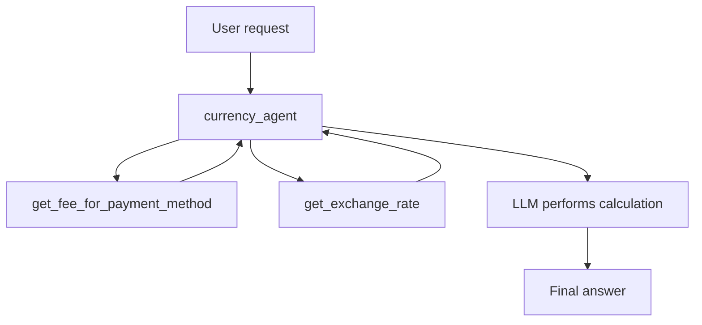
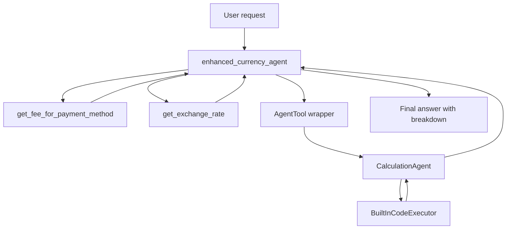

# Day 2a — Agent Tools: Cell-by-Cell Documentation

> **Notebook explained:** `agentic-ai-day-2a-agent-tools.ipynb`  
> **Course context:** Kaggle / Google 5-Day Agents Intensive — Day 2  
> **Topic:** Custom tools, function tools, agent-as-a-tool, and built-in code execution  
> **Format:** GitHub-ready Markdown documentation

---

## Table of Contents

1. [What this notebook teaches](#what-this-notebook-teaches)
2. [Notebook architecture at a glance](#notebook-architecture-at-a-glance)
3. [Important components](#important-components)
4. [Cell-by-cell documentation](#cell-by-cell-documentation)
5. [Core concepts explained](#core-concepts-explained)
6. [Expected calculations](#expected-calculations)
7. [Common errors and fixes](#common-errors-and-fixes)
8. [Production-readiness notes](#production-readiness-notes)
9. [Final learning checklist](#final-learning-checklist)
10. [References](#references)

---

## What this notebook teaches

This notebook shows how an LLM agent becomes more useful when it can call **tools**.

A plain LLM can generate text, reason from its training data, and follow instructions. A tool-using agent can also call external logic, use business rules, perform calculations, retrieve data, and delegate work to specialist agents.

By the end of the notebook, you build two versions of a currency-conversion assistant:

1. **Basic currency agent**
   - Uses two custom Python function tools:
     - `get_fee_for_payment_method()`
     - `get_exchange_rate()`
   - Lets the LLM calculate the final converted amount.

2. **Enhanced currency agent**
   - Uses the same two custom tools.
   - Adds a specialist `CalculationAgent`.
   - Wraps that specialist with `AgentTool`.
   - Uses `BuiltInCodeExecutor` so arithmetic is done by Python code instead of by the LLM directly.

The key lesson is:

> Tools turn an agent from a text generator into a system that can call reliable logic, interact with external capabilities, and delegate specialized tasks.

---

## Notebook architecture at a glance

### Basic version



### Enhanced version



### Why the enhanced version is better

The basic version asks the LLM to do arithmetic in natural language. That can work for small examples, but it is not the most reliable pattern.

The enhanced version forces a separation of responsibilities:

| Responsibility | Component |
|---|---|
| Understand the user request | `enhanced_currency_agent` |
| Look up payment fee | `get_fee_for_payment_method()` |
| Look up exchange rate | `get_exchange_rate()` |
| Generate calculation code | `CalculationAgent` |
| Execute calculation | `BuiltInCodeExecutor` |
| Explain result to user | `enhanced_currency_agent` |

This makes the final system easier to debug, extend, and trust.

---

## Important components

| Component | Type | Defined in cell | Purpose |
|---|---:|---:|---|
| `GOOGLE_API_KEY` | Environment variable | 8 | Authenticates Gemini API calls |
| `retry_config` | Retry configuration | 14 | Retries transient API failures |
| `show_python_code_and_result()` | Helper function | 12 | Prints generated code / code execution output from agent responses |
| `get_fee_for_payment_method()` | Function tool | 18 | Returns mock payment fee percentages |
| `get_exchange_rate()` | Function tool | 20 | Returns mock currency exchange rates |
| `currency_agent` | `LlmAgent` | 22 | Basic tool-using currency assistant |
| `currency_runner` | `InMemoryRunner` | 23 | Runs the basic agent interactively |
| `calculation_agent` | `LlmAgent` + code executor | 27 | Specialist agent that generates and executes Python calculations |
| `enhanced_currency_agent` | `LlmAgent` | 29 | Improved currency assistant that delegates math |
| `enhanced_runner` | `InMemoryRunner` | 30 | Runs the enhanced agent interactively |

---

# Cell-by-cell documentation

## Cell 1 — Copyright notice

**Type:** Markdown  
**Purpose:** Provides the copyright attribution for the notebook.

The cell states that the notebook content is copyrighted by Google LLC.

This is metadata / legal context only. It does not affect execution.

---

## Cell 2 — Notebook title and Day 2 context

**Type:** Markdown  
**Purpose:** Introduces the notebook as **Agent Tools** for Day 2 of the course.

The cell explains that Day 1 covered basic agents, built-in tools such as Google Search, and multi-agent orchestration. Day 2 now focuses on giving agents more practical capabilities through tools.

Important ideas introduced here:

- Agents can use custom logic.
- Agents can delegate tasks to other agents.
- A single agent can use multiple tools.
- ADK provides multiple tool types.

This is the conceptual starting point for the notebook.

---

## Cell 3 — Why agents need tools

**Type:** Markdown  
**Purpose:** Explains the motivation for tools.

The notebook states the core limitation of a tool-less LLM: it cannot reliably access external systems, current information, private databases, custom business logic, or deterministic actions.

The cell frames tools as the bridge between:

| Without tools | With tools |
|---|---|
| Agent can only respond from model knowledge | Agent can query external data |
| Agent cannot call company-specific logic | Agent can call internal functions/APIs |
| Agent may approximate calculations | Agent can use deterministic code |
| Agent is mostly conversational | Agent becomes action-capable |

The learning objectives listed in this cell are exactly what the notebook implements later:

- Turn Python functions into tools.
- Use one agent as a tool inside another agent.
- Build a multi-tool agent.
- Explore ADK tool categories.

---

## Cell 4 — Kaggle Notebook setup instructions

**Type:** Markdown  
**Purpose:** Explains how to run the notebook in Kaggle.

This cell is operational guidance for learners using Kaggle Notebooks.

It covers:

1. **Account verification**
   - Kaggle phone verification is required for running the course notebooks.

2. **Copy and Edit**
   - The original notebook is read-only.
   - You must create your own editable copy.

3. **Run code cells in order**
   - The notebook is stateful.
   - Later cells depend on imports, variables, tools, and agents defined earlier.

4. **Factory reset**
   - Useful when the notebook environment becomes inconsistent.

5. **Kaggle Discord**
   - Suggested place to ask course-related questions.

This cell does not define code, but it is important because many later issues come from running cells out of order.

---

## Cell 5 — Setup section marker

**Type:** Markdown  
**Purpose:** Starts **Section 1: Setup**.

The cell tells the learner that the next few cells prepare the environment.

This section sets up:

- Dependencies
- Gemini API authentication
- ADK imports
- Helper functions
- Retry behavior

---

## Cell 6 — Dependency installation guidance

**Type:** Markdown  
**Purpose:** Explains dependency expectations.

The notebook states that Kaggle already includes a pre-installed version of `google-adk` and its required dependencies.

It also shows the installation command for running outside Kaggle:

```bash
pip install google-adk
```

Use this command only in a separate local or cloud Python environment. Inside the official Kaggle course notebook, installation is usually unnecessary.

**Key takeaway:** Kaggle is already prepared for the course, but local development requires installing ADK manually.

---

## Cell 7 — Gemini API key configuration instructions

**Type:** Markdown  
**Purpose:** Explains how to create and attach the Gemini API key.

The notebook uses Gemini models through the Gemini API, so an API key is required.

The setup flow is:

1. Create an API key in Google AI Studio.
2. Add the key to Kaggle Secrets.
3. Name the secret exactly:

```text
GOOGLE_API_KEY
```

4. Enable the checkbox so the secret is attached to the notebook.
5. Run the next code cell to load the secret.

**Important security note:** Never commit API keys to GitHub. The notebook correctly uses Kaggle Secrets instead of hardcoding credentials.

---

## Cell 8 — Load `GOOGLE_API_KEY` from Kaggle Secrets

**Type:** Code  
**Purpose:** Reads the Gemini API key from Kaggle Secrets and stores it as an environment variable.

### What the code does

This cell imports:

```python
import os
from kaggle_secrets import UserSecretsClient
```

Then it attempts to read:

```python
UserSecretsClient().get_secret("GOOGLE_API_KEY")
```

If successful, it stores the key in:

```python
os.environ["GOOGLE_API_KEY"]
```

### Why this matters

Most Google / Gemini client libraries check environment variables for authentication. Setting `GOOGLE_API_KEY` lets later Gemini model calls authenticate automatically.

### Error handling

The code uses `try` / `except`.

If the secret is missing or not attached to the notebook, it prints an authentication error message instead of crashing silently.

### Expected output

```text
✅ Setup and authentication complete.
```

### Common failure

If you see an authentication error:

- Confirm the secret name is exactly `GOOGLE_API_KEY`.
- Confirm the secret is attached/enabled in the notebook.
- Restart the notebook session after changing secrets.
- Do not put quotes or extra spaces in the secret value.

---

## Cell 9 — ADK import section introduction

**Type:** Markdown  
**Purpose:** Introduces the ADK imports used in the notebook.

This cell explains that the next code cell imports the Agent Development Kit building blocks needed for:

- LLM agents
- Gemini models
- runners
- sessions
- tools
- code execution

---

## Cell 10 — Import ADK and Gemini components

**Type:** Code  
**Purpose:** Imports all main classes and utilities used later.

### Imported components

```python
from google.genai import types
```

Used for Gemini client types, especially retry configuration.

```python
from google.adk.agents import LlmAgent
```

Used to define LLM-powered agents such as `currency_agent`, `calculation_agent`, and `enhanced_currency_agent`.

```python
from google.adk.models.google_llm import Gemini
```

Wraps a Gemini model so ADK agents can use it.

```python
from google.adk.runners import InMemoryRunner
```

Runs an agent in the notebook without needing a persistent backend.

```python
from google.adk.sessions import InMemorySessionService
```

Imported but not used directly in this notebook. It is useful when managing sessions manually.

```python
from google.adk.tools import google_search, AgentTool, ToolContext
```

- `AgentTool` is used later to wrap `calculation_agent`.
- `google_search` is imported but not used in this specific notebook.
- `ToolContext` is imported but not used directly in this specific notebook.

```python
from google.adk.code_executors import BuiltInCodeExecutor
```

Used to give the `CalculationAgent` code execution capability.

### Expected output

```text
✅ ADK components imported successfully.
```

### Important note

Some imports are included for teaching continuity or future extension. The core imports used in this notebook are:

- `types`
- `LlmAgent`
- `Gemini`
- `InMemoryRunner`
- `AgentTool`
- `BuiltInCodeExecutor`

---

## Cell 11 — Helper function introduction

**Type:** Markdown  
**Purpose:** Introduces a helper function for inspecting code execution responses.

The notebook is about tools, and tool calls often appear as structured events rather than plain text. The helper function in the next cell helps inspect generated Python code and code-execution results.

---

## Cell 12 — Define `show_python_code_and_result()`

**Type:** Code  
**Purpose:** Defines a helper function that scans an agent response and prints generated Python code or code execution results.

### What the function does

The function accepts:

```python
response
```

Then it loops over each item in the response:

```python
for i in range(len(response)):
```

For each response item, it checks whether the response has:

- `content`
- `parts`
- a `function_response`
- a nested `response`

If the nested response contains a `"result"` field, it prints either:

- generated Python code, or
- generated Python response text.

### Why the nested checks are needed

ADK agent responses can include multiple event-like objects. Some parts are text, while others are function calls, function responses, executable code, or execution results.

The helper avoids directly assuming every response object is plain text.

### What it prints

The function prints labels like:

```text
Generated Python Code >>
```

or

```text
Generated Python Response >>
```

### Expected output when defining the function

```text
✅ Helper functions defined.
```

### Limitations

This helper is written specifically for the response shape expected in this notebook. In production, response parsing should be more defensive and should inspect all parts, not only the first content part.

---

## Cell 13 — Retry configuration explanation

**Type:** Markdown  
**Purpose:** Explains why retry settings are useful for LLM API calls.

LLM API calls may fail temporarily due to:

- rate limits
- transient service errors
- temporary unavailability
- network interruptions

A retry policy improves notebook reliability by retrying selected HTTP failures automatically.

---

## Cell 14 — Configure retry options

**Type:** Code  
**Purpose:** Creates a reusable retry configuration for Gemini model calls.

### Code behavior

The cell defines:

```python
retry_config = types.HttpRetryOptions(
    attempts=5,
    exp_base=7,
    initial_delay=1,
    http_status_codes=[429, 500, 503, 504],
)
```

### Meaning of each parameter

| Parameter | Meaning |
|---|---|
| `attempts=5` | Try the request up to five times |
| `exp_base=7` | Use exponential backoff with multiplier/base behavior |
| `initial_delay=1` | Start retry delay at one second |
| `http_status_codes=[429, 500, 503, 504]` | Retry common rate-limit and transient server errors |

### Where it is used

The retry configuration is passed into each Gemini model wrapper:

```python
Gemini(model="gemini-2.5-flash-lite", retry_options=retry_config)
```

### Expected output

```text
Configuration process has been completed.
```

---

## Cell 15 — Introduction to custom tools

**Type:** Markdown  
**Purpose:** Introduces **custom tools**.

Custom tools are functions or components you write yourself and expose to an agent.

The notebook explains that built-in tools are useful, but real applications often require business-specific logic such as:

- fee structures
- internal database lookups
- proprietary APIs
- custom calculations
- domain-specific workflows

In this notebook, the custom tools are simple mock functions, but the same pattern applies to real APIs and databases.

---

## Cell 16 — Currency converter example overview

**Type:** Markdown  
**Purpose:** Defines the sample problem used in the notebook.

The example agent converts currency and accounts for transaction fees.

The workflow is:

1. Look up the transaction fee for a payment method.
2. Look up the exchange rate.
3. Calculate the converted amount after deducting fees.

The cell also shows a diagram of the currency agent.

### Important design decision

The notebook intentionally uses mock data:

- local fee database
- local exchange-rate database

This makes the example deterministic and easy to run without calling real financial APIs.

---

## Cell 17 — How to define a tool

**Type:** Markdown  
**Purpose:** Lists best practices for turning Python functions into agent tools.

The notebook highlights four important design rules.

### 1. Use dictionary returns

Good pattern:

```python
{"status": "success", "fee_percentage": 0.02}
```

or:

```python
{"status": "error", "error_message": "..."}
```

Structured returns are easier for the LLM to interpret.

### 2. Write clear docstrings

The LLM uses the function name, signature, and docstring to understand:

- what the tool does
- when to call it
- what arguments to provide
- how to interpret the result

### 3. Use type hints

Example:

```python
def get_fee_for_payment_method(method: str) -> dict:
```

Type hints help ADK generate a tool schema.

### 4. Handle errors explicitly

Returning structured errors helps the agent stop gracefully instead of hallucinating a result.

---

## Cell 18 — Define `get_fee_for_payment_method()`

**Type:** Code  
**Purpose:** Creates the first custom function tool.

### Function signature

```python
def get_fee_for_payment_method(method: str) -> dict:
```

This function takes one argument:

| Argument | Type | Meaning |
|---|---|---|
| `method` | `str` | Payment method name supplied by the user or inferred by the agent |

It returns a dictionary.

### Internal data

The function uses a mock fee database:

| Payment method | Fee |
|---|---:|
| `platinum credit card` | `0.02` / 2% |
| `gold debit card` | `0.035` / 3.5% |
| `bank transfer` | `0.01` / 1% |

### Case-insensitive lookup

The function normalizes the user input:

```python
method.lower()
```

This allows inputs such as:

- `Platinum Credit Card`
- `platinum credit card`
- `PLATINUM CREDIT CARD`

to resolve to the same database key.

### Success return

If the method exists:

```python
{"status": "success", "fee_percentage": fee}
```

### Error return

If the method is unsupported:

```python
{
    "status": "error",
    "error_message": "Payment method '...' not found"
}
```

### Why this is a good tool

This tool is a strong example because it has:

- a clear name
- a detailed docstring
- a typed argument
- structured success output
- structured error output
- deterministic behavior

### Expected test output

The cell tests:

```python
get_fee_for_payment_method("platinum credit card")
```

Expected result:

```text
✅ Fee lookup function created
💳 Test: {'status': 'success', 'fee_percentage': 0.02}
```

---

## Cell 19 — Introduction to the exchange-rate tool

**Type:** Markdown  
**Purpose:** Introduces the second custom function tool.

The cell tells the learner that the next tool, `get_exchange_rate()`, follows the same best-practice pattern:

- type hints
- docstring
- structured success response
- structured error response

---

## Cell 20 — Define `get_exchange_rate()`

**Type:** Code  
**Purpose:** Creates the second custom function tool.

### Function signature

```python
def get_exchange_rate(base_currency: str, target_currency: str) -> dict:
```

The function accepts:

| Argument | Type | Meaning |
|---|---|---|
| `base_currency` | `str` | Currency being converted from |
| `target_currency` | `str` | Currency being converted to |

### Internal exchange-rate database

The notebook uses a static mock database:

| Base | Target | Rate |
|---|---|---:|
| USD | EUR | `0.85` |
| USD | JPY | `156.40` |
| USD | INR | `90.1` |

### Input normalization

The function lowercases both currency codes:

```python
base = base_currency.lower()
target = target_currency.lower()
```

So `USD`, `usd`, and `Usd` all resolve properly.

### Success return

```python
{"status": "success", "rate": rate}
```

### Error return

If the pair is unsupported:

```python
{
    "status": "error",
    "error_message": "Unsupported currency pair: ..."
}
```

### Important limitation

This is not a live exchange-rate API. It is a mock example for learning how tools work.

For a production currency app, replace the static dictionary with a real exchange-rate service and use proper financial precision handling.

### Expected test output

The cell tests:

```python
get_exchange_rate("USD", "EUR")
```

Expected result:

```text
✅ Exchange rate function created
💱 Test: {'status': 'success', 'rate': 0.85}
```

---

## Cell 21 — Currency agent instruction explanation

**Type:** Markdown  
**Purpose:** Explains how the agent will use the custom tools.

The cell highlights the relationship between:

- `tools=[]`
- function names
- the agent instruction

The notebook emphasizes that the agent instruction references tool names directly:

```text
get_fee_for_payment_method()
get_exchange_rate()
```

This helps the LLM decide when to call each tool.

### Key idea

The `tools` list gives the agent access to tools, but the `instruction` tells the agent how to use them.

Both are important.

---

## Cell 22 — Create `currency_agent`

**Type:** Code  
**Purpose:** Defines the first complete LLM agent in the notebook.

### Agent definition

The cell creates:

```python
currency_agent = LlmAgent(...)
```

### Main parameters

| Parameter | Value / role |
|---|---|
| `name` | `"currency_agent"` |
| `model` | Gemini 2.5 Flash Lite with retry configuration |
| `instruction` | Step-by-step behavior for conversion requests |
| `tools` | `[get_fee_for_payment_method, get_exchange_rate]` |

### Why Python functions can be placed directly in `tools`

In Python ADK, native functions can be passed directly into an agent's `tools` list. ADK automatically wraps them as function tools.

That is why this works:

```python
tools=[get_fee_for_payment_method, get_exchange_rate]
```

### Instruction logic

The instruction tells the agent to:

1. Use `get_fee_for_payment_method()`.
2. Use `get_exchange_rate()`.
3. Check `"status"` in each tool response.
4. Calculate the final amount after fees.
5. State the final converted amount first.
6. Explain the intermediate steps.

### Expected output

The cell prints:

```text
✅ Currency agent created with custom function tools
🔧 Available tools:
  • get_fee_for_payment_method - Looks up company fee structure
  • get_exchange_rate - Gets current exchange rates
```

### Important limitation

The agent is still responsible for arithmetic in this first version. That is improved later with code execution.

---

## Cell 23 — Test the basic currency agent

**Type:** Code  
**Purpose:** Runs the first agent with a real prompt.

### Runner creation

The cell creates an in-memory runner:

```python
currency_runner = InMemoryRunner(agent=currency_agent)
```

This runner is suitable for notebook experimentation because it does not require setting up a separate server or persistent database.

### User prompt

```text
I want to convert 20 US Dollars to Indian Rupees using my Platinum Credit Card. How much will I receive?
```

### What should happen internally

The agent should infer:

| User phrase | Tool argument |
|---|---|
| `20 US Dollars` | base amount = 20 USD |
| `Indian Rupees` | target currency = INR |
| `Platinum Credit Card` | payment method = platinum credit card |

Then it should call:

```python
get_fee_for_payment_method("platinum credit card")
get_exchange_rate("USD", "INR")
```

### Expected tool values

| Item | Value |
|---|---:|
| Fee | 2% |
| Fee amount | 0.40 USD |
| Amount after fee | 19.60 USD |
| Exchange rate | 90.1 INR per USD |
| Final amount | 1765.96 INR |

### Expected output style

The recorded notebook output shows a response like:

```text
currency_agent > The final amount is 1765.96 INR.
```

followed by a calculation breakdown.

### Warning message

The output may include a warning about non-text parts such as function calls.

That is normal in tool-using agents because the response contains structured tool-call events in addition to text.

---

## Cell 24 — Why code execution improves reliability

**Type:** Markdown  
**Purpose:** Motivates the next improvement.

The notebook explains that the first agent is useful but still has a weakness:

> The LLM is doing the arithmetic itself.

LLMs can make arithmetic mistakes, especially when formulas become larger or when multiple intermediate values are involved.

The proposed fix is:

1. Ask an agent to generate Python code.
2. Execute the Python code.
3. Use the output as the calculation result.

This creates a stronger pattern:

```text
LLM for reasoning + Python for deterministic calculation
```

---

## Cell 25 — Enhanced currency agent diagram

**Type:** Markdown / Image  
**Purpose:** Shows the architecture of the enhanced agent.

The diagram represents the improved workflow:

1. Currency agent receives the user request.
2. It calls fee and exchange-rate tools.
3. It delegates the arithmetic to a calculation specialist.
4. The calculation specialist uses code execution.
5. The currency agent summarizes the final result.

This cell is visual-only and does not execute code.

---

## Cell 26 — Built-in code executor introduction

**Type:** Markdown  
**Purpose:** Introduces `BuiltInCodeExecutor`.

The cell explains that ADK has built-in code execution capability through Gemini.

In this notebook, code execution is not added directly to the currency agent. Instead, it is placed inside a separate specialist agent named `CalculationAgent`.

This is a cleaner design because the calculation behavior is isolated.

---

## Cell 27 — Create `calculation_agent`

**Type:** Code  
**Purpose:** Defines a specialist agent that generates and executes Python code.

### Agent definition

```python
calculation_agent = LlmAgent(...)
```

### Main parameters

| Parameter | Meaning |
|---|---|
| `name="CalculationAgent"` | Names the specialist agent |
| `model=Gemini(...)` | Uses Gemini 2.5 Flash Lite |
| `instruction=...` | Forces the agent to output only Python code |
| `code_executor=BuiltInCodeExecutor()` | Gives the agent code execution capability |

### Role of the calculation agent

This agent is not meant to chat with the user. It has one specialized role:

> Convert a calculation request into Python code, execute it, and produce the result.

### Important instruction constraints

The instruction says:

- output only Python code
- no conversational text
- code must calculate the result
- code must print the final result
- do not calculate manually

These constraints are important because the parent agent expects this specialist to behave like a calculator, not a general assistant.

### Why `BuiltInCodeExecutor()` is used

`BuiltInCodeExecutor` lets the model run generated Python code in a controlled execution environment.

This is useful for:

- arithmetic
- data transformations
- small scripts
- calculation verification

### Expected output

```text
Completed successfully.
```

---

## Cell 28 — Plan to update the agent and toolset

**Type:** Markdown  
**Purpose:** Explains the transition from basic to enhanced currency agent.

The cell states that two changes will be made:

1. Update the currency agent's instruction so it must not do arithmetic directly.
2. Add `calculation_agent` to the toolset using `AgentTool`.

### Key concept

`AgentTool` lets one agent call another agent as if it were a tool.

That means the enhanced currency agent can delegate only the calculation step to `CalculationAgent`, then continue controlling the final response.

---

## Cell 29 — Create `enhanced_currency_agent`

**Type:** Code  
**Purpose:** Defines the improved currency agent that delegates calculations.

### Agent definition

```python
enhanced_currency_agent = LlmAgent(...)
```

### Main parameters

| Parameter | Value / role |
|---|---|
| `name` | `"enhanced_currency_agent"` |
| `model` | Gemini 2.5 Flash Lite with retry settings |
| `instruction` | Strict multi-step process |
| `tools` | function tools + `AgentTool(agent=calculation_agent)` |

### Tool list

```python
tools=[
    get_fee_for_payment_method,
    get_exchange_rate,
    AgentTool(agent=calculation_agent),
]
```

This combines two tool types:

| Tool | Type |
|---|---|
| `get_fee_for_payment_method` | Function tool |
| `get_exchange_rate` | Function tool |
| `AgentTool(agent=calculation_agent)` | Agent-as-a-tool |

### Important instruction change

The enhanced agent is explicitly told:

```text
You are strictly prohibited from performing any arithmetic calculations yourself.
```

Instead, it must use the `calculation_agent` tool.

### Why this matters

This separation makes the system more reliable:

- The main agent handles reasoning and explanation.
- The tool functions provide business data.
- The calculation agent handles exact arithmetic through Python.

### Expected output

```text
✅ Enhanced currency agent created
🎯 New capability: Delegates calculations to specialist agent
🔧 Tool types used:
  • Function Tools (fees, rates)
  • Agent Tool (calculation specialist)
```

---

## Cell 30 — Create `enhanced_runner`

**Type:** Code  
**Purpose:** Creates a runner for the enhanced agent.

The cell defines:

```python
enhanced_runner = InMemoryRunner(agent=enhanced_currency_agent)
```

This allows the notebook to run test prompts against the enhanced agent.

### Expected output

```text
enhanced_runner defined successfully.
```

---

## Cell 31 — Test the enhanced currency agent

**Type:** Code  
**Purpose:** Runs the enhanced agent with a more calculation-focused prompt.

### User prompt

```text
Convert 1,250 USD to EUR using a Bank Transfer. Show me the precise calculation.
```

### Expected tool calls

The enhanced agent should call:

```python
get_fee_for_payment_method("bank transfer")
get_exchange_rate("USD", "EUR")
calculation_agent(...)
```

The exact internal prompt passed to `calculation_agent` may vary, but it should include enough information to calculate:

- initial amount
- fee rate
- exchange rate

### Expected values

| Item | Value |
|---|---:|
| Initial amount | 1250 USD |
| Payment method | Bank Transfer |
| Fee | 1% |
| Fee amount | 12.50 USD |
| Amount after fee | 1237.50 USD |
| Exchange rate | 0.85 EUR per USD |
| Final amount | 1051.875 EUR |

### Expected output style

The notebook output shows a response similar to:

```text
The transaction fee for a Bank Transfer is 1% and the exchange rate from USD to EUR is 0.85.
...
Therefore, the final converted amount is 1,051.875 EUR.
```

### Why this test is important

This cell validates the full multi-tool chain:

```text
Main agent → function tools → agent tool → code executor → final explanation
```

---

## Cell 32 — Observe what happened

**Type:** Markdown  
**Purpose:** Explains the behavior of the enhanced agent.

The cell points out that:

- The currency agent passed calculation work to the `CalculationAgent`.
- The `CalculationAgent` generated Python code.
- The code executor ran that code.
- The result was returned to the currency agent.
- The currency agent used the result in its final answer.

This reinforces the main Day 2a pattern:

> Use LLMs for orchestration and code/tools for reliable execution.

---

## Cell 33 — Inspect generated Python code

**Type:** Code  
**Purpose:** Uses the helper function from Cell 12 to inspect code execution details.

The cell runs:

```python
show_python_code_and_result(response)
```

where `response` is the result from Cell 31.

### Expected output

The notebook shows generated Python code similar to:

```python
initial_amount = 1250
transaction_fee_rate = 0.01
exchange_rate = 0.85

amount_after_fee = initial_amount * (1 - transaction_fee_rate)
final_amount = amount_after_fee * exchange_rate

print(f"Amount after fee: {amount_after_fee}")
print(f"Final amount in EUR: {final_amount}")
```

### What this proves

The calculation was represented as executable Python logic instead of only natural-language reasoning.

### Why this is useful for debugging

This lets you verify:

- which formula the agent used
- whether the fee was deducted before conversion
- whether the correct exchange rate was used
- whether the code printed the expected value

---

## Cell 34 — Agent Tools vs Sub-Agents

**Type:** Markdown  
**Purpose:** Explains the difference between using an agent as a tool and using a sub-agent handoff.

### Agent as a tool

In this notebook:

```python
AgentTool(agent=calculation_agent)
```

means:

1. The main agent calls the calculation agent.
2. The calculation agent returns a result.
3. Control goes back to the main agent.
4. The main agent continues the conversation.

This is ideal for delegation.

### Sub-agent handoff

A sub-agent transfer means:

1. The main agent hands control to another agent.
2. The other agent takes over the interaction.
3. The original agent is no longer controlling the immediate response.

This is ideal for routing or ownership transfer.

### Why this notebook uses `AgentTool`

The currency agent still needs to produce the final user-facing explanation. It only needs the calculation agent for one specific task.

So the correct pattern is:

```text
AgentTool, not full handoff
```

---

## Cell 35 — Guide to ADK tool types

**Type:** Markdown  
**Purpose:** Introduces the broader ADK tool ecosystem.

The notebook now zooms out from the example and explains the bigger toolkit.

It divides tools into:

1. Custom tools
2. Built-in tools

The example has already used both:

| Used in notebook | Category |
|---|---|
| `get_fee_for_payment_method()` | Custom function tool |
| `get_exchange_rate()` | Custom function tool |
| `AgentTool(agent=calculation_agent)` | Custom / agent-as-a-tool pattern |
| `BuiltInCodeExecutor()` | Built-in Gemini capability |

---

## Cell 36 — Custom tools heading

**Type:** Markdown  
**Purpose:** Starts the custom tools subsection.

No code is executed here. The cell marks the first major category of tools.

---

## Cell 37 — Custom tools diagram

**Type:** Markdown / Image  
**Purpose:** Provides a visual overview of custom tools.

The image groups several custom-tool patterns, including the ones used in this notebook.

This cell is visual-only.

---

## Cell 38 — Custom tools overview

**Type:** Markdown  
**Purpose:** Explains custom tool types and when to use them.

### Function tools

Used in this notebook.

Examples:

```python
get_fee_for_payment_method()
get_exchange_rate()
```

Best for:

- simple business logic
- API wrappers
- database lookups
- deterministic calculations
- utility functions

### Long-running function tools

Not implemented in this notebook.

Best for:

- tasks that take time
- human approvals
- file processing
- asynchronous workflows

### Agent tools

Used in this notebook.

Example:

```python
AgentTool(agent=calculation_agent)
```

Best for:

- specialist agents
- reusable skills
- delegation while parent agent keeps control

### MCP tools

Not implemented in this notebook.

Best for:

- connecting to Model Context Protocol servers
- filesystem access
- databases
- external service integrations

### OpenAPI tools

Not implemented in this notebook.

Best for:

- turning REST API specifications into callable tools
- avoiding hand-written wrappers for every endpoint

---

## Cell 39 — Built-in tools heading

**Type:** Markdown  
**Purpose:** Starts the built-in tools subsection.

No code is executed here.

---

## Cell 40 — Built-in tools diagram

**Type:** Markdown / Image  
**Purpose:** Provides a visual overview of built-in tools.

This image explains built-in ADK/Gemini/Google Cloud tool categories.

This cell is visual-only.

---

## Cell 41 — Built-in tools overview

**Type:** Markdown  
**Purpose:** Explains built-in tool categories.

### Gemini tools

Used in this notebook through:

```python
BuiltInCodeExecutor()
```

The notebook also imports:

```python
google_search
```

but does not use it in the Day 2a execution flow.

Gemini tools are useful when you need capabilities like:

- code execution
- search grounding
- built-in model-supported operations

### Google Cloud tools

Not used in this notebook.

Examples listed in the notebook include:

- BigQuery
- Spanner
- API Hub

These are more production / enterprise oriented and usually require Google Cloud setup.

### Third-party tools

Not used in this notebook.

Examples include wrappers for ecosystems such as:

- Hugging Face
- Firecrawl
- GitHub tools

These are useful when existing services already provide capabilities you want your agent to use.

---

## Cell 42 — Congratulations and recap

**Type:** Markdown  
**Purpose:** Summarizes what the learner has completed.

The cell confirms that the notebook has taught:

1. **Function tools**
   - Converting Python functions into tools.

2. **Agent tools**
   - Using a specialist agent inside another agent.

3. **ADK tool ecosystem**
   - Understanding custom tools, built-in tools, MCP tools, OpenAPI tools, cloud tools, and third-party integrations.

It also states:

```text
No submission required.
```

This notebook is for practice and learning.

The cell links to further documentation and points the learner to the next notebook on tool patterns.

---

## Cell 43 — Author attribution

**Type:** Markdown / HTML  
**Purpose:** Displays the author table.

The cell credits the notebook author:

- Laxmi Harikumar

This is documentation/attribution only and does not affect code execution.

---

# Core concepts explained

## 1. What is a tool in an agent system?

A tool is a callable capability exposed to an agent.

Examples:

- Python function
- API wrapper
- database query
- code executor
- search tool
- another agent

The LLM does not directly execute Python by itself. It decides which tool should be called and with what arguments. The framework then executes the tool and returns the result back to the model.

---

## 2. Why docstrings matter

For function tools, the docstring is not just developer documentation. It helps the LLM understand the tool.

A good docstring should explain:

- what the tool does
- when to use it
- what each argument means
- what the function returns
- what errors look like

In this notebook, both custom tools have strong docstrings.

---

## 3. Why structured returns matter

The notebook uses a consistent return pattern:

```python
{"status": "success", ...}
```

or:

```python
{"status": "error", "error_message": "..."}
```

This is useful because the agent can explicitly check:

```python
response["status"]
```

before continuing.

Without structured returns, the LLM would need to infer success or failure from arbitrary text.

---

## 4. Why use `AgentTool`?

`AgentTool` is useful when a subtask deserves its own agent but the main agent should remain in control.

In this notebook, calculation is a specialized capability. The main currency agent should not become a calculator. Instead, it calls a calculator agent as a tool.

This gives you modularity:

```text
Currency domain agent + calculation specialist
```

Instead of one large, overloaded agent.

---

## 5. Why use code execution?

Code execution is useful when exactness matters.

LLMs can produce plausible but incorrect arithmetic. Python code is more reliable for calculations.

The enhanced agent therefore uses the LLM to decide what needs to be calculated, then uses Python execution to compute the result.

---

# Expected calculations

## Basic agent test

Prompt:

```text
I want to convert 20 US Dollars to Indian Rupees using my Platinum Credit Card.
```

Inputs:

| Value | Amount |
|---|---:|
| Original amount | 20 USD |
| Platinum credit card fee | 2% |
| Exchange rate | 90.1 INR / USD |

Calculation:

```text
fee = 20 * 0.02 = 0.40 USD
amount_after_fee = 20 - 0.40 = 19.60 USD
final_amount = 19.60 * 90.1 = 1765.96 INR
```

Expected final result:

```text
1765.96 INR
```

---

## Enhanced agent test

Prompt:

```text
Convert 1,250 USD to EUR using a Bank Transfer.
```

Inputs:

| Value | Amount |
|---|---:|
| Original amount | 1250 USD |
| Bank transfer fee | 1% |
| Exchange rate | 0.85 EUR / USD |

Calculation:

```text
fee = 1250 * 0.01 = 12.50 USD
amount_after_fee = 1250 - 12.50 = 1237.50 USD
final_amount = 1237.50 * 0.85 = 1051.875 EUR
```

Expected final result:

```text
1051.875 EUR
```

---

# Common errors and fixes

## 1. `GOOGLE_API_KEY` authentication error

### Symptom

The setup cell prints an authentication error.

### Fix

- Add a Kaggle secret named exactly `GOOGLE_API_KEY`.
- Attach the secret to the notebook.
- Confirm the value is a valid Gemini API key.
- Restart and rerun the notebook from the top.

---

## 2. `kaggle_secrets` not found

### Symptom

You run the notebook outside Kaggle and see an import error.

### Cause

`kaggle_secrets` is available in Kaggle Notebook environments, not necessarily in local Python.

### Fix

For local development, set the environment variable manually:

```bash
export GOOGLE_API_KEY="your-key-here"
```

or create a `.env` file and load it with your preferred environment manager.

Never commit `.env` files containing secrets.

---

## 3. Tool returns unsupported payment method

### Symptom

The agent reports that the payment method was not found.

### Cause

The mock fee database only supports:

- `platinum credit card`
- `gold debit card`
- `bank transfer`

### Fix

Use one of the supported methods or extend the dictionary in `get_fee_for_payment_method()`.

---

## 4. Tool returns unsupported currency pair

### Symptom

The agent reports an unsupported currency pair.

### Cause

The mock exchange-rate database only supports:

- USD to EUR
- USD to JPY
- USD to INR

### Fix

Use a supported pair or extend the `rate_database`.

---

## 5. LLM output differs from the notebook output

### Symptom

The wording differs from the sample output.

### Cause

LLM text generation is non-deterministic. The same code may produce slightly different explanations.

### Fix

Focus on whether:

- the correct tools were called
- the correct rates were used
- the final arithmetic is correct
- the error handling works

Small wording differences are normal.

---

## 6. `await` error outside notebook

### Symptom

You see an error about using `await` outside an async function.

### Cause

The notebook runs in an environment that supports top-level `await`.

### Fix

In a plain Python script, wrap async calls inside an async function and run it with `asyncio.run()`.

---

## 7. Code executor and tool-combination issues

### Symptom

You try to add `BuiltInCodeExecutor()` directly to an agent that also has normal tools and encounter limitations.

### Cause

Some built-in tools have restrictions when combined directly with other tools in a single agent.

### Fix

Use the pattern shown in this notebook:

1. Put code execution inside a separate specialist agent.
2. Wrap that specialist with `AgentTool`.
3. Give the parent agent access to the specialist via its `tools` list.

---

# Production-readiness notes

This notebook is a teaching example. To adapt it for real applications, improve the following areas.

## 1. Replace mock data with real services

The fee and exchange-rate dictionaries are hardcoded.

Production alternatives:

- payment-fee database
- exchange-rate API
- internal pricing service
- configuration service

---

## 2. Use precise decimal arithmetic

For money, prefer `Decimal` over floating-point arithmetic.

Example:

```python
from decimal import Decimal
```

Floating-point numbers are fine for a teaching notebook but not ideal for financial systems.

---

## 3. Add stronger validation

Validate:

- currency codes
- payment method names
- amount ranges
- negative values
- unsupported conversions
- malformed user input

---

## 4. Improve error handling

Production tools should return structured errors with:

- error code
- user-facing message
- developer-facing details
- retryability flag
- correlation ID, if relevant

---

## 5. Add observability

Track:

- tool calls
- tool latency
- tool failures
- model responses
- calculation code
- final answer correctness

This becomes especially important once multiple tools and agents are involved.

---

## 6. Add tests

Suggested unit tests:

| Test | Expected result |
|---|---|
| Platinum credit card fee | `0.02` |
| Bank transfer fee | `0.01` |
| Unsupported payment method | structured error |
| USD to EUR | `0.85` |
| USD to INR | `90.1` |
| Unsupported currency pair | structured error |
| 20 USD to INR with platinum card | `1765.96` |
| 1250 USD to EUR with bank transfer | `1051.875` |

---

## 7. Be careful with code execution

Code execution is powerful. Treat it carefully in production.

Important safeguards:

- restrict what code can do
- sandbox execution
- avoid arbitrary system access
- log generated code
- set execution timeouts
- prevent secret leakage
- review what user inputs can influence

---

# Final learning checklist

After completing this notebook, you should be able to explain:

- [ ] Why agents need tools.
- [ ] How a Python function becomes an ADK function tool.
- [ ] Why docstrings and type hints matter for tool calling.
- [ ] Why tools should return structured dictionaries.
- [ ] How to create an `LlmAgent`.
- [ ] How to attach custom tools to an agent.
- [ ] How to run an agent with `InMemoryRunner`.
- [ ] Why LLM arithmetic can be unreliable.
- [ ] How `BuiltInCodeExecutor` improves calculation reliability.
- [ ] How to wrap one agent inside another using `AgentTool`.
- [ ] The difference between an agent-as-a-tool and a sub-agent handoff.
- [ ] The main categories of ADK tools.
- [ ] How to troubleshoot secret, tool, and currency-pair errors.

---

# References

These links are useful when extending the notebook beyond the course example:

- [ADK — LLM Agents](https://adk.dev/agents/llm-agents/)
- [ADK — Function Tools](https://adk.dev/tools-custom/function-tools/)
- [ADK — Multi-Agent Systems](https://adk.dev/agents/multi-agents/)
- [ADK — Gemini API Code Execution Tool](https://adk.dev/integrations/code-execution/)
- [ADK — Tool Limitations](https://adk.dev/tools/limitations/)
- [Google Cloud Blog — Tools Make an Agent](https://cloud.google.com/blog/topics/developers-practitioners/tools-make-an-agent-from-zero-to-assistant-with-adk)

---

## Suggested README placement

For a GitHub repository, place this file as:

```text
docs/day-2a-agent-tools-cell-by-cell.md
```

or:

```text
Day-2/Day2a_Agent_Tools_Cell_by_Cell_Documentation.md
```

Then link it from your main course README.
