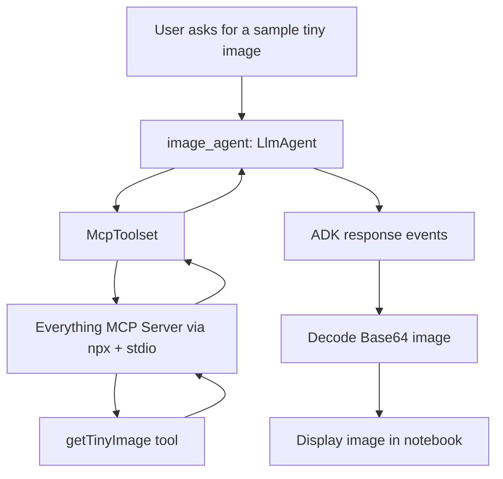
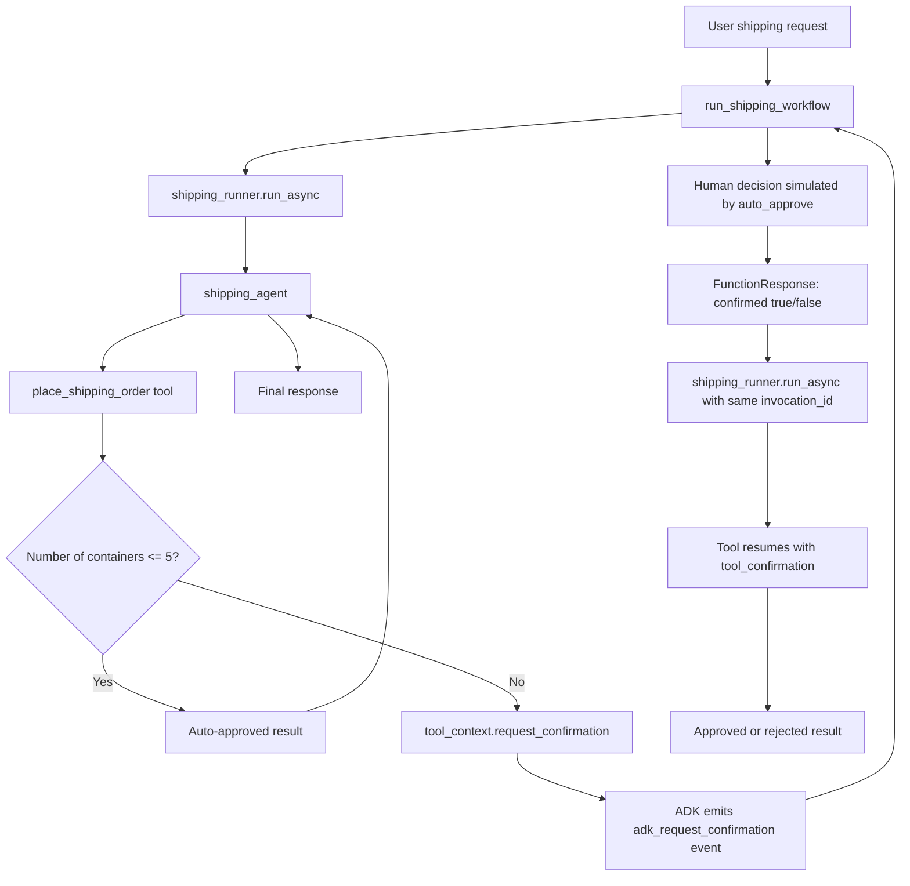

# Day 2b — Agent Tools Best Practices: Cell-by-Cell Documentation

> **Notebook explained:** `agentic-ai-day-2b-agent-tools-best-practices.ipynb`  
> **Course context:** Kaggle / Google 5-Day Agents Intensive — Day 2  
> **Topic:** MCP integration, external tool servers, long-running operations, human approval, resumable workflows  
> **Format:** GitHub-ready Markdown documentation

---

## Table of Contents

1. [What this notebook teaches](#what-this-notebook-teaches)
2. [Notebook architecture at a glance](#notebook-architecture-at-a-glance)
3. [Important components](#important-components)
4. [Recommended execution order](#recommended-execution-order)
5. [Cell-by-cell documentation](#cell-by-cell-documentation)
6. [Core concepts explained](#core-concepts-explained)
7. [Common errors and fixes](#common-errors-and-fixes)
8. [Production-readiness notes](#production-readiness-notes)
9. [Final learning checklist](#final-learning-checklist)
10. [References](#references)

---

## What this notebook teaches

This notebook builds on the earlier Day 2a tool notebook.

Day 2a focused on **custom Python tools** and **agent-as-a-tool** composition. Day 2b moves into more production-like tool patterns:

1. **Model Context Protocol (MCP) integration**
   - Connect an ADK agent to an external MCP server.
   - Use `McpToolset` to expose MCP tools to an `LlmAgent`.
   - Call an MCP tool that returns a Base64-encoded image.
   - Decode and display the tool response.

2. **Long-running operations**
   - Build a tool that sometimes completes immediately and sometimes pauses.
   - Request human approval for high-risk or high-volume actions.
   - Detect ADK confirmation events.
   - Resume a paused agent execution using the same `invocation_id`.

3. **Workflow-level control**
   - Understand why a tool alone is not enough for human-in-the-loop workflows.
   - Add an `App` with `ResumabilityConfig`.
   - Use a `Runner`, `SessionService`, `Event` stream, and `FunctionResponse` to coordinate pause/resume behavior.

The key lesson is:

> Advanced agents need more than simple function calls. They need standardized external integrations, safe approval checkpoints, stateful execution, and workflow logic that can pause and resume correctly.

---

## Notebook architecture at a glance

### Part A — MCP image tool flow



### Part B — Long-running shipping workflow



### Why these patterns matter

| Problem | Pattern used in notebook | Why it helps |
|---|---|---|
| Need external tools without custom API clients | MCP + `McpToolset` | Standardizes tool discovery and invocation |
| Need rich tool responses | MCP content parts + Base64 decoding | Supports non-text outputs such as images |
| Need human approval before risky actions | `ToolContext.request_confirmation()` | Pauses execution safely |
| Need to resume after approval | `App` + `ResumabilityConfig` + `invocation_id` | Continues the same paused workflow |
| Need to inspect what happened | Event iteration | Lets the application detect pauses and print responses |

---

## Important components

| Component | Type | Defined in cell | Purpose |
|---|---:|---:|---|
| `GOOGLE_API_KEY` | Environment variable | 6 | Authenticates Gemini API calls |
| `retry_config` | `types.HttpRetryOptions` | 10 | Retries transient Gemini/API errors |
| `mcp_image_server` | `McpToolset` | 16 | Connects ADK to the Everything MCP server |
| `image_agent` | `LlmAgent` | 19 | Uses the MCP image tool |
| `runner` | `InMemoryRunner` | 21 | Runs the MCP image agent in-memory |
| `response` | list/stream of ADK events | 23 | Stores the debug run output |
| `LARGE_ORDER_THRESHOLD` | integer constant | 32 | Sets approval threshold at more than 5 containers |
| `place_shipping_order()` | function tool | 32 | Auto-approves small orders and pauses large ones |
| `shipping_agent` | `LlmAgent` | 37 | Uses the shipping-order tool |
| `shipping_app` | `App` | 39 | Wraps the agent in a resumable workflow container |
| `session_service` | `InMemorySessionService` | 41 | Stores sessions/events in memory |
| `shipping_runner` | `Runner` | 41 | Executes the resumable shipping app |
| `check_for_approval()` | helper function | 48 | Detects `adk_request_confirmation` events |
| `print_agent_response()` | helper function | 50 | Prints text parts from ADK events |
| `create_approval_response()` | helper function | 52 | Converts a human approval/rejection into a `FunctionResponse` |
| `run_shipping_workflow()` | async workflow function | 55 | Coordinates the full request → pause → approval → resume flow |

> The cell numbers above are 1-based and follow the order of cells in the notebook.

---

## Recommended execution order

Run the notebook from top to bottom.

The most important dependency chain is:

```text
API key setup
  → ADK imports
  → retry config
  → MCP toolset
  → MCP image agent
  → MCP runner
  → MCP test call
  → image decoding
  → shipping tool
  → shipping agent
  → resumable App
  → Runner + SessionService
  → helper functions
  → workflow function
  → demos
```

Running later cells before earlier cells will usually cause `NameError` exceptions because agents, tools, runners, or helper functions have not been defined yet.

---

# Cell-by-cell documentation

## Cell 1 — Copyright notice

**Type:** Markdown  
**Purpose:** Provides legal attribution.

This cell states that the notebook content is copyrighted by Google LLC. It has no execution impact.

---

## Cell 2 — Notebook title and learning objectives

**Type:** Markdown  
**Purpose:** Introduces the notebook as **Agent Tool Patterns and Best Practices**.

This cell explains the two major topics:

1. Consuming external MCP services.
2. Handling long-running operations that require external input.

It also lists the practical outcomes:

- Connect to MCP servers.
- Pause agent execution for human input.
- Build resumable workflows.
- Understand when these patterns should be used.

---

## Cell 3 — Kaggle Notebook startup instructions

**Type:** Markdown  
**Purpose:** Explains how to run the course notebook on Kaggle.

The cell covers:

- Verifying the Kaggle account.
- Creating an editable copy with **Copy and Edit**.
- Running cells in order.
- Using **Factory reset** if the environment gets stuck.
- Asking for help in Kaggle community channels.

This matters because the notebook is stateful. Later cells depend on variables and objects created by earlier cells.

---

## Cell 4 — Section 1 setup and dependency note

**Type:** Markdown  
**Purpose:** Starts the setup section.

The notebook notes that Kaggle already includes `google-adk` and its required dependencies.

For local development outside Kaggle, the equivalent install command is:

```bash
pip install google-adk
```

This cell does not execute code, but it clarifies that the notebook assumes ADK is already installed in the Kaggle runtime.

---

## Cell 5 — Configure Gemini API key instructions

**Type:** Markdown  
**Purpose:** Explains how to configure authentication.

The notebook uses the Gemini API, so it needs a valid API key.

The cell instructs the learner to:

1. Create an API key in Google AI Studio.
2. Add it to Kaggle Secrets with the exact name `GOOGLE_API_KEY`.
3. Attach the secret to the notebook.
4. Run the next code cell to load it into the environment.

The exact secret name matters. If the Kaggle secret is called something else, the next cell will fail.

---

## Cell 6 — Load `GOOGLE_API_KEY` from Kaggle Secrets

**Type:** Code  
**Main objects:** `GOOGLE_API_KEY`, `UserSecretsClient`, `os.environ`

```python
import os
from kaggle_secrets import UserSecretsClient

try:
    GOOGLE_API_KEY = UserSecretsClient().get_secret("GOOGLE_API_KEY")
    os.environ["GOOGLE_API_KEY"] = GOOGLE_API_KEY
    print("✅ Setup and authentication complete.")
except Exception as e:
    print(
        f"🔑 Authentication Error: Please make sure you have added 'GOOGLE_API_KEY' to your Kaggle secrets. Details: {e}"
    )
```

### What this cell does

This cell authenticates the notebook for Gemini API calls.

It:

1. Imports `os` to modify environment variables.
2. Imports `UserSecretsClient` from Kaggle.
3. Reads the Kaggle secret named `GOOGLE_API_KEY`.
4. Stores that value in `os.environ["GOOGLE_API_KEY"]`.
5. Prints a success message if the key is found.
6. Prints a helpful error message if the key is missing or inaccessible.

### Why it matters

The later `Gemini(...)` model objects need API credentials. By setting `GOOGLE_API_KEY` as an environment variable, the Google SDK and ADK can discover the key automatically.

### Expected output

```text
✅ Setup and authentication complete.
```

### Common failure

If you see an authentication error:

- Check that the secret name is exactly `GOOGLE_API_KEY`.
- Check that the secret is attached/enabled for the notebook.
- Restart or factory reset the notebook after changing secrets.

---

## Cell 7 — Import ADK components introduction

**Type:** Markdown  
**Purpose:** Explains that the next cell imports the notebook's ADK building blocks.

This cell is a conceptual bridge between authentication and coding. It prepares the reader for the imported modules used throughout both MCP and long-running-operation sections.

---

## Cell 8 — Import required Python, Gemini, ADK, MCP, and app classes

**Type:** Code  
**Main objects imported:** `uuid`, `types`, `LlmAgent`, `Gemini`, `Runner`, `InMemorySessionService`, `McpToolset`, `ToolContext`, `StdioConnectionParams`, `StdioServerParameters`, `App`, `ResumabilityConfig`, `FunctionTool`

```python
import uuid
from google.genai import types

from google.adk.agents import LlmAgent
from google.adk.models.google_llm import Gemini
from google.adk.runners import Runner
from google.adk.sessions import InMemorySessionService

from google.adk.tools.mcp_tool.mcp_toolset import McpToolset
from google.adk.tools.tool_context import ToolContext
from google.adk.tools.mcp_tool.mcp_session_manager import StdioConnectionParams
from mcp import StdioServerParameters

from google.adk.apps.app import App, ResumabilityConfig
from google.adk.tools.function_tool import FunctionTool
```

### What this cell does

This cell imports all major building blocks used later.

### Import breakdown

| Import | Purpose |
|---|---|
| `uuid` | Generates unique session IDs for shipping workflows |
| `google.genai.types` | Provides message/content objects such as `Content`, `Part`, `FunctionResponse`, and retry options |
| `LlmAgent` | Defines model-driven agents |
| `Gemini` | Configures Gemini model access inside ADK |
| `Runner` | Executes an agent or app with sessions |
| `InMemorySessionService` | Stores session data in memory for demos |
| `McpToolset` | Connects an ADK agent to MCP tools |
| `ToolContext` | Gives tools access to ADK runtime features such as confirmations |
| `StdioConnectionParams` | Configures a local stdio connection to an MCP server |
| `StdioServerParameters` | Defines the command and args used to launch the MCP server |
| `App` | Wraps agents as application-level workflows |
| `ResumabilityConfig` | Enables pause/resume behavior |
| `FunctionTool` | Wraps a Python function as an ADK tool |

### Expected output

```text
✅ ADK components imported successfully.
```

### Why it matters

The notebook combines several ADK layers:

- **Agent layer:** `LlmAgent`
- **Tool layer:** `McpToolset`, `FunctionTool`, `ToolContext`
- **Runtime layer:** `Runner`, `InMemorySessionService`
- **Application layer:** `App`, `ResumabilityConfig`

Understanding which layer each import belongs to makes the later code easier to follow.

---

## Cell 9 — Retry configuration introduction

**Type:** Markdown  
**Purpose:** Explains why retry behavior is useful.

LLM API calls can fail temporarily due to rate limits, overload, or service availability. Retry configuration prevents some transient errors from stopping the notebook immediately.

---

## Cell 10 — Configure retry options for Gemini calls

**Type:** Code  
**Main object:** `retry_config`

```python
retry_config = types.HttpRetryOptions(
    attempts=5,
    exp_base=7,
    initial_delay=1,
    http_status_codes=[429, 500, 503, 504],
)
```

### What this cell does

This cell creates a retry policy for Gemini model calls.

### Parameter explanation

| Parameter | Meaning |
|---|---|
| `attempts=5` | Try a request up to 5 times |
| `initial_delay=1` | Wait 1 second before the first retry |
| `exp_base=7` | Increase delay exponentially using base 7 |
| `http_status_codes=[429, 500, 503, 504]` | Retry rate-limit and temporary server errors |

### Why it matters

This retry policy is passed into the `Gemini(...)` model objects later:

```python
Gemini(model="gemini-2.5-flash-lite", retry_options=retry_config)
```

That makes both the image agent and the shipping agent more resilient to transient failures.

---

## Cell 11 — Section 2: Model Context Protocol

**Type:** Markdown  
**Purpose:** Introduces MCP.

This cell explains why MCP is useful: connecting agents to external systems such as GitHub, databases, and Slack normally requires custom API clients. MCP reduces this integration burden by standardizing how tools are exposed and invoked.

Key ideas:

- MCP is an open standard.
- MCP servers expose tools.
- Agents can connect to MCP servers instead of hand-writing every integration.
- Tool capabilities can scale by adding more servers.

---

## Cell 12 — How MCP works

**Type:** Markdown  
**Purpose:** Explains the MCP client-server model.

The cell presents this architecture:

```text
Agent / MCP client → standard MCP protocol → MCP servers
```

Important roles:

| Role | Meaning in this notebook |
|---|---|
| MCP client | The ADK agent/toolset side |
| MCP server | The external process exposing tools |
| Standard protocol | The common communication layer between client and server |

In this notebook, the ADK agent uses `McpToolset`, and the external server is the Everything MCP server launched by `npx`.

---

## Cell 13 — MCP usage workflow

**Type:** Markdown  
**Purpose:** Gives the high-level sequence for using MCP with an agent.

The workflow is:

1. Choose an MCP server and tool.
2. Create the MCP toolset.
3. Add the toolset to an agent.
4. Run and test the agent.

The rest of Section 2 follows this exact sequence.

---

## Cell 14 — Choose the Everything MCP Server

**Type:** Markdown  
**Purpose:** Selects the demo MCP server.

The notebook uses:

```text
@modelcontextprotocol/server-everything
```

This server is a test/demo server. It includes a small image tool, `getTinyImage`, that returns a 16×16 Base64-encoded test image.

Important warning:

> This server is for learning MCP. In production, you would use trusted MCP servers for real external systems such as internal APIs, maps, GitHub, databases, or enterprise tools.

---

## Cell 15 — Introduce `McpToolset`

**Type:** Markdown  
**Purpose:** Explains the next code cell.

This markdown cell says that `McpToolset` will:

- Run the MCP server through `npx`.
- Connect to the Everything MCP server.
- Filter the available tools down to `getTinyImage`.

The filtering is important because real MCP servers may expose many tools, and agents should only receive tools they actually need.

---

## Cell 16 — Create the MCP toolset

**Type:** Code  
**Main object:** `mcp_image_server`

```python
mcp_image_server = McpToolset(
    connection_params=StdioConnectionParams(
        server_params=StdioServerParameters(
            command="npx",
            args=[
                "-y",
                "@modelcontextprotocol/server-everything",
            ],
            tool_filter=["getTinyImage"],
        ),
        timeout=30,
    )
)
```

### What this cell does

This cell creates an ADK toolset that connects to a local MCP server process.

### Step-by-step explanation

1. `McpToolset(...)` creates a tool container ADK can give to an agent.
2. `StdioConnectionParams(...)` says communication will happen through standard input/output.
3. `StdioServerParameters(...)` defines how to launch the MCP server.
4. `command="npx"` uses Node's package runner.
5. `args=["-y", "@modelcontextprotocol/server-everything"]` launches the Everything MCP server and automatically confirms package execution.
6. `tool_filter=["getTinyImage"]` exposes only the tiny-image tool.
7. `timeout=30` gives the server up to 30 seconds for operations.

### Why it matters

This is the core MCP integration point. The agent does not need to know how to call the MCP server directly. ADK handles the connection, discovery, and tool execution through `McpToolset`.

### Expected output

```text
✅ MCP Tool created
```

### Common failure points

| Error source | Typical symptom | Fix |
|---|---|---|
| Node / `npx` unavailable | command not found | Use an environment with Node.js installed |
| No network access | npm package cannot download | Preinstall the server package or run in an environment with npm access |
| Wrong tool filter | tool never appears | Check the server's actual tool names |
| Server startup timeout | timeout error | Increase timeout or check package startup |

---

## Cell 17 — Behind-the-scenes MCP explanation

**Type:** Markdown  
**Purpose:** Explains what happens after creating the toolset.

The cell breaks the MCP connection into six stages:

1. Server launch.
2. Stdio handshake.
3. Tool discovery.
4. Tool registration with the agent.
5. Tool execution.
6. Response delivery.

This is important because `McpToolset` hides most of the integration complexity. The agent sees a normal tool, while ADK handles protocol communication in the background.

---

## Cell 18 — Add the MCP tool to an agent

**Type:** Markdown  
**Purpose:** Introduces the next code cell.

The cell says the MCP toolset will be added to the agent's `tools` list, and the agent's instruction will tell it to use the MCP tool for tiny-image requests.

---

## Cell 19 — Create `image_agent` with MCP integration

**Type:** Code  
**Main object:** `image_agent`

```python
image_agent = LlmAgent(
    model=Gemini(model="gemini-2.5-flash-lite", retry_options=retry_config),
    name="image_agent",
    instruction="Use the MCP Tool to generate images for user queries",
    tools=[mcp_image_server],
)
```

### What this cell does

This cell creates an ADK LLM agent that can call the MCP image tool.

### Parameter explanation

| Parameter | Meaning |
|---|---|
| `model=Gemini(...)` | Uses Gemini 2.5 Flash Lite as the reasoning model |
| `retry_options=retry_config` | Reuses the retry policy from Cell 10 |
| `name="image_agent"` | Gives the agent a stable identifier |
| `instruction=...` | Tells the agent when to use the MCP tool |
| `tools=[mcp_image_server]` | Makes the MCP toolset available to the agent |

### Why it matters

The MCP server is not called directly by your code. Instead:

1. The user asks the agent for an image.
2. The LLM decides to use the MCP tool.
3. ADK routes the tool call through `McpToolset`.
4. The MCP server returns the result.
5. The result is returned as part of ADK events.

---

## Cell 20 — Create runner introduction

**Type:** Markdown  
**Purpose:** Signals that the next cell will create a runner.

A runner is needed because defining an agent is not the same as executing it. The runner coordinates the actual invocation.

---

## Cell 21 — Create an in-memory runner for the image agent

**Type:** Code  
**Main object:** `runner`

```python
from google.adk.runners import InMemoryRunner

runner = InMemoryRunner(agent=image_agent)
```

### What this cell does

This cell creates an `InMemoryRunner` for the image agent.

### Why `InMemoryRunner` is used

`InMemoryRunner` is convenient for notebooks and quick experiments because it avoids explicit session-service setup. It is appropriate here because the MCP image example is simple and does not need persistent state.

### Difference from the later `Runner`

Later, the notebook uses:

```python
Runner(app=shipping_app, session_service=session_service)
```

That is more explicit and is needed for resumable long-running workflows.

---

## Cell 22 — Test the MCP agent introduction

**Type:** Markdown  
**Purpose:** Explains that the next cell asks the image agent to generate an image.

The important behavior to watch for is not just the final answer, but the intermediate tool call. With `verbose=True`, the debug run prints when the agent calls the MCP tool and what tool result returns.

---

## Cell 23 — Run the MCP image agent with `run_debug()`

**Type:** Code  
**Main object:** `response`

```python
response = await runner.run_debug("Provide a sample tiny image", verbose=True)
```

### What this cell does

This cell sends a test prompt to `image_agent`.

### What happens internally

1. `runner.run_debug(...)` creates or uses a debug session.
2. The user message is sent to the agent.
3. The agent sees that it needs to generate or provide an image.
4. The agent calls the MCP tool.
5. The MCP server returns a response with both text and image content.
6. The debug output prints tool calls, tool results, and final text.

### Expected output pattern

The attached notebook output shows a pattern like:

```text
User > Provide a sample tiny image
image_agent > [Calling tool: get-tiny-image({})]
image_agent > [Tool result: {'content': [{'type': 'text', ...}, {'type': 'image', 'data': ...}]}]
image_agent > Here's the image you requested:
The image above is the MCP logo.
```

### Warning you may see

You may see warnings about non-text parts in the response. That is expected here because the MCP tool returns image data in addition to text.

---

## Cell 24 — Display the image introduction

**Type:** Markdown  
**Purpose:** Explains that the MCP server returns Base64-encoded image data.

The next cell extracts the image from the ADK/MCP response structure, decodes it, and displays it in the notebook.

---

## Cell 25 — Decode and display the Base64 image

**Type:** Code  
**Main objects:** `display`, `IPImage`, `base64`

```python
from IPython.display import display, Image as IPImage
import base64

for event in response:
    if event.content and event.content.parts:
        for part in event.content.parts:
            if hasattr(part, "function_response") and part.function_response:
                for item in part.function_response.response.get("content", []):
                    if item.get("type") == "image":
                        display(IPImage(data=base64.b64decode(item["data"])))
```

### What this cell does

This cell searches the ADK response events for image content and displays it.

### Step-by-step explanation

1. Imports `display` and `IPImage` from IPython.
2. Imports Python's `base64` module.
3. Iterates over all events in `response`.
4. Checks whether each event has content parts.
5. Finds parts that contain a `function_response`.
6. Looks inside `function_response.response["content"]`.
7. Filters for content items where `type == "image"`.
8. Decodes the Base64 string in `item["data"]`.
9. Displays the decoded bytes as an image.

### Why the loops are nested

ADK responses are event-based. A single response can contain multiple events, and each event can contain multiple parts. Tool outputs may appear as function-response parts rather than plain text.

### Expected output

The notebook displays the small image returned by the MCP server.

### Common failure

If no image appears:

- Confirm Cell 23 ran successfully.
- Inspect the raw `response`.
- Check whether the MCP server returned an item with `"type": "image"`.
- Confirm the Base64 string exists in `item["data"]`.

---

## Cell 26 — Extending to other MCP servers

**Type:** Markdown  
**Purpose:** Shows that the same MCP pattern can connect to other servers.

The notebook provides a Kaggle MCP connection example using:

```python
npx -y mcp-remote https://www.kaggle.com/mcp
```

It lists possible capabilities such as:

- Searching and downloading Kaggle datasets.
- Accessing notebook metadata.
- Querying competition information.

The important idea is that only the connection configuration changes. The agent-side pattern remains the same:

```python
tools=[some_mcp_toolset]
```

---

## Cell 27 — GitHub MCP Server example

**Type:** Markdown  
**Purpose:** Shows an HTTP-based MCP example.

This cell demonstrates that not all MCP servers need to run locally over stdio. Some can use HTTP-based transport with headers, tokens, and configuration.

The example includes:

- `StreamableHTTPServerParams`
- GitHub Copilot MCP endpoint
- Authorization header
- Read-only mode

This is not executed in the notebook, but it shows how production integrations often require authentication and careful scoping.

---

## Cell 28 — Section 3: Long-running operations

**Type:** Markdown  
**Purpose:** Introduces human-in-the-loop long-running operations.

The cell contrasts two flows:

### Immediate tool flow

```text
User asks → Agent calls tool → Tool returns result → Agent responds
```

### Long-running approval flow

```text
User asks → Agent calls tool → Tool pauses and asks human
→ Human approves/rejects → Tool completes → Agent responds
```

The notebook uses shipping orders as the example domain.

---

## Cell 29 — When to use long-running operations

**Type:** Markdown  
**Purpose:** Lists use cases for approval-based or delayed tools.

Examples include:

- Financial transactions.
- Bulk deletes.
- Compliance checkpoints.
- High-cost cloud operations.
- Irreversible account or data changes.

The core rule is:

> Use long-running operations when the agent should not complete the action without external approval or external completion.

---

## Cell 30 — What the notebook is building

**Type:** Markdown  
**Purpose:** Defines the shipping-agent scenario.

The planned behavior:

| Order size | Behavior |
|---|---|
| `≤ 5` containers | Auto-approved |
| `> 5` containers | Pause and request approval |
| Human approves | Complete order |
| Human rejects | Cancel/reject order |

This cell frames the rest of the notebook.

---

## Cell 31 — Introduce the shipping tool and `ToolContext`

**Type:** Markdown  
**Purpose:** Explains the role of `ToolContext`.

The next code cell defines the shipping tool.

The key signature feature is:

```python
tool_context: ToolContext
```

ADK injects this object when the tool is called.

`ToolContext` is used for two important capabilities:

1. Request approval with `tool_context.request_confirmation(...)`.
2. Read approval status with `tool_context.tool_confirmation`.

---

## Cell 32 — Define `place_shipping_order()` with approval logic

**Type:** Code  
**Main objects:** `LARGE_ORDER_THRESHOLD`, `place_shipping_order()`

```python
LARGE_ORDER_THRESHOLD = 5

def place_shipping_order(
    num_containers: int, destination: str, tool_context: ToolContext
) -> dict:
    ...
```

### What this cell does

This cell defines the core long-running tool.

It handles three scenarios:

1. Small order: approve immediately.
2. Large order, first call: pause and request approval.
3. Large order, resumed call: complete or reject based on human decision.

### Scenario 1 — Small orders

```python
if num_containers <= LARGE_ORDER_THRESHOLD:
    return {
        "status": "approved",
        "order_id": f"ORD-{num_containers}-AUTO",
        ...
    }
```

If the number of containers is 5 or fewer, the tool returns immediately with an approved status and an auto-generated order ID.

No human approval is needed.

### Scenario 2 — Large order, first call

```python
if not tool_context.tool_confirmation:
    tool_context.request_confirmation(
        hint=f"⚠️ Large order: {num_containers} containers to {destination}. Do you want to approve?",
        payload={"num_containers": num_containers, "destination": destination},
    )
    return {
        "status": "pending",
        "message": f"Order for {num_containers} containers requires approval",
    }
```

If the order is larger than the threshold and no confirmation exists yet:

1. The tool calls `request_confirmation()`.
2. ADK creates a confirmation request event.
3. The tool returns `"status": "pending"`.
4. The workflow must detect that approval is needed.

The `hint` is the human-readable approval prompt. The `payload` carries structured context about the request.

### Scenario 3 — Large order, resumed call

```python
if tool_context.tool_confirmation.confirmed:
    return {
        "status": "approved",
        "order_id": f"ORD-{num_containers}-HUMAN",
        ...
    }
else:
    return {
        "status": "rejected",
        ...
    }
```

When the workflow resumes, `tool_context.tool_confirmation` is populated.

If the human approved, the tool returns an approved order. If rejected, it returns a rejected status.

### Why this is a long-running tool pattern

The same tool can be called twice:

1. First call: detects approval is needed and pauses.
2. Second call: receives the approval decision and completes.

### Expected output

```text
✅ Long-running functions created!
```

### Important design note

Any real-world tool that might run more than once must be designed carefully. If the tool charges money, creates orders, sends emails, or deletes data, make it idempotent so a resume/retry cannot accidentally repeat the side effect.

---

## Cell 33 — Understanding the shipping tool

**Type:** Markdown  
**Purpose:** Introduces a visual breakdown of the long-running tool.

The diagram linked in this cell shows how the tool transitions through:

1. Initial call.
2. Approval request.
3. Resume with confirmation.
4. Final approved/rejected result.

---

## Cell 34 — Three-scenario breakdown

**Type:** Markdown  
**Purpose:** Explains the three control paths in `place_shipping_order()`.

The cell clarifies the key condition:

```python
if not tool_context.tool_confirmation:
```

This condition separates the **first large-order call** from the **resumed large-order call**.

The key insight is:

> `request_confirmation()` does not complete the workflow by itself. Your application workflow must detect the confirmation event and resume the execution.

---

## Cell 35 — Create the agent, app, and runner

**Type:** Markdown  
**Purpose:** Starts the setup for running the shipping tool.

The notebook now moves from defining the tool to wiring it into an executable ADK workflow.

---

## Cell 36 — Create the shipping agent introduction

**Type:** Markdown  
**Purpose:** Explains that the tool will be added to an agent.

The agent will decide when to call `place_shipping_order`, but the tool itself decides whether approval is needed.

This division of responsibility is important:

| Responsibility | Component |
|---|---|
| Understand user request | `shipping_agent` |
| Extract number of containers and destination | `shipping_agent` |
| Apply approval rule | `place_shipping_order()` |
| Pause and request confirmation | `ToolContext` inside the tool |

---

## Cell 37 — Create `shipping_agent`

**Type:** Code  
**Main object:** `shipping_agent`

```python
shipping_agent = LlmAgent(
    name="shipping_agent",
    model=Gemini(model="gemini-2.5-flash-lite", retry_options=retry_config),
    instruction="""You are a shipping coordinator assistant.
    ...
    """,
    tools=[FunctionTool(func=place_shipping_order)],
)
```

### What this cell does

This cell creates an LLM agent that can place shipping orders by using the `place_shipping_order` tool.

### Key configuration

| Parameter | Purpose |
|---|---|
| `name="shipping_agent"` | Names the agent for ADK runtime/events |
| `model=Gemini(...)` | Uses Gemini as the reasoning model |
| `instruction=...` | Defines the shipping coordinator behavior |
| `tools=[FunctionTool(...)]` | Makes the Python shipping function callable by the agent |

### Why `FunctionTool` is used

`FunctionTool` wraps a Python function so the model can call it as a structured tool. The function signature and docstring help ADK expose the tool schema to the model.

### Instruction behavior

The instruction tells the agent to:

1. Use the shipping tool for shipping requests.
2. Inform the user if approval is required.
3. Summarize the final status after completion.
4. Keep responses concise.

### Expected output

```text
✅ Shipping Agent created!
```

---

## Cell 38 — Wrap the agent in a resumable app introduction

**Type:** Markdown  
**Purpose:** Explains why an `App` is needed.

The cell states the problem:

> A regular `LlmAgent` call is not enough for a paused workflow because the execution needs to remember where it stopped.

The solution is to wrap the root agent in an `App` and enable resumability.

The app-level wrapper preserves enough execution context to resume the workflow later.

---

## Cell 39 — Create `shipping_app` with resumability enabled

**Type:** Code  
**Main object:** `shipping_app`

```python
shipping_app = App(
    name="shipping_coordinator",
    root_agent=shipping_agent,
    resumability_config=ResumabilityConfig(is_resumable=True),
)
```

### What this cell does

This cell creates a resumable ADK application.

### Parameter explanation

| Parameter | Meaning |
|---|---|
| `name="shipping_coordinator"` | Application name used when creating sessions |
| `root_agent=shipping_agent` | The main agent for this app |
| `resumability_config=...` | Enables resume behavior |

### Why it matters

For long-running operations, the workflow needs to remember:

- The conversation messages.
- Which tool was called.
- Tool arguments.
- Where execution paused.
- Which `invocation_id` should be resumed.

`App` provides the application-level container for this behavior.

### Expected output

```text
✅ Resumable app created!
```

### Warning you may see

The attached notebook shows an experimental-feature warning for `ResumabilityConfig`. That means the API can change in future ADK versions. Pin your ADK version for reproducible projects.

---

## Cell 40 — Create session and runner introduction

**Type:** Markdown  
**Purpose:** Explains that the runner should receive the app, not just the agent.

The notebook explicitly says:

```python
app=shipping_app
```

instead of:

```python
agent=shipping_agent
```

This is necessary because the runner needs the app's resumability configuration.

---

## Cell 41 — Create `InMemorySessionService` and `shipping_runner`

**Type:** Code  
**Main objects:** `session_service`, `shipping_runner`

```python
session_service = InMemorySessionService()

shipping_runner = Runner(
    app=shipping_app,
    session_service=session_service,
)
```

### What this cell does

This cell creates the runtime objects needed to execute the resumable shipping workflow.

### Component roles

| Component | Role |
|---|---|
| `InMemorySessionService()` | Stores session events/state in memory |
| `Runner(...)` | Executes the app and yields events |
| `app=shipping_app` | Gives the runner the resumable app |
| `session_service=session_service` | Provides event/session storage |

### Expected output

```text
✅ Runner created!
```

### Important limitation

`InMemorySessionService` is fine for demos, but it loses data when the notebook kernel restarts. A production app needs durable session storage.

---

## Cell 42 — Recap of completed shipping setup

**Type:** Markdown  
**Purpose:** Confirms that the pausable shipping agent is now assembled.

By this point, the notebook has:

1. A pausable function tool.
2. An agent that can use the tool.
3. A resumable app.
4. A runner that can execute the app.

The next step is workflow code that detects pauses and sends approval decisions back.

---

## Cell 43 — Section 4: Building the workflow

**Type:** Markdown  
**Purpose:** Introduces workflow orchestration.

The cell notes that this section uses ADK runtime concepts:

- Sessions
- Runners
- Events

It also points out that Day 3 covers state and memory more deeply. For this notebook, only the pieces needed for long-running operations are used.

---

## Cell 44 — Critical workflow responsibility

**Type:** Markdown  
**Purpose:** States that pause/resume is not automatic at the application level.

Every human-in-the-loop workflow must:

1. Detect the pause.
2. Get the human decision.
3. Resume the agent with the saved `invocation_id`.

This is a central lesson of the notebook. ADK can emit the confirmation event, but the application must handle it.

---

## Cell 45 — Key technical concepts

**Type:** Markdown  
**Purpose:** Defines `events`, `adk_request_confirmation`, and `invocation_id`.

### `events`

ADK emits events as the agent runs. Events can represent:

- User messages.
- Model responses.
- Tool calls.
- Tool results.
- Confirmation requests.

### `adk_request_confirmation`

This special function-call event indicates that a tool requested approval and the workflow should pause.

### `invocation_id`

Every `run_async()` call has an invocation ID. When resuming, the workflow passes the same ID so ADK knows this is a continuation, not a new execution.

---

## Cell 46 — Helper functions section

**Type:** Markdown  
**Purpose:** Introduces helper functions for processing event streams.

Instead of placing event-parsing logic directly inside the demo code, the notebook defines small helpers:

- `check_for_approval()`
- `print_agent_response()`
- `create_approval_response()`

This makes the final workflow function easier to read.

---

## Cell 47 — Introduce `check_for_approval()`

**Type:** Markdown  
**Purpose:** Explains the helper that detects pauses.

The helper searches through all events and looks for the special `adk_request_confirmation` function call.

If found, it returns the confirmation request ID and the `invocation_id`.

---

## Cell 48 — Define `check_for_approval()`

**Type:** Code  
**Main object:** `check_for_approval`

```python
def check_for_approval(events):
    for event in events:
        if event.content and event.content.parts:
            for part in event.content.parts:
                if (
                    part.function_call
                    and part.function_call.name == "adk_request_confirmation"
                ):
                    return {
                        "approval_id": part.function_call.id,
                        "invocation_id": event.invocation_id,
                    }
    return None
```

### What this cell does

This helper detects whether the agent paused for approval.

### Step-by-step explanation

1. Iterates through each event.
2. Checks whether the event has content.
3. Iterates through the event's parts.
4. Looks for a `function_call`.
5. Checks whether the function call name is `adk_request_confirmation`.
6. If found, returns:
   - `approval_id`: the ID of the confirmation request.
   - `invocation_id`: the execution ID needed for resume.
7. Returns `None` if no approval request is found.

### Why it matters

The workflow cannot resume correctly unless it captures the `invocation_id`. Without it, ADK would treat the next call as a new invocation.

### Production note

In a UI application, this function's result would typically trigger an approval screen or notification.

---

## Cell 49 — Introduce `print_agent_response()`

**Type:** Markdown  
**Purpose:** Explains a helper for printing text output.

ADK events can contain many types of parts, not just text. This helper extracts only text parts and prints them.

---

## Cell 50 — Define `print_agent_response()`

**Type:** Code  
**Main object:** `print_agent_response`

```python
def print_agent_response(events):
    """Print agent's text responses from events."""
    for event in events:
        if event.content and event.content.parts:
            for part in event.content.parts:
                if part.text:
                    print(f"Agent > {part.text}")
```

### What this cell does

This helper prints text messages produced by the agent.

### Why it matters

During an ADK run, events may contain:

- Tool calls.
- Tool responses.
- Confirmation requests.
- Final text.

This helper ignores non-text parts and prints only human-readable text.

### Limitation

If an agent produces no text part, this function prints nothing. In the attached notebook run, the small-order demo printed the user request and separators but did not show a final text line. In that case, inspect the raw events to debug whether the model returned text or only tool events.

---

## Cell 51 — Introduce `create_approval_response()`

**Type:** Markdown  
**Purpose:** Explains how the simulated human decision is formatted.

ADK does not resume from a plain string like `"yes"`. It expects a structured `FunctionResponse` that corresponds to the original confirmation request.

---

## Cell 52 — Define `create_approval_response()`

**Type:** Code  
**Main object:** `create_approval_response`

```python
def create_approval_response(approval_info, approved):
    confirmation_response = types.FunctionResponse(
        id=approval_info["approval_id"],
        name="adk_request_confirmation",
        response={"confirmed": approved},
    )
    return types.Content(
        role="user", parts=[types.Part(function_response=confirmation_response)]
    )
```

### What this cell does

This helper converts a human approval decision into the format ADK expects.

### Step-by-step explanation

1. Builds a `types.FunctionResponse`.
2. Uses the same `approval_id` captured from the confirmation request.
3. Uses the name `adk_request_confirmation`.
4. Stores the human decision as:
   ```python
   {"confirmed": approved}
   ```
5. Wraps the function response in a user `Content` object.
6. Returns that content so it can be passed to `runner.run_async()`.

### Why the ID matters

The `id` connects the response to the exact confirmation request. If the ID does not match, ADK may not treat it as the answer to the pending approval.

### Expected output

```text
✅ Helper functions defined
```

---

## Cell 53 — Introduce the workflow function

**Type:** Markdown  
**Purpose:** Explains that the next code cell ties everything together.

The workflow function will:

- Create a session.
- Send the user request.
- Collect events.
- Detect approval requests.
- Simulate a human decision.
- Resume when needed.
- Print the final answer.

---

## Cell 54 — Workflow diagram

**Type:** Markdown  
**Purpose:** Displays a diagram of the long-running operation workflow.

The image illustrates how control moves between:

- User.
- Workflow function.
- Runner.
- Agent.
- Tool.
- Approval event.
- Human decision.
- Resume call.

This is the visual version of the logic implemented in the next cell.

---

## Cell 55 — Define `run_shipping_workflow()`

**Type:** Code  
**Main object:** `run_shipping_workflow`

```python
async def run_shipping_workflow(query: str, auto_approve: bool = True):
    ...
```

### What this cell does

This cell defines the full orchestration function for the long-running shipping workflow.

It is the most important cell in the notebook because it shows how application code handles a pause/resume workflow.

### Step 1 — Print request and create a unique session ID

```python
print(f"\n{'='*60}")
print(f"User > {query}\n")

session_id = f"order_{uuid.uuid4().hex[:8]}"
```

Each workflow run gets a unique session ID such as:

```text
order_a1b2c3d4
```

This keeps separate demo runs from mixing their event histories.

### Step 2 — Create an ADK session

```python
await session_service.create_session(
    app_name="shipping_coordinator", user_id="test_user", session_id=session_id
)
```

This creates a session for the app.

The `app_name` must match the app name from Cell 39:

```python
name="shipping_coordinator"
```

### Step 3 — Convert the user query into ADK content

```python
query_content = types.Content(role="user", parts=[types.Part(text=query)])
```

ADK expects structured content, not just a raw string, when using the lower-level runner API.

### Step 4 — Run the agent and collect events

```python
events = []

async for event in shipping_runner.run_async(
    user_id="test_user", session_id=session_id, new_message=query_content
):
    events.append(event)
```

This starts the initial agent execution.

The agent may either:

- Complete immediately.
- Pause by emitting an `adk_request_confirmation` event.

### Step 5 — Detect whether approval is needed

```python
approval_info = check_for_approval(events)
```

If the tool requested confirmation, this returns:

```python
{
    "approval_id": "...",
    "invocation_id": "..."
}
```

If no approval is needed, it returns `None`.

### Step 6A — Approval path

```python
if approval_info:
    print(f"⏸️  Pausing for approval...")
    print(f"🤔 Human Decision: {'APPROVE ✅' if auto_approve else 'REJECT ❌'}\n")
```

This branch handles large orders.

The notebook simulates a human decision with the `auto_approve` argument:

| `auto_approve` | Simulated human decision |
|---|---|
| `True` | Approve |
| `False` | Reject |

Then it resumes the same execution:

```python
async for event in shipping_runner.run_async(
    user_id="test_user",
    session_id=session_id,
    new_message=create_approval_response(approval_info, auto_approve),
    invocation_id=approval_info["invocation_id"],
):
    ...
```

The critical argument is:

```python
invocation_id=approval_info["invocation_id"]
```

That tells ADK to resume the paused invocation instead of starting from scratch.

### Step 6B — No-approval path

```python
else:
    print_agent_response(events)
```

If approval was not needed, the workflow simply prints any text responses from the initial event list.

### Expected output

```text
✅ Workflow function ready
```

### Why this function is important

The function demonstrates that long-running operation support requires cooperation between:

| Layer | Responsibility |
|---|---|
| Tool | Calls `request_confirmation()` |
| ADK runtime | Emits confirmation event and supports resume |
| App | Enables resumability |
| Session service | Stores event/session history |
| Workflow code | Detects event, obtains decision, resumes |
| Human/UI | Approves or rejects |

---

## Cell 56 — Code breakdown markdown

**Type:** Markdown  
**Purpose:** Summarizes the workflow function.

This cell restates the three main phases:

1. Send initial request.
2. Detect pause.
3. Resume execution if approval is needed.

It also names the two paths:

| Path | Meaning |
|---|---|
| Path A | Large order pauses and resumes |
| Path B | Small order completes without approval |

---

## Cell 57 — Demo testing introduction

**Type:** Markdown  
**Purpose:** Prepares the learner to run three demo cases.

The cell explains that `run_shipping_workflow()` hides the low-level pause/resume mechanics so the demo can focus on user requests.

It also warns that non-text-part warnings are normal because agents may call tools in addition to producing text.

---

## Cell 58 — Run the three shipping workflow demos

**Type:** Code  
**Main calls:** `run_shipping_workflow(...)`

```python
await run_shipping_workflow("Ship 3 containers to Singapore")

await run_shipping_workflow("Ship 10 containers to Rotterdam", auto_approve=True)

await run_shipping_workflow("Ship 8 containers to Los Angeles", auto_approve=False)
```

### What this cell does

This cell tests all important paths.

### Demo 1 — Small order

```python
await run_shipping_workflow("Ship 3 containers to Singapore")
```

Expected tool behavior:

- `num_containers = 3`
- `3 <= 5`
- Tool auto-approves.
- No confirmation event should be required.

Expected order ID pattern:

```text
ORD-3-AUTO
```

In the attached run, this demo printed the user request and separators, but did not show a final agent text line. If that happens, inspect the raw events to see whether the model produced only tool-related events.

### Demo 2 — Large order approved

```python
await run_shipping_workflow("Ship 10 containers to Rotterdam", auto_approve=True)
```

Expected behavior:

1. Tool detects a large order.
2. Tool requests confirmation.
3. Workflow detects the approval event.
4. Simulated human approves.
5. Workflow resumes with the same `invocation_id`.
6. Tool returns approved status.

Expected order ID pattern:

```text
ORD-10-HUMAN
```

Attached output pattern:

```text
⏸️  Pausing for approval...
🤔 Human Decision: APPROVE ✅

Agent > The order for 10 containers to Rotterdam has been approved. The order ID is ORD-10-HUMAN.
```

### Demo 3 — Large order rejected

```python
await run_shipping_workflow("Ship 8 containers to Los Angeles", auto_approve=False)
```

Expected behavior:

1. Tool detects a large order.
2. Tool requests confirmation.
3. Workflow detects the approval event.
4. Simulated human rejects.
5. Workflow resumes with the same `invocation_id`.
6. Tool returns rejected status.

Attached output pattern:

```text
⏸️  Pausing for approval...
🤔 Human Decision: REJECT ❌

Agent > Shipping order for 8 containers to Los Angeles has been rejected.
```

### Warnings you may see

The notebook may print experimental-feature warnings for confirmation/resumability classes. These warnings do not necessarily mean the demo failed; they mean the APIs may change in future versions.

---

## Cell 59 — Optional complete execution trace

**Type:** Markdown  
**Purpose:** Gives a timeline for the large-order approval case.

The trace explains what happens for:

```python
run_shipping_workflow("Ship 10 containers to Rotterdam", auto_approve=True)
```

The most important point is:

> The tool pauses at the confirmation request, and the workflow later resumes using the same `invocation_id`.

The trace also clarifies that the tool is invoked again after approval, this time with `tool_context.tool_confirmation.confirmed = True`.

---

## Cell 60 — Section 5 summary

**Type:** Markdown  
**Purpose:** Summarizes the two advanced tool patterns.

| Pattern | Use when | Key ADK components |
|---|---|---|
| MCP integration | You need standardized external services | `McpToolset` |
| Long-running operations | You need pause/resume, human approval, or delayed completion | `ToolContext`, `request_confirmation`, `App`, `ResumabilityConfig` |

This cell also lists production-relevant capabilities:

- Scaling through community tools.
- Handling operations over time.
- Adding human oversight.
- Maintaining state across pauses.

---

## Cell 61 — Congratulations and next steps

**Type:** Markdown  
**Purpose:** Closes the notebook.

The cell states that no Kaggle submission is required and points learners to more resources.

It also recommends moving to Day 3, where state and memory management are covered in more depth.

---

## Cell 62 — Author attribution

**Type:** Markdown  
**Purpose:** Credits the notebook author.

This cell contains an HTML table listing the author, Laxmi Harikumar.

It has no effect on code execution.

---

# Core concepts explained

## 1. MCP integration

MCP lets an agent connect to external tools through a standardized protocol instead of custom integrations for every service.

In this notebook:

```python
McpToolset(...)
```

is the ADK-side wrapper, and:

```python
@modelcontextprotocol/server-everything
```

is the external MCP server.

The agent sees the tool through ADK's `tools` list:

```python
tools=[mcp_image_server]
```

## 2. Stdio MCP server

The notebook uses stdio transport:

```python
StdioConnectionParams(
    server_params=StdioServerParameters(
        command="npx",
        args=["-y", "@modelcontextprotocol/server-everything"],
        tool_filter=["getTinyImage"],
    )
)
```

This means ADK launches the server as a local process and communicates with it through standard input/output streams.

## 3. Event-based outputs

ADK runner calls produce events. Events can include:

- Text parts.
- Function calls.
- Function responses.
- Tool outputs.
- Confirmation requests.

That is why code repeatedly checks:

```python
if event.content and event.content.parts:
```

and then iterates through `parts`.

## 4. Long-running operation

A long-running operation is a tool call that cannot complete immediately.

In this notebook, large shipping orders pause because they need approval:

```python
tool_context.request_confirmation(...)
```

The tool first returns:

```python
{"status": "pending"}
```

Then, after approval, it returns either:

```python
{"status": "approved"}
```

or:

```python
{"status": "rejected"}
```

## 5. Resumability

Resumability means the workflow can continue from a paused or interrupted point instead of restarting.

The notebook enables this with:

```python
App(
    name="shipping_coordinator",
    root_agent=shipping_agent,
    resumability_config=ResumabilityConfig(is_resumable=True),
)
```

## 6. `invocation_id`

The `invocation_id` is the identity of a specific agent execution.

When resuming, this is essential:

```python
invocation_id=approval_info["invocation_id"]
```

Without this, the next call would be treated as a new run, not a continuation of the paused one.

## 7. Human approval as `FunctionResponse`

The human decision is represented as:

```python
types.FunctionResponse(
    id=approval_info["approval_id"],
    name="adk_request_confirmation",
    response={"confirmed": approved},
)
```

This response must match the original confirmation request.

---

# Common errors and fixes

| Problem | Likely cause | Fix |
|---|---|---|
| `Authentication Error` in Cell 6 | Kaggle secret missing or not attached | Add `GOOGLE_API_KEY` in Kaggle Secrets and enable it |
| `NameError: retry_config is not defined` | Cells run out of order | Run setup cells from the top |
| `npx: command not found` | Node.js unavailable | Use Kaggle environment or install Node.js locally |
| MCP server does not start | npm/network/server issue | Check internet access, package name, and timeout |
| No image displays | Response did not contain image content | Inspect `response` and check `function_response.response["content"]` |
| `adk_request_confirmation` not detected | Tool did not request approval or event parsing missed it | Confirm order size is greater than 5 and inspect events |
| Resume starts a new execution | Missing or wrong `invocation_id` | Pass the exact `invocation_id` from the approval event |
| Approval response ignored | Wrong confirmation ID/name | Use the original `approval_id` and name `adk_request_confirmation` |
| State disappears after restart | `InMemorySessionService` is temporary | Use durable session storage in production |
| Duplicate real-world side effects | Tool re-runs during resume/retry | Add idempotency keys and side-effect protection |

---

# Production-readiness notes

## 1. Do not expose every MCP tool by default

The notebook uses:

```python
tool_filter=["getTinyImage"]
```

This is a good habit. Real MCP servers may expose powerful tools. Give agents only the tools they need.

## 2. Treat MCP tools as privileged integrations

MCP tools can access data or execute actions. Production systems should include:

- Explicit user consent.
- Access controls.
- Tool allowlists.
- Logging and audit trails.
- Clear UI descriptions before actions.

## 3. Make long-running tools idempotent

ADK resume/retry behavior may cause tools to be called more than once. Any tool that creates orders, charges money, deletes records, sends emails, or triggers external side effects should include:

- Request IDs.
- Idempotency keys.
- Duplicate detection.
- Transaction status checks.

## 4. Replace simulated approval with real approval UI

The notebook uses:

```python
auto_approve=True
```

or:

```python
auto_approve=False
```

A production app should instead:

1. Show the approval hint and payload to a human.
2. Wait for a real decision.
3. Store the decision securely.
4. Resume with the saved `invocation_id`.

## 5. Use persistent sessions

`InMemorySessionService` is suitable for demos. Production systems should use durable storage so workflows can resume after process restarts, deployments, or crashes.

## 6. Add observability

Log at least:

- User request.
- Tool call name.
- Tool arguments.
- Confirmation payload.
- Human approver.
- Approval decision.
- `invocation_id`.
- Final tool result.

This makes long-running operations auditable and debuggable.

---

# Final learning checklist

Use this checklist to confirm you understood the notebook.

## MCP section

- [ ] I can explain what an MCP server is.
- [ ] I can explain why `McpToolset` is used.
- [ ] I understand why the notebook uses `npx`.
- [ ] I understand why `tool_filter` is important.
- [ ] I can trace how the image tool response becomes a displayed image.

## Long-running operation section

- [ ] I can explain why small orders complete immediately.
- [ ] I can explain why large orders pause.
- [ ] I understand what `ToolContext` provides.
- [ ] I know what `request_confirmation()` does.
- [ ] I know what `adk_request_confirmation` means.
- [ ] I can explain why `invocation_id` is required for resume.
- [ ] I can explain why approval is sent as a `FunctionResponse`.
- [ ] I understand the difference between a tool, an agent, an app, a runner, and a session service.

## Production section

- [ ] I know why real approval workflows need UI and persistence.
- [ ] I know why tools with side effects should be idempotent.
- [ ] I know why MCP tool access should be scoped and audited.
- [ ] I can describe how this notebook would change for a real shipping/order system.

---

# References

- [Kaggle — Day 2b: Agent Tools Best Practices](https://www.kaggle.com/code/kaggle5daysofai/day-2b-agent-tools-best-practices)
- [Kaggle — 5-Day AI Agents Intensive Course](https://www.kaggle.com/learn-guide/5-day-agents)
- [Google ADK — MCP tools](https://adk.dev/tools-custom/mcp-tools/)
- [Google ADK — Function tools](https://adk.dev/tools-custom/function-tools/)
- [Google ADK — Apps](https://adk.dev/apps/)
- [Google ADK — Resume agents](https://adk.dev/runtime/resume/)
- [Google ADK — Events](https://adk.dev/events/)
- [Model Context Protocol — Architecture overview](https://modelcontextprotocol.io/docs/learn/architecture)
- [Model Context Protocol — Specification](https://modelcontextprotocol.io/specification/2025-11-25)
