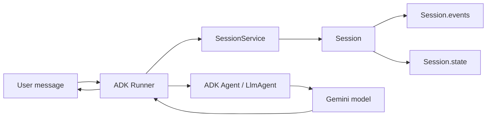
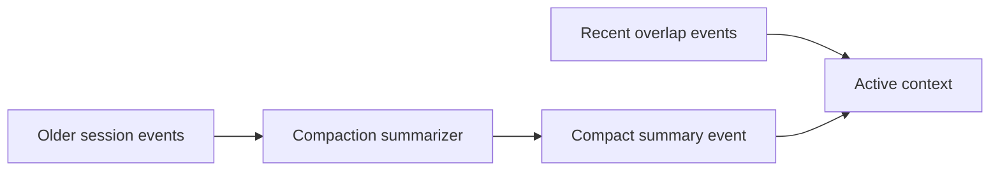
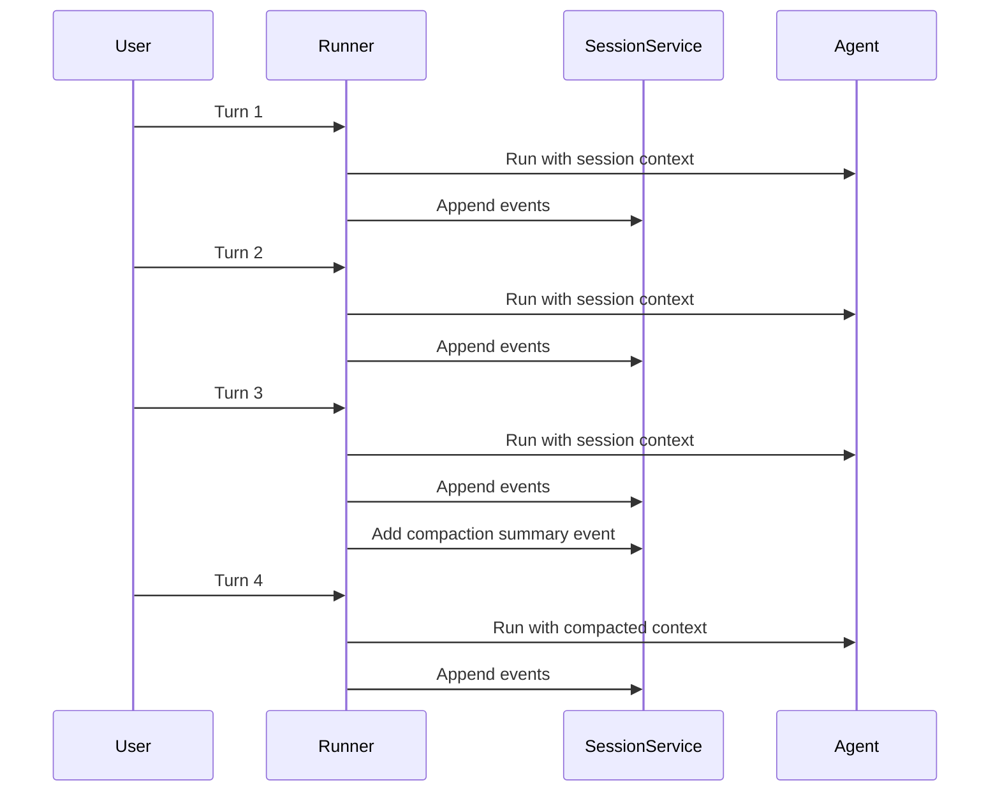

# Day 3a — Agent Sessions: Cell-by-Cell Documentation

> Notebook documented: `agentic-ai-day-3a-agent-sessions.ipynb`  
> Course context: Kaggle / Google 5-Day Agents Intensive — Day 3, Part 1  
> Topic: **Sessions, Events, Persistent Conversation History, Context Compaction, and Session State**

---

## Table of Contents

1. [Notebook Overview](#notebook-overview)
2. [Core Mental Model](#core-mental-model)
3. [Main ADK Components Used](#main-adk-components-used)
4. [Recommended Execution Path](#recommended-execution-path)
5. [Cell-by-Cell Documentation](#cell-by-cell-documentation)
   - [Cells 1–12: Setup](#cells-112-setup)
   - [Cells 13–24: In-Memory Session Management](#cells-1324-in-memory-session-management)
   - [Cells 25–37: Persistent Sessions with SQLite](#cells-2537-persistent-sessions-with-sqlite)
   - [Cells 38–50: Context Compaction](#cells-3850-context-compaction)
   - [Cells 51–63: Session State and State Tools](#cells-5163-session-state-and-state-tools)
   - [Cells 64–68: Cleanup and Summary](#cells-6468-cleanup-and-summary)
6. [Important Implementation Notes](#important-implementation-notes)
7. [Common Errors and Fixes](#common-errors-and-fixes)
8. [Learning Checklist](#learning-checklist)
9. [References](#references)

---

## Notebook Overview

This notebook teaches how an ADK-based agent can maintain useful conversational context across multiple user turns.

Large language models are stateless by default: every call sees only the input sent in that request. A real conversational agent needs additional infrastructure to remember previous turns, tool calls, and structured state. This notebook introduces that infrastructure through ADK **Sessions**.

### Notebook statistics

| Item | Count |
|---|---:|
| Total cells | 68 |
| Markdown cells | 44 |
| Code cells | 24 |

### What the notebook teaches

By the end of the notebook, you should understand:

| Concept | Meaning |
|---|---|
| Session | A single conversation thread for one user and one app/agent context |
| Events | Chronological records inside a session: user messages, agent responses, tool calls, tool responses, and system actions |
| State | A structured key-value store attached to the session/user/app scope |
| SessionService | The storage layer that creates, retrieves, and persists sessions |
| Runner | The execution layer that connects user input, session context, the agent, and streamed events |
| InMemorySessionService | Temporary session storage, useful for demos and tests |
| DatabaseSessionService | Persistent session storage backed by a database such as SQLite |
| Context Compaction | Summarizing older session events to reduce context size |
| ToolContext | The object tools can use to read and write session state |

---

## Core Mental Model

The notebook builds the following architecture gradually:



A session is not the model itself. A session is the conversation container that lets the runtime reconstruct relevant context for the model.

### Session identity

Most examples use this identity pattern:

```text
app_name + user_id + session_id
```

That means a session is retrieved by three dimensions:

| Identifier | Purpose |
|---|---|
| `app_name` | Which application owns the session |
| `user_id` | Which user owns the session |
| `session_id` | Which conversation thread is being resumed |

---

## Main ADK Components Used

| Component | Imported From | Used For |
|---|---|---|
| `Agent` | `google.adk.agents` | Simple LLM-backed agent definition |
| `LlmAgent` | `google.adk.agents` | LLM agent with tools and richer configuration |
| `App` | `google.adk.apps.app` | App-level workflow container, required here for context compaction |
| `EventsCompactionConfig` | `google.adk.apps.app` | Configures automatic event-history compaction |
| `Gemini` | `google.adk.models.google_llm` | Connects the ADK agent to a Gemini model |
| `InMemorySessionService` | `google.adk.sessions` | Temporary session storage in RAM |
| `DatabaseSessionService` | `google.adk.sessions` | Persistent session storage using a database URL |
| `Runner` | `google.adk.runners` | Runs the agent and streams ADK events |
| `ToolContext` | `google.adk.tools.tool_context` | Lets tools access session state |
| `types.Content` / `types.Part` | `google.genai.types` | Formats user messages for the Gemini/ADK runtime |
| `types.HttpRetryOptions` | `google.genai.types` | Configures retry behavior for transient API errors |

---

## Recommended Execution Path

Run the notebook in order, but treat some cells as optional experiments.

### Normal learning path

```text
1 → 12    Setup
13 → 20   Basic in-memory session demo
25 → 30   Persistent database session demo
33 → 37   Session isolation and SQLite inspection
38 → 46   Context compaction demo
51 → 63   Session state tools demo
65        Cleanup, only after all experiments
```

### Optional forgetfulness experiment

To see `InMemorySessionService` forget prior history:

1. Run setup and the in-memory demo.
2. Restart the notebook kernel.
3. Rerun setup cells, but do **not** rerun the earlier conversation cell.
4. Run the optional forgetfulness cell.

### Optional database resume experiment

To verify database persistence:

1. Run the persistent session setup and first conversation.
2. Restart the kernel.
3. Rerun setup and database session setup.
4. Do **not** delete `my_agent_data.db`.
5. Run the resume cell with the same `session_id`.

---

# Cell-by-Cell Documentation

## Cells 1–12: Setup

### Cell 1 — Copyright notice

**Type:** Markdown

This cell contains the Google copyright notice.

**Purpose:** It identifies the notebook ownership and licensing context.

---

### Cell 2 — Notebook title and learning objectives

**Type:** Markdown

This introduces the notebook as:

```text
Memory Management - Part 1 - Sessions
```

The notebook lists five goals:

1. Understand what sessions are.
2. Use sessions in an agent.
3. Build stateful agents with sessions and events.
4. Persist sessions in a database.
5. Use context-management techniques such as context compaction.
6. Share useful state safely across conversation turns.

**Key idea:** Day 3a focuses on **short-term conversational memory**. Day 3b moves into longer-term memory.

---

### Cell 3 — Kaggle notebook usage instructions

**Type:** Markdown

This cell explains how to work with Kaggle Notebooks:

| Step | Meaning |
|---|---|
| Verify your Kaggle account | Required for running course notebooks |
| Copy and Edit | Creates your editable copy of the notebook |
| Run cells in order | Prevents missing variables/imports |
| Factory reset | Useful when the notebook state becomes inconsistent |
| Kaggle Discord | Support channel if you get stuck |

**Why it matters:** This notebook depends on execution state. If cells are skipped or run out of order, variables like `session_service`, `runner`, `USER_ID`, or `retry_config` may not exist.

---

### Cell 4 — Section 1 setup and dependency note

**Type:** Markdown

This cell explains that Kaggle already includes `google-adk` and its dependencies for this course.

It also shows the installation command for local development:

```bash
pip install google-adk
```

**Important distinction:**

| Environment | What to do |
|---|---|
| Kaggle course notebook | Usually no ADK installation needed |
| Local machine / VS Code / Colab | Install `google-adk` manually |
| Later SQLite persistence section | Installs `aiosqlite` separately |

---

### Cell 5 — Configure Gemini API key

**Type:** Markdown

This cell explains how to authenticate the notebook.

The notebook expects a Kaggle secret named:

```text
GOOGLE_API_KEY
```

You must:

1. Create a Gemini API key in Google AI Studio.
2. Add it to Kaggle Secrets.
3. Enable the secret for this notebook.
4. Run the next code cell to load it into the environment.

**Security note:** Never hard-code API keys in a notebook or commit them to GitHub.

---

### Cell 6 — Load `GOOGLE_API_KEY` from Kaggle Secrets

**Type:** Code

```python
import os
from kaggle_secrets import UserSecretsClient

try:
    GOOGLE_API_KEY = UserSecretsClient().get_secret("GOOGLE_API_KEY")
    os.environ["GOOGLE_API_KEY"] = GOOGLE_API_KEY
    print("✅ Gemini API key setup complete.")
except Exception as e:
    print(
        f"🔑 Authentication Error: Please make sure you have added 'GOOGLE_API_KEY' to your Kaggle secrets. Details: {e}"
    )
```

#### What this cell does

1. Imports `os` so the notebook can set environment variables.
2. Imports `UserSecretsClient` to read Kaggle Secrets.
3. Reads the secret named `GOOGLE_API_KEY`.
4. Stores the key in `os.environ["GOOGLE_API_KEY"]`.
5. Prints a success message if authentication is ready.
6. Prints a clear error message if the secret is missing or not attached.

#### Why this is necessary

The Gemini client and ADK model wrapper need credentials. Setting the environment variable lets downstream code access the key without manually passing it everywhere.

#### Expected output

```text
✅ Gemini API key setup complete.
```

#### Common failure

```text
Authentication Error: Please make sure you have added 'GOOGLE_API_KEY'
```

This usually means:

- The secret name is misspelled.
- The checkbox next to the secret is not enabled.
- You are running a copied notebook without attaching the secret.

---

### Cell 7 — Import ADK components introduction

**Type:** Markdown

This cell introduces the next code cell, where all required ADK and Gemini components are imported.

**Purpose:** It explains that imports are grouped before the agent/session examples begin.

---

### Cell 8 — Import ADK, Gemini, session, runner, and type components

**Type:** Code

```python
from typing import Any, Dict

from google.adk.agents import Agent, LlmAgent
from google.adk.apps.app import App, EventsCompactionConfig
from google.adk.models.google_llm import Gemini
from google.adk.sessions import DatabaseSessionService
from google.adk.sessions import InMemorySessionService
from google.adk.runners import Runner
from google.adk.tools.tool_context import ToolContext
from google.genai import types

print("✅ ADK components imported successfully.")
```

#### What this cell does

This cell imports all building blocks used later in the notebook.

#### Import-by-import explanation

| Import | Purpose |
|---|---|
| `Any`, `Dict` | Type hints for tool return values |
| `Agent` | Basic ADK agent class |
| `LlmAgent` | ADK agent class used for LLM-driven behavior and tools |
| `App` | Application wrapper used later for compaction |
| `EventsCompactionConfig` | Enables automatic event history compaction |
| `Gemini` | ADK model wrapper for Gemini |
| `DatabaseSessionService` | Persistent session storage |
| `InMemorySessionService` | Temporary in-memory session storage |
| `Runner` | Runtime object that executes the agent |
| `ToolContext` | Gives tools access to state and runtime context |
| `types` | Gemini SDK types such as `Content`, `Part`, and retry settings |

#### Expected output

```text
✅ ADK components imported successfully.
```

---

### Cell 9 — Helper function overview

**Type:** Markdown

This cell introduces a helper function named `run_session()`.

The helper is designed to:

1. Create or retrieve a session.
2. Accept either one query or multiple queries.
3. Convert plain text into the ADK/Gemini message format.
4. Run the agent asynchronously.
5. Stream and print the agent response.

The examples show two valid calling styles:

```python
await run_session(runner, "What is the capital of France?", "geography-session")
await run_session(runner, ["Hello!", "What's my name?"], "user-intro-session")
```

---

### Cell 10 — Define reusable `run_session()` helper

**Type:** Code

```python
async def run_session(
    runner_instance: Runner,
    user_queries: list[str] | str = None,
    session_name: str = "default",
):
    ...
```

#### What this cell does

This is the main utility function used throughout the notebook. It hides repetitive runtime logic so the later cells can focus on session behavior.

#### Step-by-step behavior

| Step | Code behavior | Meaning |
|---|---|---|
| 1 | Prints the session name | Makes the output easier to read |
| 2 | Reads `runner_instance.app_name` | Uses the app name associated with the current runner |
| 3 | Calls `session_service.create_session(...)` | Tries to create a new session |
| 4 | Falls back to `session_service.get_session(...)` | Reuses an existing session if creation fails |
| 5 | Converts a string query into a list | Allows one function to support one or many turns |
| 6 | Wraps each query as `types.Content` | Converts text into the message object expected by ADK/Gemini |
| 7 | Calls `runner_instance.run_async(...)` | Streams the agent run as events |
| 8 | Prints non-empty text parts | Displays model text responses |

#### Important code fragment

```python
query = types.Content(role="user", parts=[types.Part(text=query)])
```

This converts a raw Python string into a Gemini-compatible content message.

#### Important code fragment

```python
async for event in runner_instance.run_async(
    user_id=USER_ID, session_id=session.id, new_message=query
):
```

This starts an asynchronous ADK run and yields events as they occur.

#### Global variables used by this helper

The function receives `runner_instance`, but it also depends on global variables:

| Global variable | Used for |
|---|---|
| `session_service` | Creating or retrieving sessions |
| `USER_ID` | Identifying the current user |
| `MODEL_NAME` | Printing the model label |

#### Expected output

```text
✅ Helper functions defined.
```

#### Production notes

This helper is useful for learning, but in production you would improve it by:

- Catching specific exceptions instead of using a bare `except`.
- Passing `session_service`, `USER_ID`, and `MODEL_NAME` explicitly instead of relying on globals.
- Checking `event.is_final_response()` if you only want final answers.
- Logging structured events instead of printing raw text.

---

### Cell 11 — Retry option explanation

**Type:** Markdown

This cell explains that LLM APIs can return transient errors such as:

- Rate limits
- Temporary service unavailability
- Gateway timeouts
- Server errors

Retry options help recover from those issues automatically.

---

### Cell 12 — Configure HTTP retry behavior

**Type:** Code

```python
retry_config = types.HttpRetryOptions(
    attempts=5,
    exp_base=7,
    initial_delay=1,
    http_status_codes=[429, 500, 503, 504],
)
```

#### What this cell does

This creates a retry configuration for Gemini model calls.

#### Parameter explanation

| Parameter | Meaning |
|---|---|
| `attempts=5` | Try the request up to five times |
| `initial_delay=1` | Wait one second before the first retry |
| `exp_base=7` | Increase retry delay exponentially |
| `http_status_codes=[429, 500, 503, 504]` | Retry only for rate-limit and temporary server errors |

#### Why these status codes matter

| Code | Typical meaning |
|---|---|
| `429` | Too many requests / rate limited |
| `500` | Internal server error |
| `503` | Service unavailable |
| `504` | Gateway timeout |

This configuration is passed into the Gemini model wrapper later:

```python
Gemini(model="gemini-2.5-flash-lite", retry_options=retry_config)
```

---

## Cells 13–24: In-Memory Session Management

### Cell 13 — Why sessions are needed

**Type:** Markdown

This cell introduces the core problem:

> LLMs are inherently stateless.

A raw model call does not automatically remember previous turns. It only knows what is included in the current request.

#### Key distinction introduced here

| ADK concept | Role |
|---|---|
| Sessions | Short-term memory for the current conversation |
| Memory | Long-term memory, covered in the next notebook |

**Important idea:** Day 3a is about conversation-level continuity, not full long-term personalization.

---

### Cell 14 — Definition of Session, Events, and State

**Type:** Markdown

This cell defines the core session model.

#### Session

A `Session` is a container for one continuous conversation.

It is tied to:

```text
app + user + session
```

#### Events

`Session.events` is the chronological event log.

Examples include:

| Event type | Example |
|---|---|
| User input | A text message from the user |
| Agent response | The model’s reply |
| Tool call | The agent requesting a function/tool |
| Tool output | The result returned by that tool |

#### State

`Session.state` is a key-value store.

It can hold dynamic structured information such as:

```python
{"user:name": "Arnab", "user:country": "India"}
```

**Important distinction:** Events capture the conversational timeline. State captures structured facts that tools/agents may need to reuse.

---

### Cell 15 — Session diagram

**Type:** Markdown

This cell displays an image showing that a session contains:

```text
Session
├── Session.Events
└── Session.State
```

The commented Mermaid diagram reinforces the same structure.

**Purpose:** It gives a visual model of the session object.

---

### Cell 16 — SessionService and Runner

**Type:** Markdown

This cell explains the two most important runtime pieces.

| Component | Responsibility |
|---|---|
| `SessionService` | Storage layer for sessions, events, and state |
| `Runner` | Orchestration layer that runs the agent with session context |

#### Analogy used in the notebook

| Analogy | ADK concept |
|---|---|
| Notebook | Session |
| Entries in the notebook | Events |
| Filing cabinet | SessionService |
| Assistant managing the conversation | Runner |

#### Practical meaning

When the user sends a message:

1. The `Runner` receives the message.
2. The `Runner` uses the `SessionService` to load session history/state.
3. The agent/model receives relevant context.
4. New events and state changes are written back to the session.

---

### Cell 17 — First stateful agent introduction

**Type:** Markdown

This cell introduces the first runnable session example.

The notebook starts with `InMemorySessionService`, which stores session data in RAM.

| Feature | InMemorySessionService |
|---|---|
| Easy to use | Yes |
| Requires external database | No |
| Survives kernel restart | No |
| Good for production persistence | No |
| Good for learning/prototyping | Yes |

---

### Cell 18 — Create the first stateful agent using `InMemorySessionService`

**Type:** Code

```python
APP_NAME = "default"
USER_ID = "default"
SESSION = "default"

MODEL_NAME = "gemini-2.5-flash-lite"

root_agent = Agent(
    model=Gemini(model="gemini-2.5-flash-lite", retry_options=retry_config),
    name="text_chat_bot",
    description="A text chatbot",
)

session_service = InMemorySessionService()

runner = Runner(agent=root_agent, app_name=APP_NAME, session_service=session_service)
```

#### What this cell does

This cell creates the first stateful chatbot.

#### Step-by-step explanation

| Step | Code | Explanation |
|---|---|---|
| 1 | `APP_NAME = "default"` | Names the application |
| 2 | `USER_ID = "default"` | Names the user for session lookup |
| 3 | `SESSION = "default"` | Defines a default session label, though later calls pass explicit names |
| 4 | `MODEL_NAME = "gemini-2.5-flash-lite"` | Stores the display/model name |
| 5 | `root_agent = Agent(...)` | Creates a Gemini-backed text chatbot |
| 6 | `session_service = InMemorySessionService()` | Stores conversation history in memory |
| 7 | `runner = Runner(...)` | Connects the agent to the session service |

#### Expected output

```text
✅ Stateful agent initialized!
   - Application: default
   - User: default
   - Using: InMemorySessionService
```

#### Why this agent is stateful

The model itself is not stateful. The **runtime** becomes stateful because the `Runner` keeps using the same session and `SessionService`.

---

### Cell 19 — Testing the stateful agent

**Type:** Markdown

This cell introduces the first practical test.

The notebook will send two messages in the same session:

1. Introduce a name.
2. Ask the agent to recall the name.

---

### Cell 20 — Run two turns in the same in-memory session

**Type:** Code

```python
await run_session(
    runner,
    [
        "Hi, I am Arnab! What is the capital of India?",
        "Hello! What is my name?",
    ],
    "stateful-agentic-session",
)
```

#### What this cell does

This cell sends two sequential user turns into the same session named:

```text
stateful-agentic-session
```

#### Why the second turn works

The first turn creates event history:

```text
User: Hi, I am Arnab...
Agent: Hi Arnab...
```

The second turn is run with the same session ID. The `Runner` loads the previous events, so the model can answer:

```text
Your name is Arnab.
```

#### Expected output pattern

```text
### Session: stateful-agentic-session

User > Hi, I am Arnab! What is the capital of India?
gemini-2.5-flash-lite > Hi Arnab! The capital of India is New Delhi.

User > Hello! What is my name?
gemini-2.5-flash-lite > Your name is Arnab.
```

#### Key learning

The agent remembers the name because session history is included, not because the model permanently learned it.

---

### Cell 21 — Success explanation and in-memory limitation

**Type:** Markdown

This cell explains why the previous example worked.

The `Runner` maintained conversation history inside `InMemorySessionService`.

#### Limitation

`InMemorySessionService` is temporary. When the kernel/app process stops, the session history is lost.

---

### Cell 22 — Optional forgetfulness test instructions

**Type:** Markdown

This cell explains how to prove that in-memory sessions are temporary.

To perform the experiment correctly:

1. Restart the kernel.
2. Rerun setup cells.
3. Do **not** rerun the original conversation.
4. Run the next cell.

If done correctly, the agent should no longer remember the earlier conversation.

---

### Cell 23 — Optional test after restarting the kernel

**Type:** Code

```python
await run_session(
    runner,
    ["What did I ask you about earlier?", "And remind me, what's my name?"],
    "stateful-agentic-session",
)
```

#### What this cell is intended to demonstrate

This cell reuses the same session name:

```text
stateful-agentic-session
```

But if the kernel was restarted, `InMemorySessionService` has no stored events.

#### Expected behavior after a real restart

The agent should say it does not know what you asked earlier and does not know your name.

#### Important note about the attached notebook output

The saved notebook output shows the agent still remembered earlier information. That happens if the cell is run **without** restarting the kernel first.

So there are two possible outcomes:

| Situation | Result |
|---|---|
| Run immediately after Cell 20 | Agent still remembers |
| Restart kernel, skip Cell 20, then run Cell 23 | Agent forgets |

---

### Cell 24 — Persistence problem

**Type:** Markdown

This cell transitions to the next section.

The problem is:

> In-memory sessions are useful for demos, but real apps need conversation history to survive restarts.

The solution introduced next is `DatabaseSessionService`.

---

## Cells 25–37: Persistent Sessions with SQLite

### Cell 25 — Persistent sessions section overview

**Type:** Markdown

This cell introduces `DatabaseSessionService`.

It compares three storage options:

| Service | Persistence | Best for |
|---|---|---|
| `InMemorySessionService` | No | Prototypes and tests |
| `DatabaseSessionService` | Yes | Self-managed apps and demos |
| Agent Engine Sessions | Yes, managed | Production on Google Cloud |

#### Key idea

Persistence means the session can be reloaded after a restart, as long as the database still exists.

---

### Cell 26 — Persistent session implementation intro

**Type:** Markdown

This cell introduces the SQLite-backed example.

SQLite is used because:

- It is local.
- It does not require a separate database server.
- It is easy to inspect manually.

---

### Cell 27 — Install `aiosqlite`

**Type:** Code

```python
!pip install aiosqlite
```

#### What this cell does

Installs the async SQLite driver needed by the database URL used later:

```text
sqlite+aiosqlite:///my_agent_data.db
```

#### Why it is needed

`DatabaseSessionService` uses a database connection URL. In this notebook, the URL uses the `aiosqlite` driver, so the Python package must be available.

#### Expected output

The attached notebook has no saved output for this cell, but a live run usually shows `pip` installation messages or “requirement already satisfied.”

---

### Cell 28 — Create persistent chatbot with `DatabaseSessionService`

**Type:** Code

```python
chatbot_agent = LlmAgent(
    model=Gemini(model="gemini-2.5-flash-lite", retry_options=retry_config),
    name="text_chat_bot",
    description="A text chatbot with persistent memory",
)

db_url = "sqlite+aiosqlite:///my_agent_data.db"
session_service = DatabaseSessionService(db_url=db_url)

runner = Runner(agent=chatbot_agent, app_name=APP_NAME, session_service=session_service)
```

#### What this cell does

This cell replaces in-memory storage with database-backed storage.

#### Step-by-step explanation

| Step | Code | Explanation |
|---|---|---|
| 1 | `chatbot_agent = LlmAgent(...)` | Creates a Gemini-backed chatbot |
| 2 | `db_url = "sqlite+aiosqlite:///my_agent_data.db"` | Points to a local SQLite database file |
| 3 | `DatabaseSessionService(db_url=db_url)` | Creates persistent session storage |
| 4 | `Runner(...)` | Connects the agent to the persistent session service |

#### Expected output

```text
✅ Upgraded to persistent sessions!
   - Database: my_agent_data.db
   - Sessions will survive restarts!
```

#### Important note about comments in the notebook

The notebook comments mention sync/async calls around the SQLite URLs. The URL actually used:

```text
sqlite+aiosqlite:///my_agent_data.db
```

uses the `aiosqlite` async driver.

#### Why this matters

After this cell runs, conversation events are written into `my_agent_data.db`. If the kernel restarts but the file remains, the notebook can resume the same session by using the same `app_name`, `user_id`, and `session_id`.

---

### Cell 29 — Test Run 1 explanation

**Type:** Markdown

This cell introduces the first persistent-session test.

It says the user will introduce the name “Sam,” but the actual code in the next cell uses:

```text
Arnab
```

#### Minor inconsistency

| Markdown says | Code uses |
|---|---|
| Sam | Arnab |

The concept is unaffected: the agent should remember whatever name is introduced in the first turn.

---

### Cell 30 — First persistent conversation in `test-db-session-01`

**Type:** Code

```python
await run_session(
    runner,
    ["Hi, I am Arnab! What is the capital of the India?", "Hello! What is my name?"],
    "test-db-session-01",
)
```

#### What this cell does

This runs a two-turn conversation in a database-backed session.

#### Why it matters

The session ID is:

```text
test-db-session-01
```

Events from this conversation are stored in SQLite, not just RAM.

#### Expected output pattern

```text
User > Hi, I am Arnab! What is the capital of the India?
gemini-2.5-flash-lite > Hi Arnab! The capital of India is New Delhi.

User > Hello! What is my name?
gemini-2.5-flash-lite > Your name is Arnab.
```

#### Key learning

The session can be persisted and later resumed using the same session identity.

---

### Cell 31 — Optional database resume instructions

**Type:** Markdown

This cell explains how to verify persistence after a kernel restart.

Correct procedure:

1. Stop/restart the notebook kernel.
2. Rerun setup and persistent-session setup.
3. Do **not** rerun Cell 30.
4. Run the next cell with the same session ID.

If `my_agent_data.db` still exists, the session history can be loaded.

---

### Cell 32 — Resume existing database session

**Type:** Code

```python
await run_session(
    runner,
    ["What is the capital of India?", "Hello! What is my name?"],
    "test-db-session-01",
)
```

#### What this cell does

This reuses the database session:

```text
test-db-session-01
```

#### Expected behavior

If the earlier session exists in SQLite, the agent should still know the name introduced earlier.

#### Key learning

With `DatabaseSessionService`, continuity can survive restarts because events are stored outside process memory.

---

### Cell 33 — Session isolation explanation

**Type:** Markdown

This cell introduces an important property:

> A different session should not automatically inherit another session’s event history.

The next cell uses a different session ID to show isolation.

---

### Cell 34 — Test a different session ID

**Type:** Code

```python
await run_session(
    runner, ["Hello! What is my name?"], "test-db-session-02"
)
```

#### What this cell does

This asks the same agent for the user’s name, but in a different session:

```text
test-db-session-02
```

#### Expected behavior

The agent should not know the name from `test-db-session-01`, because the event history is separate.

#### Key learning

Events are isolated by session ID.

#### Important nuance

Later, the notebook introduces `user:` state prefixes, which can share selected structured state across sessions for the same user. That is different from sharing full event history.

---

### Cell 35 — SQLite database inspection intro

**Type:** Markdown

This cell explains that the notebook will inspect the SQLite database directly.

The goal is to see how events are stored behind the scenes.

---

### Cell 36 — Inspect SQLite `events` table schema

**Type:** Code

```python
import sqlite3

with sqlite3.connect("my_agent_data.db") as conn:
    cursor = conn.cursor()
    cursor.execute("PRAGMA table_info(events);")
    for row in cursor.fetchall():
        print(row)
```

#### What this cell does

This opens the SQLite database and asks SQLite to describe the `events` table.

#### Important SQLite command

```sql
PRAGMA table_info(events);
```

This returns metadata about each column.

#### Expected output pattern

The attached notebook shows columns such as:

| Column | Meaning |
|---|---|
| `id` | Event identifier |
| `app_name` | Application name |
| `user_id` | User identifier |
| `session_id` | Session identifier |
| `invocation_id` | Runtime invocation identifier |
| `timestamp` | Event timestamp |
| `event_data` | Serialized event payload |

#### Key learning

ADK stores session activity as serialized events associated with app/user/session identity.

---

### Cell 37 — Query and print stored event data

**Type:** Code

```python
import sqlite3

def check_data_in_db():
    with sqlite3.connect("my_agent_data.db") as connection:
        cursor = connection.cursor()
        result = cursor.execute(
            "select app_name, session_id, user_id, event_data from events"
        )
        print([_[0] for _ in result.description])
        for each in result.fetchall():
            print(each)

check_data_in_db()
```

#### What this cell does

This queries the `events` table and prints stored event rows.

#### SQL query used

```sql
select app_name, session_id, user_id, event_data from events
```

#### Output structure

The first printed line is the column list:

```python
['app_name', 'session_id', 'user_id', 'event_data']
```

Then each row shows one stored event.

#### What `event_data` contains

`event_data` is serialized structured data. It can include:

- User message content
- Model response content
- Author
- Invocation ID
- Tool/action metadata
- Timestamps or other event metadata

#### Security and privacy note

A real production app should treat stored event data as sensitive because it may contain user messages, tool outputs, and personal information.

---

## Cells 38–50: Context Compaction

### Cell 38 — Context compaction problem

**Type:** Markdown

This cell introduces a scaling problem:

> If every event is kept in full and repeatedly sent as context, long sessions become slower and more expensive.

Context compaction solves this by summarizing older events.

#### Why compaction helps

| Problem | Compaction benefit |
|---|---|
| Long history | Shorter summarized context |
| Higher token cost | Fewer tokens sent to the model |
| Slower response time | Smaller prompt/context payload |
| Distracting old details | More focused relevant summary |

---

### Cell 39 — Context compaction diagram

**Type:** Markdown

This cell displays a large image explaining the context compaction flow.

Conceptually:



The summary replaces older verbose context for future turns, while recent overlap preserves continuity.

---

### Cell 40 — Create an App for compaction

**Type:** Markdown

This cell explains why `App` is introduced.

Context compaction is configured at the app/workflow level, not directly on the simple `Agent` object in this notebook.

Two configuration values are introduced:

| Setting | Meaning |
|---|---|
| `compaction_interval` | How often compaction is triggered |
| `overlap_size` | How many recent turns/events are retained alongside the summary |

---

### Cell 41 — Create `App` with `EventsCompactionConfig`

**Type:** Code

```python
research_app_compacting = App(
    name="research_app_compacting",
    root_agent=chatbot_agent,
    events_compaction_config=EventsCompactionConfig(
        compaction_interval=3,
        overlap_size=1,
    ),
)

db_url = "sqlite+aiosqlite:///my_agent_data.db"
session_service = DatabaseSessionService(db_url=db_url)

research_runner_compacting = Runner(
    app=research_app_compacting, session_service=session_service
)
```

#### What this cell does

This creates a new ADK `App` configured for automatic event compaction.

#### Step-by-step explanation

| Step | Code | Meaning |
|---|---|---|
| 1 | `App(...)` | Wraps the agent as an application workflow |
| 2 | `root_agent=chatbot_agent` | Uses the existing persistent chatbot |
| 3 | `EventsCompactionConfig(...)` | Enables event history compaction |
| 4 | `compaction_interval=3` | Trigger compaction after every 3 invocations |
| 5 | `overlap_size=1` | Keep one recent turn/event group for continuity |
| 6 | `DatabaseSessionService(...)` | Store compacted history in SQLite |
| 7 | `Runner(app=...)` | Runs the app instead of only passing `agent=` |

#### Expected output

```text
✅ Research App upgraded with Events Compaction!
```

#### Warning in attached output

The saved notebook output includes an experimental warning:

```text
[EXPERIMENTAL] EventsCompactionConfig: This feature is experimental...
```

#### What that means

The API may change in future ADK versions. Use it for learning, but pin/test versions carefully in production.

---

### Cell 42 — Running compaction demo intro

**Type:** Markdown

This cell explains that the next code cell will run enough turns to trigger compaction.

The visible conversation will look normal, but the session history will be changed behind the scenes after the configured threshold.

---

### Cell 43 — Run four turns to trigger context compaction

**Type:** Code

```python
await run_session(
    research_runner_compacting,
    "What is the latest news about AI in healthcare?",
    "compaction_demo",
)

await run_session(
    research_runner_compacting,
    "Are there any new developments in drug discovery?",
    "compaction_demo",
)

await run_session(
    research_runner_compacting,
    "Tell me more about the second development you found.",
    "compaction_demo",
)

await run_session(
    research_runner_compacting,
    "Who are the main companies involved in that?",
    "compaction_demo",
)
```

#### What this cell does

This runs four separate invocations in the same session:

```text
compaction_demo
```

Since compaction is configured with:

```python
compaction_interval=3
```

the third invocation should trigger compaction.

#### Flow



#### Important note about the example prompt

The first question asks for “latest news,” but the agent is not using a live search tool in this notebook. Treat the generated healthcare news text as sample model output, not as verified current news.

#### Key learning

The demo is about **context compaction mechanics**, not about healthcare facts.

---

### Cell 44 — Rendered output from compaction demo

**Type:** Markdown

This cell contains a long saved output from Cell 43.

It shows the conversation as if nothing special happened.

#### Why this cell exists

It helps learners see that compaction is not visible from the normal user conversation.

#### Important point

The user-facing output remains a normal conversation. The compaction evidence appears only when inspecting session events later.

---

### Cell 45 — Verifying compaction intro

**Type:** Markdown

This cell explains how the notebook will prove compaction occurred.

The key claim:

> Compaction does not simply delete old events. It creates a special summary event that contains compacted content.

The next cell searches session events for that compaction marker.

---

### Cell 46 — Inspect session events for compaction summary

**Type:** Code

```python
final_session = await session_service.get_session(
    app_name=research_runner_compacting.app_name,
    user_id=USER_ID,
    session_id="compaction_demo",
)

print("--- Searching for Compaction Summary Event ---")
found_summary = False
for event in final_session.events:
    if event.actions and event.actions.compaction:
        print("\n✅ SUCCESS! Found the Compaction Event:")
        print(f"  Author: {event.author}")
        print(f"\n Compacted information: {event}")
        found_summary = True
        break

if not found_summary:
    print(
        "\n❌ No compaction event found. Try increasing the number of turns in the demo."
    )
```

#### What this cell does

This retrieves the final session and scans all events for a compaction action.

#### Step-by-step explanation

| Step | Code | Meaning |
|---|---|---|
| 1 | `session_service.get_session(...)` | Loads the `compaction_demo` session |
| 2 | `for event in final_session.events` | Iterates through event history |
| 3 | `event.actions and event.actions.compaction` | Looks for the special compaction marker |
| 4 | Prints event details | Displays the generated summary event |
| 5 | Prints failure message if absent | Helps debug if compaction did not run |

#### Expected output

```text
--- Searching for Compaction Summary Event ---

✅ SUCCESS! Found the Compaction Event:
  Author: user
```

#### Why this is important

This proves that session history has been transformed internally. The compacted event can now stand in for older verbose turns.

---

### Cell 47 — Rendered compaction event output

**Type:** Markdown

This cell shows the saved output from Cell 46.

The output includes a field similar to:

```text
actions=EventActions(... compaction=EventCompaction(... compacted_content=Content(...)))
```

#### What the compacted content contains

The summary includes:

- The initial healthcare AI question.
- The agent’s broad overview.
- The user’s narrower drug-discovery question.
- The agent’s deeper explanation.
- The user’s follow-up about the second development.
- A summary of the focus on de novo drug design.

#### Key learning

The compaction event is a structured ADK event with a generated summary. Future turns can use this compacted content rather than full older conversation history.

---

### Cell 48 — Automatic context management recap

**Type:** Markdown

This cell summarizes what happened:

1. Conversation ran normally.
2. The `Runner` monitored event length.
3. The configured threshold triggered summarization.
4. A summary event was written into the session.
5. Future turns can use the summary instead of all old events.

#### Core benefit

Context compaction reduces token usage and keeps the active context more focused.

---

### Cell 49 — More context engineering options

**Type:** Markdown

This cell mentions two additional ADK context-management features.

#### Custom Compaction

Instead of using ADK’s default summarizer, you can provide a custom compactor such as a specialized `SlidingWindowCompactor`.

Use cases:

- Custom summarization prompt
- Domain-specific summary format
- Cheaper/faster summarization model
- Stronger retention rules for critical details

#### Context Caching

Context caching can reduce token cost for repeated static instructions or content by caching request data.

#### Difference

| Technique | Main purpose |
|---|---|
| Context compaction | Summarize growing conversation/event history |
| Context caching | Avoid repeatedly resending stable/static context |

---

### Cell 50 — Problem of cross-session preferences

**Type:** Markdown

This cell introduces a new problem:

> Sometimes you do not want to share the entire session history, but you do want to share selected structured facts.

Examples:

- User name
- Country
- Preferences
- Domain expertise level
- Communication style

The next section shows how tools can save and retrieve selected facts from session state.

---

## Cells 51–63: Session State and State Tools

### Cell 51 — Session state tools intro

**Type:** Markdown

This cell introduces manual session-state management through custom tools.

The example stores two user characteristics:

| Field | Why useful |
|---|---|
| `user_name` | Personalizes responses |
| `country` | Useful for localized answers |

The cell emphasizes that tools can access `ToolContext`.

---

### Cell 52 — Define `save_userinfo()` and `retrieve_userinfo()` tools

**Type:** Code

```python
USER_NAME_SCOPE_LEVELS = ("temp", "user", "app")

def save_userinfo(
    tool_context: ToolContext, user_name: str, country: str
) -> Dict[str, Any]:
    tool_context.state["user:name"] = user_name
    tool_context.state["user:country"] = country
    return {"status": "success"}

def retrieve_userinfo(tool_context: ToolContext) -> Dict[str, Any]:
    user_name = tool_context.state.get("user:name", "Username not found")
    country = tool_context.state.get("user:country", "Country not found")
    return {"status": "success", "user_name": user_name, "country": country}
```

#### What this cell does

This defines two Python functions that ADK can expose as tools to the agent.

#### Tool 1: `save_userinfo`

| Parameter | Meaning |
|---|---|
| `tool_context` | Injected by ADK, gives access to runtime state |
| `user_name` | Name to save |
| `country` | Country to save |

It writes:

```python
tool_context.state["user:name"] = user_name
tool_context.state["user:country"] = country
```

#### Tool 2: `retrieve_userinfo`

Reads:

```python
tool_context.state.get("user:name", "Username not found")
tool_context.state.get("user:country", "Country not found")
```

and returns both values.

#### State key prefixes

| Prefix | Meaning |
|---|---|
| `user:` | User-scoped state, potentially available across sessions for that user depending on session service |
| `app:` | Application-scoped state |
| `temp:` | Temporary invocation-scoped state |
| No prefix | Session-scoped state |

#### Expected output

```text
✅ Tools created.
```

#### Important note

`USER_NAME_SCOPE_LEVELS` is defined but not used later. It acts as a reminder of common state scopes.

---

### Cell 53 — Key concepts for state tools

**Type:** Markdown

This cell summarizes three ideas:

1. Tools can read/write `tool_context.state`.
2. Prefixes such as `user:`, `app:`, and `temp:` help organize state scope.
3. State can persist across conversation turns within a session.

#### Practical meaning

A tool can update structured state in a way that is easier to retrieve than searching through raw conversation history.

---

### Cell 54 — Agent with state tools intro

**Type:** Markdown

This cell introduces the next step: create an agent that has access to the two state-management tools.

---

### Cell 55 — Create `LlmAgent` with state-management tools

**Type:** Code

```python
APP_NAME = "default"
USER_ID = "default"
MODEL_NAME = "gemini-2.5-flash-lite"

root_agent = LlmAgent(
    model=Gemini(model="gemini-2.5-flash-lite", retry_options=retry_config),
    name="text_chat_bot",
    description="""A text chatbot.
    Tools for managing user context:
    * To record username and country when provided use `save_userinfo` tool. 
    * To fetch username and country when required use `retrieve_userinfo` tool.
    """,
    tools=[save_userinfo, retrieve_userinfo],
)

session_service = InMemorySessionService()
runner = Runner(agent=root_agent, session_service=session_service, app_name="default")
```

#### What this cell does

This creates a new agent that can call the two Python tools from Cell 52.

#### Important parts

| Code | Meaning |
|---|---|
| `tools=[save_userinfo, retrieve_userinfo]` | Makes both functions available to the model |
| `description=...` | Tells the model when to use the tools |
| `InMemorySessionService()` | Starts fresh temporary state storage |
| `Runner(...)` | Connects the agent, app name, and session service |

#### Expected output

```text
✅ Agent with session state tools initialized!
```

#### Key learning

The agent does not directly mutate state. It asks the ADK runtime to call tools, and the tools mutate `tool_context.state`.

---

### Cell 56 — State testing intro

**Type:** Markdown

This cell introduces a three-turn conversation that tests the tools:

1. Ask for the name before giving it.
2. Provide name and country.
3. Ask the agent to recall both.

---

### Cell 57 — Test session state across conversation turns

**Type:** Code

```python
await run_session(
    runner,
    [
        "Hi there, how are you doing today? What is my name?",
        "My name is Arnab. I'm from India.",
        "What is my name? Which country am I from?",
    ],
    "state-demo-session",
)
```

#### What this cell does

This runs three turns in the same session:

```text
state-demo-session
```

#### Expected behavior by turn

| Turn | User says | Expected agent behavior |
|---|---|---|
| 1 | “What is my name?” | Agent should not know yet |
| 2 | “My name is Arnab. I'm from India.” | Agent should call `save_userinfo` |
| 3 | “What is my name? Which country am I from?” | Agent should call `retrieve_userinfo` or use available state |

#### Why function-call warnings may appear

The attached output includes warnings about non-text response parts such as `function_call`.

That happens because tool use creates event parts that are not plain text. The simple `run_session()` helper prints text parts and does not fully render tool-call events.

#### Key learning

State updates can happen inside tool calls, not only in model text.

---

### Cell 58 — Inspect session state intro

**Type:** Markdown

This cell explains that the notebook will directly inspect the session state object.

This is useful because model responses alone do not show the internal state.

---

### Cell 59 — Retrieve and print `state-demo-session` state

**Type:** Code

```python
session = await session_service.get_session(
    app_name=APP_NAME, user_id=USER_ID, session_id="state-demo-session"
)

print("Session State Contents:")
print(session.state)
print("\n🔍 Notice the 'user:name' and 'user:country' keys storing our data!")
```

#### What this cell does

This loads the `state-demo-session` session and prints its `state`.

#### Expected output

```python
Session State Contents:
{'user:name': 'Arnab', 'user:country': 'India'}
```

#### Key learning

The name and country are stored as structured state, not just hidden inside conversation history.

#### Why this matters

Structured state is easier to:

- Retrieve
- Validate
- Update
- Share across selected scopes
- Use in tools and business logic

---

### Cell 60 — Session state isolation intro

**Type:** Markdown

This cell introduces another isolation test using a new session ID.

It asks whether a new session knows the previous session’s data.

---

### Cell 61 — Start a new session and ask for the name

**Type:** Code

```python
await run_session(
    runner,
    ["Hi there, how are you doing today? What is my name?"],
    "new-isolated-session",
)
```

#### What this cell does

This starts a different session:

```text
new-isolated-session
```

and asks for the user’s name.

#### Expected visible behavior

The agent may say it does not know the name, because it may not automatically retrieve state unless it decides to call the retrieval tool.

#### Key learning

A model does not automatically “see” all state values. State must be surfaced through:

- Tools
- Instructions
- Context injection
- Prompt templates
- Runtime logic

---

### Cell 62 — Cross-session state sharing intro

**Type:** Markdown

This cell points out something subtle:

Even though sessions are separate, state prefixes can affect sharing behavior.

The next cell inspects the new session’s state directly.

---

### Cell 63 — Inspect state in `new-isolated-session`

**Type:** Code

```python
session = await session_service.get_session(
    app_name=APP_NAME, user_id=USER_ID, session_id="new-isolated-session"
)

print("New Session State:")
print(session.state)
```

#### What this cell does

This retrieves the new session and prints its state.

#### Attached notebook output

```python
New Session State:
{'user:name': 'Arnab', 'user:country': 'India'}
```

#### Why this can happen

The keys use the `user:` prefix:

```python
"user:name"
"user:country"
```

User-scoped state can be available across sessions for the same user within the same session service.

#### Why Cell 61 may still say it does not know the name

Having state available is not the same as automatically injecting it into the LLM’s visible prompt. The agent may need to call `retrieve_userinfo` or be explicitly instructed to use user state at the start of a session.

#### Practical design lesson

Use session state intentionally:

| Scope | Good for |
|---|---|
| No prefix | Data only relevant to one conversation |
| `user:` | Stable user facts/preferences across conversations |
| `app:` | Application-level shared data |
| `temp:` | Temporary data within one invocation |

---

## Cells 64–68: Cleanup and Summary

### Cell 64 — Cleanup section header

**Type:** Markdown

This cell begins the cleanup section.

---

### Cell 65 — Delete the local SQLite database file

**Type:** Code

```python
import os

if os.path.exists("my_agent_data.db"):
    os.remove("my_agent_data.db")
print("✅ Cleaned up old database files")
```

#### What this cell does

This deletes the SQLite database file created during the persistent session demo.

#### Expected output

```text
✅ Cleaned up old database files
```

#### When to run this

Run this only after finishing the database persistence and compaction experiments.

#### Warning

If you run this before testing resume behavior, you will delete the persistent session history.

#### Production note

For SQLite in some configurations, related files such as `my_agent_data.db-wal` or `my_agent_data.db-shm` may also exist. This teaching cell only removes the main `.db` file.

---

### Cell 66 — Summary

**Type:** Markdown

This cell summarizes the notebook’s achievements:

| Topic | What you learned |
|---|---|
| Context Engineering | How context is assembled and compacted |
| Sessions & Events | How multi-turn history is maintained |
| Persistent Storage | How database-backed sessions survive restarts |
| Session State | How structured data is stored |
| Manual State Management | How tools can read/write state |
| Production Considerations | Why persistence and context control matter |

---

### Cell 67 — Congratulations and next steps

**Type:** Markdown

This cell closes the notebook and explains that no submission is required.

It also points to further ADK documentation and previews the next notebook: long-term memory.

#### Why Day 3b matters

Day 3a shows manual state management. Day 3b moves toward memory systems that can automatically extract, store, and retrieve useful facts across longer time horizons.

---

### Cell 68 — Authors

**Type:** Markdown

This cell lists the notebook author information.

---

## Important Implementation Notes

### 1. `run_session()` is a teaching helper, not production-grade orchestration

It is useful because it keeps the notebook readable, but it has limitations:

| Limitation | Better production approach |
|---|---|
| Uses global `session_service` | Pass service explicitly |
| Uses bare `except` | Catch specific session-exists exceptions |
| Prints all text parts | Filter final events or log all event types intentionally |
| Ignores structured tool-call rendering | Handle function calls and function responses explicitly |
| Prints directly | Use structured logs or UI response objects |

---

### 2. In-memory memory is not real persistence

`InMemorySessionService` is useful for quick local demos, but it loses all data when the process ends.

Use it for:

- Learning
- Unit tests
- Prototypes
- Stateless demos

Avoid it for:

- Production memory
- Multi-instance deployments
- Long-running user history

---

### 3. Database-backed sessions persist events, not model weights

`DatabaseSessionService` does not teach the model anything permanently. It stores previous events externally so the runtime can load them later.

---

### 4. Session event isolation and user state sharing are different

Event history is isolated by session ID. User-prefixed state can be shared across sessions for the same user.

| Data type | Usually isolated by session? | Can be shared across sessions? |
|---|---:|---:|
| Raw event history | Yes | Not by default |
| No-prefix state | Yes | No |
| `user:` state | Not necessarily | Yes, for same user |
| `app:` state | No | Yes, app-wide |

---

### 5. The model does not automatically know all state

Even if state exists, the LLM must receive it somehow. Common patterns:

- Tool call retrieves state.
- Runtime injects state into prompt.
- Agent instruction tells model to call retrieval tools.
- Prompt template references known state keys.

---

### 6. Context compaction changes the internal history representation

After compaction, older verbose events can be summarized into a smaller summary event. This helps with long conversations but can also lose fine details if the summary is too coarse.

---

### 7. “Latest news” answers are not grounded in this notebook

The compaction demo uses questions about current AI healthcare news, but the agent has no live search tool in this notebook. Those responses are sample model text, not verified current research/news.

---

## Common Errors and Fixes

| Problem | Likely cause | Fix |
|---|---|---|
| `GOOGLE_API_KEY` error | Secret missing or not attached | Add Kaggle secret named exactly `GOOGLE_API_KEY` and enable it |
| `NameError: retry_config is not defined` | Cell 12 not run | Run setup cells in order |
| `NameError: session_service is not defined` | Session setup cell skipped | Run Cell 18, 28, 41, or 55 depending on section |
| Agent forgetfulness test still remembers | Kernel was not restarted | Restart kernel before Cell 23 experiment |
| Database resume test fails | DB file deleted or not created | Do not run cleanup before resume test |
| `aiosqlite` missing | Cell 27 not run | Run `!pip install aiosqlite` |
| No compaction event found | Not enough turns or config not active | Run all four compaction turns and ensure Cell 41 ran |
| Function-call warnings in state demo | Helper prints text but tool calls are non-text event parts | Use a more detailed event printer for tool calls |
| New session has user data but agent says it does not know | State exists but was not surfaced to the model | Instruct the agent to call `retrieve_userinfo` or inject state |

---

## Learning Checklist

After studying this notebook, you should be able to explain and implement the following:

- [ ] Explain why raw LLM calls are stateless.
- [ ] Define an ADK `Session`.
- [ ] Distinguish `Session.events` from `Session.state`.
- [ ] Explain what `SessionService` does.
- [ ] Explain what `Runner` does.
- [ ] Build a basic agent using `InMemorySessionService`.
- [ ] Demonstrate multi-turn recall in the same session.
- [ ] Explain why in-memory sessions disappear after restart.
- [ ] Build a persistent session setup with `DatabaseSessionService`.
- [ ] Resume a conversation using the same `session_id`.
- [ ] Inspect SQLite session events.
- [ ] Configure `App` with `EventsCompactionConfig`.
- [ ] Verify a compaction summary event in session history.
- [ ] Create tools that read and write `tool_context.state`.
- [ ] Use `user:` state keys for user-scoped facts.
- [ ] Explain why state availability does not automatically mean model visibility.
- [ ] Identify which state scope to use for session, user, app, and temporary data.
- [ ] Explain how Day 3a prepares you for Day 3b memory systems.

---

## References

- ADK Sessions: <https://adk.dev/sessions/session/>
- ADK State: <https://adk.dev/sessions/state/>
- ADK Context: <https://adk.dev/context/>
- ADK Context Compaction: <https://adk.dev/context/compaction/>
- ADK Apps: <https://adk.dev/apps/>
- ADK Custom Tools and `ToolContext`: <https://adk.dev/tools-custom/>
- ADK LLM Agents and `run_async`: <https://adk.dev/agents/llm-agents/>
- aiosqlite documentation: <https://aiosqlite.omnilib.dev/>

---

## Suggested README Placement

For a GitHub repository, place this file at one of the following paths:

```text
docs/day-3a-agent-sessions.md
```

or:

```text
Day-3/Day3a_Agent_Sessions_Cell_by_Cell_Documentation.md
```

Then link it from your main README:

```markdown
- [Day 3a — Agent Sessions](docs/day-3a-agent-sessions.md)
```
