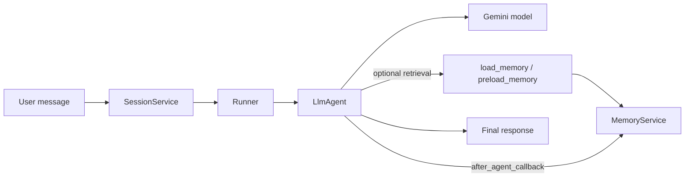

# Day 3b — Agent Memory: Cell-by-Cell Documentation

This document explains the notebook `agentic-ai-day-3b-agent-memory.ipynb` in a way that is suitable for GitHub. It gives you:

- a complete cell map for **all 77 notebook cells**
- a deep explanation of **all 20 executable code cells**
- the memory concepts behind the notebook: **session vs memory**, **manual vs automatic storage**, and **reactive vs proactive retrieval**

## Notebook at a glance

| Item | Value |
|---|---:|
| Notebook | `agentic-ai-day-3b-agent-memory.ipynb` |
| Total cells | 77 |
| Markdown cells | 57 |
| Code cells | 20 |
| Main topic | Adding long-term memory to an ADK agent |
| Memory backend used in the notebook | `InMemoryMemoryService` |
| Session backend used in the notebook | `InMemorySessionService` |
| Manual write API | `add_session_to_memory(session)` |
| Direct search API | `search_memory(app_name, user_id, query)` |
| Agent retrieval tools | `load_memory`, `preload_memory` |
| Automation hook | `after_agent_callback` |

## What the notebook is teaching

The notebook builds one mental model in stages:

1. **Sessions capture conversation history** for a specific chat.
2. **Memory stores knowledge across sessions** so the agent can recall facts later.
3. **The agent needs tools** to search memory.
4. **Callbacks can automate memory writes** so you do not have to save each session manually.
5. **Managed memory systems can consolidate raw chat history into better memories** for production use.

## Core architecture



## Concept primer

### Session vs Memory

| Concept | What it stores | Scope | Used for |
|---|---|---|---|
| **Session** | current conversation events and temporary state | one conversation/thread | short-term context |
| **Memory** | information ingested from one or more sessions | across conversations | long-term recall |

### `load_memory` vs `preload_memory`

| Tool | Pattern | What happens | Trade-off |
|---|---|---|---|
| `load_memory` | Reactive | the model decides when to search memory | cheaper, but the model may forget to use it |
| `preload_memory` | Proactive | memory is loaded before every turn | more reliable context, but potentially wasteful |

### Manual vs Automatic memory writes

| Pattern | How it works | Cells in this notebook |
|---|---|---|
| **Manual** | you explicitly call `add_session_to_memory()` after a session is created | 34, 44 |
| **Automatic** | an `after_agent_callback` writes the session for you | 58, 60, 64 |

## Complete cell map

This table covers **every cell** in the notebook so you can quickly understand the flow before diving into the code.

| Cell | Type | Title / first line | What this cell is doing |
|---:|---|---|---|
| 1 | markdown | Copyright 2025 Google LLC. | Copyright/licensing notice for the notebook content. |
| 2 | markdown | 🧠 Memory Management - Part 2 - Memory | Notebook title. Introduces Day 3b as the Memory-focused follow-up to the sessions notebook. |
| 3 | markdown | 🤔 Why Memory? | Motivates why long-term memory matters: sessions alone are not enough when agents must remember facts across conversations. |
| 4 | markdown | 🎯 What you'll learn: | Lists the learning objectives: initialize memory, ingest sessions, retrieve memories, automate storage, and understand consolidation. |
| 5 | markdown | -- | Visual separator before setup instructions. |
| 6 | markdown | 📖 Get started with Kaggle Notebooks | Kaggle-specific usage guidance: make a copy, run cells in order, and reset the notebook if needed. |
| 7 | markdown | -- | Setup overview. Notes that Kaggle already includes the necessary ADK package, while local environments can install it with `pip install google-adk`. |
| 8 | markdown | 1.2: Configure your Gemini API Key | Explains how to create a Gemini API key, store it as `GOOGLE_API_KEY` in Kaggle Secrets, and authenticate the notebook. |
| 9 | code | import os | Authenticates the notebook without hard-coding credentials into the notebook source. |
| 10 | markdown | 1.3: Import ADK components | Introduces the import step and frames ADK components as the notebook’s building blocks. |
| 11 | code | from google.adk.agents import LlmAgent | Brings in the core classes and tools for memory-enabled agents. |
| 12 | markdown | 1.4: Helper functions | Introduces the upcoming helper function for running conversations. |
| 13 | code | async def run_session( | Wraps session creation, message packaging, model execution, and response printing into one reusable async function. |
| 14 | markdown | 1.5: Configure Retry Options | Explains why retry behavior matters for LLM notebooks. |
| 15 | code | retry_config = types.HttpRetryOptions( | Makes model calls more resilient to transient HTTP failures. |
| 16 | markdown | -- | Introduces the notebook’s three-step memory workflow: initialize, ingest, retrieve. |
| 17 | markdown | Illustration / diagram | Diagram cell showing the high-level memory workflow. |
| 18 | markdown | -- | Separator before Section 3. |
| 19 | markdown | 3.1 Initialize Memory | Explains the available memory-service implementations and why the notebook uses `InMemoryMemoryService`. |
| 20 | code | memory_service = ( | Creates the long-term memory store used for all later memory ingestion and retrieval examples. |
| 21 | markdown | 3.2 Add Memory to Agent | Introduces the first agent creation step. |
| 22 | code | # Define constants used throughout the notebook | Sets notebook-wide identifiers and creates an agent that can answer normally but does not yet know how to use memory. |
| 23 | markdown | *Create Runner** | Explains why the runner needs both the session service and the memory service. |
| 24 | code | # Create Session Service | Connects the agent to both short-term sessions and long-term memory. |
| 25 | markdown | ‼️ Important | Important conceptual warning: configuring a memory service does not automatically make the agent use memory. |
| 26 | markdown | 3.3 MemoryService Implementation Options | Compares the learning-focused in-memory backend with the production-oriented Vertex AI Memory Bank backend. |
| 27 | markdown | -- | Separator before the ingestion section. |
| 28 | markdown | *Why should you transfer Session data to Memory?** | Explains why sessions must be transferred into memory and notes that managed services can consolidate during ingestion. |
| 29 | markdown | Before we can transfer anything, we need data. Let's have a conversation with our agent to populate the session. This co | Prepares the first example conversation so there is session data to save. |
| 30 | code | # User tells agent about their favorite color | Populates a real session with user data (`blue-green` favorite color) so there is something to inspect and ingest. |
| 31 | markdown | Let's verify the conversation was captured in the session. You should see the session events containing both the user's  | Introduces the session-inspection step. |
| 32 | code | session = await session_service.get_session( | Verifies that the previous conversation really exists in session storage before transferring it into memory. |
| 33 | markdown | Perfect! The session contains our conversation. Now we're ready to transfer it to memory. Call add_session_to_memory() a | Explains that `add_session_to_memory()` is the write operation that moves data into long-term memory. |
| 34 | code | # This is the key method! | Performs the central write operation that moves knowledge from session storage into the memory backend. |
| 35 | markdown | -- | Introduces the retrieval section and explains that agents need tools to access memory. |
| 36 | markdown | 5.1 Memory Retrieval in ADK | Compares `load_memory` and `preload_memory` as reactive vs proactive retrieval strategies. |
| 37 | markdown | 5.2 Add Load Memory Tool to Agent | Introduces the reactive `load_memory` implementation. |
| 38 | code | # Create agent | Enables reactive memory retrieval: the agent can decide when to search memory during a turn. |
| 39 | markdown | 5.3 Update the Runner and Test | Sets up the cross-session favorite-color recall test. |
| 40 | code | # Create a new runner with the updated agent | Swaps the old agent out for the new memory-enabled one and tests whether a fresh session can recall the favorite color. |
| 41 | markdown | 5.4 Complete Manual Workflow Test | Introduces a complete manual workflow example using a birthday fact. |
| 42 | code | await run_session(runner, "My birthday is on March 15th.", "birthday-session-01") | Creates another session containing a simple factual preference/detail that is easy to retrieve later. |
| 43 | markdown | Now manually save this session to memory. This is the crucial step that transfers the conversation from short-term sessi | Explains that the birthday session now needs to be saved manually. |
| 44 | code | # Manually save the session to memory | Repeats the manual ingestion workflow for the birthday example. |
| 45 | markdown | Here's the crucial test: we'll start a completely new session with a different session ID and ask the agent to recall th | Sets up the cross-session birthday recall test. |
| 46 | code | # Test retrieval in a NEW session | Tests whether the memory-enabled agent can answer a personal fact from long-term memory in a separate conversation. |
| 47 | markdown | *What happens:** | Narrates the expected retrieval steps for the birthday question. |
| 48 | markdown | 🚀 Your Turn: Experiment with Both Patterns | Encourages experimenting by swapping `load_memory` for `preload_memory`. |
| 49 | markdown | 5.5 Manual Memory Search | Introduces direct `search_memory()` calls for debugging and analytics. |
| 50 | code | # Search for color preferences | Demonstrates that memory can be queried programmatically without going through the agent. |
| 51 | markdown | *🚀 Your Turn: Test Different Queries** | Suggests experimental search queries to show the limits of keyword matching. |
| 52 | markdown | 5.6 How Search Works | Explains how `InMemoryMemoryService` keyword matching differs from semantic search in managed memory backends. |
| 53 | markdown | -- | Separator before the automation section. |
| 54 | markdown | So far, we've **manually** called add_session_to_memory() to transfer data to long-term storage. Production systems need | Motivates automating memory writes instead of manually calling `add_session_to_memory()`. |
| 55 | markdown | 6.1 Callbacks | Explains callback concepts and positions `after_agent_callback` as the hook used in this notebook. |
| 56 | markdown | Illustration / diagram | Illustration showing the different callback hook types in ADK. |
| 57 | markdown | 6.2 Automatic Memory Storage with Callbacks | Introduces automatic memory storage via a callback and explains why `callback_context` matters. |
| 58 | code | async def auto_save_to_memory(callback_context): | Automates memory ingestion so the notebook no longer needs manual `add_session_to_memory()` calls after each conversation. |
| 59 | markdown | 6.3 Create an Agent: Callback and PreLoad Memory Tool | Introduces the fully automated agent that combines callback-based saving and preload-based retrieval. |
| 60 | code | # Agent with automatic memory saving | Combines automatic memory writing with proactive memory retrieval. |
| 61 | markdown | *What happens automatically:** | Summarizes what the automated agent will do after each turn. |
| 62 | markdown | 6.4 Create a Runner and Test The Agent | Introduces the runner creation and test for the auto-memory agent. |
| 63 | code | # Create a runner for the auto-save agent | Binds the new callback-enabled, preload-enabled agent to the same session and memory services. |
| 64 | code | # Test 1: Tell the agent about a gift (first conversation) | Shows that the callback saves the first session automatically and `preload_memory` retrieves the fact automatically in a second session. |
| 65 | markdown | *What just happened:** | Explains the outcome of the two-session automated-memory test. |
| 66 | markdown | 6.5 How often should you save Sessions to Memory? | Discusses trade-offs in how often to save sessions into memory. |
| 67 | markdown | -- | Separator before the memory-consolidation section. |
| 68 | markdown | 7.1 The Limitation of Raw Storage | Shows why raw storage does not scale as conversations grow. |
| 69 | markdown | 7.2 What is Memory Consolidation? | Defines memory consolidation as extracting facts while discarding conversational noise. |
| 70 | markdown | Illustration / diagram | Diagram cell visualizing raw storage vs consolidated memory. |
| 71 | markdown | 7.3 How Consolidation Works (Conceptual) | Explains the conceptual consolidation pipeline from raw events to concise facts. |
| 72 | markdown | 7.4 Next Steps for Memory Consolidation | Connects the same API methods to smarter managed services that perform consolidation automatically. |
| 73 | markdown | -- | Separator before the summary. |
| 74 | markdown | You've learned the **core mechanics** of Memory in ADK: | Recaps the notebook’s main memory concepts and APIs. |
| 75 | markdown | 🎉 **Congratulations!** You've learned Memory Management in ADK! | Completion/congratulations cell. |
| 76 | markdown | *📚 Learn More:** | Links to further reading and points the learner toward Day 4. |
| 77 | markdown | -- | Closing separator and author credits. |

## Detailed walkthrough of every executable code cell

The notebook has **20 code cells**. Each one is explained below in execution order.

### Cell 9 — Load the Gemini API key from Kaggle Secrets

**Purpose:** Authenticates the notebook without hard-coding credentials into the notebook source.

<details>
<summary>Show code</summary>

```python
import os
from kaggle_secrets import UserSecretsClient

try:
    GOOGLE_API_KEY = UserSecretsClient().get_secret("GOOGLE_API_KEY")
    os.environ["GOOGLE_API_KEY"] = GOOGLE_API_KEY
    print("✅ Gemini API key setup complete.")
except Exception as e:
    print(
        f"🔑 Authentication Error: Please make sure you have added 'GOOGLE_API_KEY' to your Kaggle secrets. Details: {e}"
    )
```

</details>

**Step-by-step explanation**

1. `import os` lets the notebook write the API key into an environment variable that downstream libraries can read automatically.
2. `UserSecretsClient` is Kaggle’s secret manager wrapper; it safely retrieves a secret attached to the notebook runtime.
3. The `try` block fetches the secret named `GOOGLE_API_KEY` and stores it in `os.environ['GOOGLE_API_KEY']` so the Gemini client can authenticate.
4. The `except` block prints a readable setup error instead of crashing immediately, which makes the notebook friendlier for first-time users.

**Why this cell matters**

Every later Gemini call depends on this cell. If it fails, the agent code can still import, but model calls will fail at runtime.

**Example notebook output**

```text
✅ Gemini API key setup complete.
```

**Watch out for**

- The most common failure is forgetting to add `GOOGLE_API_KEY` in Kaggle Secrets or leaving the secret unattached.
- If you copy this notebook outside Kaggle, replace `UserSecretsClient` with your local secret-loading approach.

### Cell 11 — Import the ADK building blocks used throughout the notebook

**Purpose:** Brings in the core classes and tools for memory-enabled agents.

<details>
<summary>Show code</summary>

```python
from google.adk.agents import LlmAgent
from google.adk.models.google_llm import Gemini
from google.adk.runners import Runner
from google.adk.sessions import InMemorySessionService
from google.adk.memory import InMemoryMemoryService
from google.adk.tools import load_memory, preload_memory
from google.genai import types

print("✅ ADK components imported successfully.")
```

</details>

**Step-by-step explanation**

1. `LlmAgent` defines the agent itself.
2. `Gemini` creates the model wrapper used by the agent.
3. `Runner` orchestrates execution: it connects the agent, session service, and memory service.
4. `InMemorySessionService` stores active conversation sessions in RAM for this notebook run.
5. `InMemoryMemoryService` stores long-term memory in RAM for this notebook run.
6. `load_memory` and `preload_memory` are built-in ADK memory-retrieval tools.
7. `types` from `google.genai` provides request/response content primitives such as `Content` and `Part`.

**Why this cell matters**

This import list reveals the notebook’s architecture: one agent, one runner, one session backend, one memory backend, and two retrieval patterns.

**Example notebook output**

```text
✅ ADK components imported successfully.
```

### Cell 13 — Define `run_session()` helper to execute conversations

**Purpose:** Wraps session creation, message packaging, model execution, and response printing into one reusable async function.

<details>
<summary>Show code</summary>

```python
async def run_session(
    runner_instance: Runner, user_queries: list[str] | str, session_id: str = "default"
):
    """Helper function to run queries in a session and display responses."""
    print(f"\n### Session: {session_id}")

    # Create or retrieve session
    try:
        session = await session_service.create_session(
            app_name=APP_NAME, user_id=USER_ID, session_id=session_id
        )
    except:
        session = await session_service.get_session(
            app_name=APP_NAME, user_id=USER_ID, session_id=session_id
        )

    # Convert single query to list
    if isinstance(user_queries, str):
        user_queries = [user_queries]

    # Process each query
    for query in user_queries:
        print(f"\nUser > {query}")
        query_content = types.Content(role="user", parts=[types.Part(text=query)])

        # Stream agent response
        async for event in runner_instance.run_async(
            user_id=USER_ID, session_id=session.id, new_message=query_content
        ):
            if event.is_final_response() and event.content and event.content.parts:
                text = event.content.parts[0].text
                if text and text != "None":
                    print(f"Model: > {text}")


print("✅ Helper functions defined.")
```

</details>

**Step-by-step explanation**

1. The function accepts a `Runner`, either one query or multiple queries, and a `session_id`.
2. It first tries to create a session. If the session already exists, it falls back to `get_session()` so the same helper works for both new and existing conversations.
3. If the caller passes a single string, the helper converts it into a one-item list so the rest of the logic only has to handle one shape.
4. Each user query is wrapped as `types.Content(role='user', parts=[types.Part(text=query)])`, which is the format ADK expects.
5. `runner_instance.run_async(...)` streams events from the agent runtime. The helper listens for final-response events and prints the first text part.
6. This helper intentionally keeps the output simple, but that also means it only surfaces text parts and may hide function-call/tool-call details.

**Why this cell matters**

This one helper is used in nearly every demonstration cell, so understanding it makes the rest of the notebook much easier to follow.

**Example notebook output**

```text
✅ Helper functions defined.
```

**Watch out for**

- Because it only prints `event.content.parts[0].text`, tool invocation events or non-text parts can appear as warnings or seem to ‘disappear’.
- The helper depends on globally defined `session_service`, `APP_NAME`, and `USER_ID`, so those must exist before you call it.

**Important implementation detail**

This helper is intentionally lightweight. It makes the notebook easy to read, but it is not a full debugger. If you need to inspect tool calls, intermediate events, or multiple content parts, you would extend this helper or use ADK’s richer debugging tools.

### Cell 15 — Create retry policy for Gemini API calls

**Purpose:** Makes model calls more resilient to transient HTTP failures.

<details>
<summary>Show code</summary>

```python
retry_config = types.HttpRetryOptions(
    attempts=5,  # Maximum retry attempts
    exp_base=7,  # Delay multiplier
    initial_delay=1,
    http_status_codes=[429, 500, 503, 504],  # Retry on these HTTP errors
)
```

</details>

**Step-by-step explanation**

1. `attempts=5` means the client can retry up to five times.
2. `exp_base=7` and `initial_delay=1` configure exponential backoff between retries.
3. `http_status_codes=[429, 500, 503, 504]` targets typical transient failures such as rate limiting and temporary service outages.

**Why this cell matters**

Notebook demos should be reliable. This cell reduces the chance that a short-lived infrastructure issue breaks the exercise.

### Cell 20 — Initialize the notebook’s memory backend

**Purpose:** Creates the long-term memory store used for all later memory ingestion and retrieval examples.

<details>
<summary>Show code</summary>

```python
memory_service = (
    InMemoryMemoryService()
)  # ADK's built-in Memory Service for development and testing
```

</details>

**Step-by-step explanation**

1. `InMemoryMemoryService()` is the simplest memory backend in ADK.
2. It keeps memory only in the Python process, so data disappears when the runtime restarts.
3. It stores raw session content and uses simple matching, which makes it ideal for learning but not for production-grade semantic memory.

**Why this cell matters**

This is the notebook’s first step in the three-part memory workflow: initialize, ingest, retrieve.

### Cell 22 — Define constants and create the first simple agent

**Purpose:** Sets notebook-wide identifiers and creates an agent that can answer normally but does not yet know how to use memory.

<details>
<summary>Show code</summary>

```python
# Define constants used throughout the notebook
APP_NAME = "MemoryDemoApp"
USER_ID = "demo_user"

# Create agent
user_agent = LlmAgent(
    model=Gemini(model="gemini-2.5-flash-lite", retry_options=retry_config),
    name="MemoryDemoAgent",
    instruction="Answer user questions in simple words.",
)

print("✅ Agent created")
```

</details>

**Step-by-step explanation**

1. `APP_NAME` groups sessions and memory entries under one application namespace.
2. `USER_ID` scopes the data to one logical user. Memory lookups later use this value, so changing it changes what can be recalled.
3. `LlmAgent(...)` builds an agent named `MemoryDemoAgent`.
4. `Gemini(model='gemini-2.5-flash-lite', retry_options=retry_config)` attaches the model and the retry policy from cell 15.
5. The instruction is intentionally simple: the agent should answer user questions in simple words.
6. At this stage there is no memory tool in `tools`, so the agent cannot retrieve long-term memory yet even though a memory service will soon exist.

**Why this cell matters**

This cell separates two ideas that beginners often mix up: having a memory backend available is not the same as giving the agent permission to search it.

**Example notebook output**

```text
✅ Agent created
```

### Cell 24 — Create session service and memory-aware runner

**Purpose:** Connects the agent to both short-term sessions and long-term memory.

<details>
<summary>Show code</summary>

```python
# Create Session Service
session_service = InMemorySessionService()  # Handles conversations

# Create runner with BOTH services
runner = Runner(
    agent=user_agent,
    app_name="MemoryDemoApp",
    session_service=session_service,
    memory_service=memory_service,  # Memory service is now available!
)

print("✅ Agent and Runner created with memory support!")
```

</details>

**Step-by-step explanation**

1. `InMemorySessionService()` stores session history for the current runtime.
2. `Runner(...)` wires together the `agent`, `app_name`, `session_service`, and `memory_service`.
3. From this point on, the runtime has access to both conversation history and a memory backend.

**Why this cell matters**

The runner is the integration point. Without it, the agent, session service, and memory service remain separate objects.

**Example notebook output**

```text
✅ Agent and Runner created with memory support!
```

**Watch out for**

- Adding `memory_service` here only makes memory available to the runtime. It does not automatically ingest sessions or retrieve memories.

### Cell 30 — Create the first conversation that will later become memory

**Purpose:** Populates a real session with user data (`blue-green` favorite color) so there is something to inspect and ingest.

<details>
<summary>Show code</summary>

```python
# User tells agent about their favorite color
await run_session(
    runner,
    "My favorite color is blue-green. Can you write a Haiku about it?",
    "conversation-01",  # Session ID
)
```

</details>

**Step-by-step explanation**

1. `await run_session(...)` sends a single prompt through the runner under session ID `conversation-01`.
2. The prompt intentionally includes a personal fact plus a creative request. That combination makes the stored session easy to recognize later.
3. The model responds with a haiku, and both the user prompt and the model response become session events.

**Why this cell matters**

Memory cannot store anything until a session contains events. This cell generates the raw material that later gets transferred into long-term memory.

**Example notebook output**

```text
### Session: conversation-01

User > My favorite color is blue-green. Can you write a Haiku about it?
Model: > Ocean's calm embrace,
Emerald whispers to the sea,
Peace in every hue.
```

### Cell 32 — Inspect the captured session events

**Purpose:** Verifies that the previous conversation really exists in session storage before transferring it into memory.

<details>
<summary>Show code</summary>

```python
session = await session_service.get_session(
    app_name=APP_NAME, user_id=USER_ID, session_id="conversation-01"
)

# Let's see what's in the session
print("📝 Session contains:")
for event in session.events:
    text = (
        event.content.parts[0].text[:60]
        if event.content and event.content.parts
        else "(empty)"
    )
    print(f"  {event.content.role}: {text}...")
```

</details>

**Step-by-step explanation**

1. `get_session(...)` fetches the session created in cell 30.
2. The `for` loop iterates through `session.events`, which are the canonical conversation records stored by the session service.
3. For each event, the code extracts a short text preview from the first content part and prints the speaker role (`user` or `model`).

**Why this cell matters**

This cell visually proves the difference between session storage and memory storage: the conversation already exists in the session service even though it has not yet been added to memory.

**Example notebook output**

```text
📝 Session contains:
  user: My favorite color is blue-green. Can you write a Haiku about...
  model: Ocean's calm embrace,
Emerald whispers to the sea,
Peace in ...
```

### Cell 34 — Manually ingest the session into long-term memory

**Purpose:** Performs the central write operation that moves knowledge from session storage into the memory backend.

<details>
<summary>Show code</summary>

```python
# This is the key method!
await memory_service.add_session_to_memory(session)

print("✅ Session added to memory!")
```

</details>

**Step-by-step explanation**

1. `await memory_service.add_session_to_memory(session)` takes the entire session object and ingests it into the configured memory service.
2. In this notebook’s `InMemoryMemoryService`, the ingestion is straightforward: raw content is stored in memory for later searches.

**Why this cell matters**

This is the notebook’s first explicit long-term-memory write. Without this call, later memory retrieval would have nothing to find.

**Example notebook output**

```text
✅ Session added to memory!
```

### Cell 38 — Recreate the agent with the `load_memory` tool

**Purpose:** Enables reactive memory retrieval: the agent can decide when to search memory during a turn.

<details>
<summary>Show code</summary>

```python
# Create agent
user_agent = LlmAgent(
    model=Gemini(model="gemini-2.5-flash-lite", retry_options=retry_config),
    name="MemoryDemoAgent",
    instruction="Answer user questions in simple words. Use load_memory tool if you need to recall past conversations.",
    tools=[
        load_memory
    ],  # Agent now has access to Memory and can search it whenever it decides to!
)

print("✅ Agent with load_memory tool created.")
```

</details>

**Step-by-step explanation**

1. The agent definition is rebuilt rather than mutated in place.
2. The instruction now explicitly tells the model to use the `load_memory` tool when it needs past-conversation context.
3. `tools=[load_memory]` exposes the built-in retrieval tool to the model.
4. This is a reactive pattern: memory is searched only when the model thinks it is useful.

**Why this cell matters**

This is the first time the agent can actually consult long-term memory rather than only answering from the current session.

**Example notebook output**

```text
✅ Agent with load_memory tool created.
```

### Cell 40 — Create a new runner with the memory-enabled agent and test recall

**Purpose:** Swaps the old agent out for the new memory-enabled one and tests whether a fresh session can recall the favorite color.

<details>
<summary>Show code</summary>

```python
# Create a new runner with the updated agent
runner = Runner(
    agent=user_agent,
    app_name=APP_NAME,
    session_service=session_service,
    memory_service=memory_service,
)

await run_session(runner, "What is my favorite color?", "color-test")
```

</details>

**Step-by-step explanation**

1. A new `Runner` is created because the agent object changed in cell 38.
2. The test prompt is asked in a different session ID, `color-test`, so the answer cannot come from same-session history.
3. If the agent answers correctly, it must be because the `load_memory` tool searched long-term memory.

**Why this cell matters**

This is the notebook’s proof that memory retrieval can work across sessions.

**Example notebook output**

```text
### Session: color-test

User > What is my favorite color?
Warning: there are non-text parts in the response: ['function_call'], returning concatenated text result from text parts. Check the full candidates.content.parts accessor to get the full model response.
/usr/local/lib/python3.12/dist-packages/google/adk/flows/llm_flows/base_llm_flow.py:449: UserWarning: [EXPERIMENTAL] feature FeatureName.PROGRESSIVE_SSE_STREAMING is enabled.
  async for event in agen:
```

**Watch out for**

- The notebook output shows a warning about non-text parts (`function_call`). That is a side effect of the helper in cell 13 printing only text parts while the model/tool exchange includes a function call.
- In other words, the warning does not mean memory failed. It means the simplified display helper is not showing the full structured event stream.

**Why the warning appears in this cell**

The memory-enabled agent can call `load_memory`, which shows up internally as a function call/tool call. The helper from cell 13 only prints text parts from final events, so the notebook surfaces a warning about non-text parts. That warning is a display limitation, not a conceptual problem with memory itself.

### Cell 42 — Start a second manual-memory example with a birthday fact

**Purpose:** Creates another session containing a simple factual preference/detail that is easy to retrieve later.

<details>
<summary>Show code</summary>

```python
await run_session(runner, "My birthday is on March 15th.", "birthday-session-01")
```

</details>

**Step-by-step explanation**

1. The session ID `birthday-session-01` isolates this conversation from earlier ones.
2. The agent is told `My birthday is on March 15th.` and responds in the current session.

**Why this cell matters**

This cell starts a complete end-to-end demonstration of the manual pattern: capture → save → recall.

**Example notebook output**

```text
### Session: birthday-session-01

User > My birthday is on March 15th.
Model: > Ok, I will remember that.
```

### Cell 44 — Save the birthday session into memory

**Purpose:** Repeats the manual ingestion workflow for the birthday example.

<details>
<summary>Show code</summary>

```python
# Manually save the session to memory
birthday_session = await session_service.get_session(
    app_name=APP_NAME, user_id=USER_ID, session_id="birthday-session-01"
)

await memory_service.add_session_to_memory(birthday_session)

print("✅ Birthday session saved to memory!")
```

</details>

**Step-by-step explanation**

1. `get_session(...)` fetches `birthday-session-01` from the session service.
2. `add_session_to_memory(...)` writes that session into the memory backend.

**Why this cell matters**

The notebook intentionally repeats the manual pattern so the memory lifecycle becomes concrete rather than abstract.

**Example notebook output**

```text
✅ Birthday session saved to memory!
```

### Cell 46 — Recall the birthday from a new session

**Purpose:** Tests whether the memory-enabled agent can answer a personal fact from long-term memory in a separate conversation.

<details>
<summary>Show code</summary>

```python
# Test retrieval in a NEW session
await run_session(
    runner, "When is my birthday?", "birthday-session-02"  # Different session ID
)
```

</details>

**Step-by-step explanation**

1. The question is asked under a new session ID, `birthday-session-02`.
2. The correct answer, `March 15th`, is not present in the new session itself, so the agent must retrieve it from memory via `load_memory`.

**Why this cell matters**

This is the cleanest manual-memory success case in the notebook because the output clearly shows the correct recalled answer.

**Example notebook output**

```text
### Session: birthday-session-02

User > When is my birthday?
Model: > Your birthday is on March 15th.
```

### Cell 50 — Search the memory store directly in code

**Purpose:** Demonstrates that memory can be queried programmatically without going through the agent.

<details>
<summary>Show code</summary>

```python
# Search for color preferences
search_response = await memory_service.search_memory(
    app_name=APP_NAME, user_id=USER_ID, query="What is the user's favorite color?"
)

print("🔍 Search Results:")
print(f"  Found {len(search_response.memories)} relevant memories")
print()

for memory in search_response.memories:
    if memory.content and memory.content.parts:
        text = memory.content.parts[0].text[:80]
        print(f"  [{memory.author}]: {text}...")
```

</details>

**Step-by-step explanation**

1. `search_memory(app_name=..., user_id=..., query=...)` asks the memory backend for entries relevant to a natural-language query.
2. The notebook searches for the user’s favorite color and prints how many matching memories were found.
3. The loop prints each memory result’s `author` and a short preview of its content.

**Why this cell matters**

Direct search is useful for debugging, analytics, admin tooling, or validating what the agent is actually able to retrieve.

**Example notebook output**

```text
🔍 Search Results:
  Found 3 relevant memories

  [user]: My favorite color is blue-green. Can you write a Haiku about it?...
  [MemoryDemoAgent]: Ocean's calm embrace,
Emerald whispers to the sea,
Peace in every hue....
  [user]: My birthday is on March 15th....
```

**Watch out for**

- With `InMemoryMemoryService`, matching is relatively literal. Queries that use different wording can miss relevant results even when a human would see the connection.

### Cell 58 — Define an `after_agent_callback` that auto-saves sessions to memory

**Purpose:** Automates memory ingestion so the notebook no longer needs manual `add_session_to_memory()` calls after each conversation.

<details>
<summary>Show code</summary>

```python
async def auto_save_to_memory(callback_context):
    """Automatically save session to memory after each agent turn."""
    await callback_context._invocation_context.memory_service.add_session_to_memory(
        callback_context._invocation_context.session
    )


print("✅ Callback created.")
```

</details>

**Step-by-step explanation**

1. The async callback receives `callback_context`, which ADK passes automatically when the agent finishes a turn.
2. The callback reaches into the invocation context to get both the active `memory_service` and the current `session`.
3. It then calls `add_session_to_memory(...)` so the just-completed session is persisted automatically.

**Why this cell matters**

This cell transforms memory from a manual workflow into an agent lifecycle feature.

**Example notebook output**

```text
✅ Callback created.
```

**Watch out for**

- The code uses `callback_context._invocation_context`, which looks private because of the underscore. The notebook and current ADK examples use this pattern, but you should still watch the official docs for API changes.

**Mental model**

Think of this callback as a persistence hook attached to the end of each agent turn. The agent finishes its response, and only then the completed session is copied into long-term memory.

### Cell 60 — Create an agent that both auto-saves and auto-loads memory

**Purpose:** Combines automatic memory writing with proactive memory retrieval.

<details>
<summary>Show code</summary>

```python
# Agent with automatic memory saving
auto_memory_agent = LlmAgent(
    model=Gemini(model="gemini-2.5-flash-lite", retry_options=retry_config),
    name="AutoMemoryAgent",
    instruction="Answer user questions.",
    tools=[preload_memory],
    after_agent_callback=auto_save_to_memory,  # Saves after each turn!
)

print("✅ Agent created with automatic memory saving!")
```

</details>

**Step-by-step explanation**

1. `after_agent_callback=auto_save_to_memory` means every completed turn is automatically written to memory.
2. `tools=[preload_memory]` means memory is automatically retrieved at the start of every turn, whether or not the model explicitly asks for it.
3. The instruction can stay simple because the tool behavior is proactive.

**Why this cell matters**

This cell demonstrates a fully automated pattern: no manual save call and no model decision required to load memory.

**Example notebook output**

```text
✅ Agent created with automatic memory saving!
```

**Watch out for**

- `preload_memory` can be wasteful for turns that do not need prior context because it retrieves memory every time.

**Design pattern introduced here**

This is the notebook’s fully automated memory pattern:

- **write automatically** with `after_agent_callback`
- **read automatically** with `preload_memory`
- **avoid manual memory-management code** in the rest of your application

### Cell 63 — Create a runner for the automated-memory agent

**Purpose:** Binds the new callback-enabled, preload-enabled agent to the same session and memory services.

<details>
<summary>Show code</summary>

```python
# Create a runner for the auto-save agent
# This connects our automated agent to the session and memory services
auto_runner = Runner(
    agent=auto_memory_agent,  # Use the agent with callback + preload_memory
    app_name=APP_NAME,
    session_service=session_service,  # Same services from Section 3
    memory_service=memory_service,
)

print("✅ Runner created.")
```

</details>

**Step-by-step explanation**

1. `auto_runner` is a separate runner so the notebook can keep the manual and automatic patterns conceptually distinct.
2. It still uses the same `APP_NAME`, `session_service`, and `memory_service`, which means both patterns operate over the same logical user memory.

**Why this cell matters**

The new runner makes the automated configuration executable without overwriting the earlier manual example’s runtime object.

**Example notebook output**

```text
✅ Runner created.
```

### Cell 64 — Demonstrate the fully automated memory workflow across two sessions

**Purpose:** Shows that the callback saves the first session automatically and `preload_memory` retrieves the fact automatically in a second session.

<details>
<summary>Show code</summary>

```python
# Test 1: Tell the agent about a gift (first conversation)
# The callback will automatically save this to memory when the turn completes
await run_session(
    auto_runner,
    "I gifted a new toy to my nephew on his 1st birthday!",
    "auto-save-test",
)

# Test 2: Ask about the gift in a NEW session (second conversation)
# The agent should retrieve the memory using preload_memory and answer correctly
await run_session(
    auto_runner,
    "What did I gift my nephew?",
    "auto-save-test-2",  # Different session ID - proves memory works across sessions!
)
```

</details>

**Step-by-step explanation**

1. The first `run_session(...)` call creates session `auto-save-test` and stores the fact that the user gifted a new toy to their nephew.
2. When that turn finishes, `after_agent_callback` runs and writes the session into memory without any manual code.
3. The second `run_session(...)` call uses a different session ID, `auto-save-test-2`, and asks what the user gifted the nephew.
4. Because `preload_memory` runs at the start of the turn, the agent receives relevant long-term memory automatically and answers correctly.

**Why this cell matters**

This is the notebook’s most production-like pattern: automatic write, automatic read, zero manual memory calls in the notebook body.

**Example notebook output**

```text
### Session: auto-save-test

User > I gifted a new toy to my nephew on his 1st birthday!
Model: > Happy Birthday to your nephew! That's a wonderful milestone. I hope he enjoys his new toy!

### Session: auto-save-test-2

User > What did I gift my nephew?
Model: > You gifted your nephew a new toy for his 1st birthday.
```

**Why this is the final proof-of-concept cell**

This cell demonstrates both halves of the automation story in one place. The first turn writes to memory without any explicit save call, and the second turn retrieves from memory without any explicit search call.

## Notebook flow in plain English

If you want the shortest possible summary of the notebook, it is this:

1. Set up authentication and imports.
2. Create a simple agent and a runner with a memory service.
3. Hold a conversation so the session contains events.
4. Manually save that session into memory.
5. Give the agent the `load_memory` tool so it can recall facts later.
6. Prove cross-session recall with favorite-color and birthday examples.
7. Query memory directly with `search_memory()`.
8. Replace manual saving with an `after_agent_callback`.
9. Replace reactive retrieval with `preload_memory` for a fully automated pattern.
10. End with the idea that production systems should consolidate memory instead of storing every raw chat event forever.

## What each major section teaches

| Section | Main lesson |
|---|---|
| **Section 1 — Setup** | authenticate and import the ADK pieces you need |
| **Section 2 — Memory workflow** | memory requires three steps: initialize, ingest, retrieve |
| **Section 3 — Initialize MemoryService** | a memory backend must be attached to the runner before it can be used |
| **Section 4 — Ingest session data** | sessions do not automatically become memory; you must save them |
| **Section 5 — Retrieval** | agents need tools like `load_memory` or `preload_memory` to use memory |
| **Section 6 — Automation** | callbacks can save memory automatically after each turn |
| **Section 7 — Consolidation** | raw conversation storage does not scale; better systems extract concise facts |

## Important behaviors and notebook quirks

### 1. Memory is available before it is useful

A common beginner mistake is to think that adding `memory_service` to the `Runner` is enough. It is not. You still need:

- a call to `add_session_to_memory()` to write knowledge into memory
- a memory retrieval mechanism (`load_memory` or `preload_memory`) so the agent can read it

### 2. `InMemoryMemoryService` is for learning, not for serious persistence

This notebook uses in-memory storage because it keeps the examples small and clear. The downside is that the memory disappears when the runtime stops, and the matching behavior is much simpler than a managed memory service.

### 3. The helper prints text, not the full event graph

The `run_session()` helper is intentionally beginner-friendly, but it hides detail. Once tools are involved, the runtime may emit structured function-call parts that are real and useful, even if the helper does not print them nicely.

### 4. Manual and automatic patterns are both worth understanding

The notebook ends on automation, but the manual pattern matters because it teaches the lifecycle explicitly:

- create session data
- ingest that session into memory
- retrieve memory later

Once you understand that lifecycle, the callback version becomes obvious instead of magical.

## Key APIs used in the notebook

| API / object | Role in the notebook |
|---|---|
| `LlmAgent` | defines the agent and its instructions/tools |
| `Gemini(...)` | provides the model backend |
| `Runner` | executes the agent with the configured services |
| `InMemorySessionService` | stores active sessions for this runtime |
| `InMemoryMemoryService` | stores long-term memory for this runtime |
| `add_session_to_memory(session)` | ingests a completed session into memory |
| `search_memory(app_name, user_id, query)` | searches the memory store directly |
| `load_memory` | lets the model decide when to query memory |
| `preload_memory` | automatically fetches memory before each turn |
| `after_agent_callback` | lets you run custom logic after the agent finishes a turn |

## Suggested experiments after reading this notebook

1. Replace `load_memory` with `preload_memory` in the manual example and compare the behavior.
2. Change `USER_ID` and observe that the agent can no longer recall the previous user’s memories.
3. Change the `search_memory()` query in cell 50 to more literal and less literal wording to see the limits of keyword matching.
4. Add more personal facts across multiple sessions and inspect how many memory results are returned.
5. Extend `run_session()` so it logs full event objects instead of only final text.

## Final takeaway

This notebook is not just teaching you a few ADK APIs. It is teaching a complete lifecycle for long-term memory:

**conversation → session events → memory ingestion → later retrieval → automated memory management**

If you understand that lifecycle, you understand the real point of Day 3b.

## References

- Kaggle notebook page: [Day 3b — Agent Memory](https://www.kaggle.com/code/kaggle5daysofai/day-3b-agent-memory)
- ADK Memory docs: [Memory: Long-Term Knowledge with `MemoryService`](https://adk.dev/sessions/memory/)
- ADK callbacks overview: [Callbacks: Observe, Customize, and Control Agent Behavior](https://adk.dev/callbacks/)
- ADK callback types: [Types of callbacks](https://adk.dev/callbacks/types-of-callbacks/)
- Vertex AI / Agent Platform memory overview: [Memory Bank overview](https://cloud.google.com/vertex-ai/generative-ai/docs/agent-engine/memory-bank/overview)
