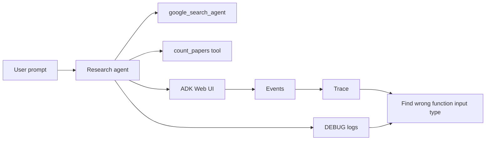
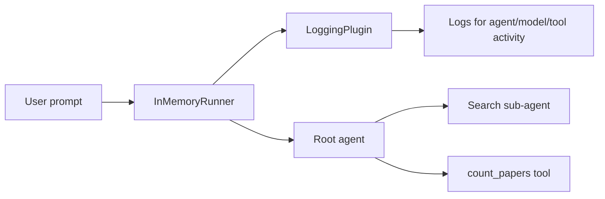

# Day 4a — Agent Observability: Cell-by-Cell Documentation

> **Notebook explained:** `agentic-ai-day-4a-agent-observability.ipynb`  
> **Course context:** Kaggle / Google 5-Day Agents Intensive — Day 4, Part 1  
> **Topic:** Observability, debugging with ADK Web UI, DEBUG logs, traces, plugins, and production logging  
> **Format:** GitHub-ready Markdown documentation

---

## Table of Contents

1. [What this notebook teaches](#what-this-notebook-teaches)
2. [Notebook statistics](#notebook-statistics)
3. [Core observability mental model](#core-observability-mental-model)
4. [Main ADK components used](#main-adk-components-used)
5. [Recommended execution order](#recommended-execution-order)
6. [Important note about the uploaded notebook state](#important-note-about-the-uploaded-notebook-state)
7. [Cell-by-cell documentation](#cell-by-cell-documentation)
   - [Cells 1–9: Setup](#cells-19-setup)
   - [Cells 10–29: Debugging a broken agent with ADK Web UI](#cells-1029-debugging-a-broken-agent-with-adk-web-ui)
   - [Cells 30–46: Production-style logging with plugins](#cells-3046-production-style-logging-with-plugins)
   - [Cells 47–50: Summary and wrap-up](#cells-4750-summary-and-wrap-up)
8. [What the intentional bug is really teaching](#what-the-intentional-bug-is-really-teaching)
9. [Common errors and fixes](#common-errors-and-fixes)
10. [Production-readiness notes](#production-readiness-notes)
11. [Learning checklist](#learning-checklist)
12. [References](#references)

---

## What this notebook teaches

This notebook is the **observability half of Day 4**.

The main idea is simple:

> Building an agent is not enough. You also need a way to see **what the agent did, why it did it, what it sent to the model, what tools it called, and where failures or wrong answers were introduced.**

The notebook teaches this in two phases:

1. **Development debugging**
   - Build a deliberately broken research-paper agent.
   - Run it in **ADK Web** with `DEBUG` logging.
   - Use the **chat UI**, **events**, **traces**, and **logs** to find the bug.

2. **Production observability**
   - Move beyond the web UI.
   - Learn what **plugins** and **callbacks** are.
   - Add ADK’s built-in **`LoggingPlugin`** to an `InMemoryRunner`.
   - Run the agent programmatically with `run_debug()`.

By the end, you should understand the difference between:

| Need | Best tool in this notebook |
|---|---|
| Interactive debugging during development | `adk web --log_level DEBUG` |
| Quick trace-level diagnosis of a broken run | ADK Web UI + Events/Trace panels |
| Local terminal/file inspection | `logger.log` |
| Standard production-style logging | `LoggingPlugin()` |
| Organization-specific observability requirements | Custom plugin + callbacks |

---

## Notebook statistics

| Item | Count |
|---|---:|
| Total cells | 50 |
| Markdown cells | 38 |
| Code cells | 12 |

### High-level notebook structure

| Section | Cell range | Purpose |
|---|---|---|
| Setup | 1–9 | Configure secrets, logging, and Kaggle proxy support |
| Debugging lab | 10–29 | Build a broken agent and diagnose it with ADK Web UI and logs |
| Production logging | 30–46 | Explain plugins/callbacks and add `LoggingPlugin` to a runner |
| Wrap-up | 47–50 | Summarize lessons and provide next steps |

---

## Core observability mental model

The notebook introduces three layers of observability:

| Layer | Meaning | Question it answers |
|---|---|---|
| Logs | Discrete records of events | **What happened?** |
| Traces | Connected sequence of steps across a request | **Why did it happen?** |
| Metrics | Aggregated numbers such as counts, durations, success rates | **How well is it performing overall?** |

### Development debugging flow



### Production logging flow



---

## Main ADK components used

| Component | Role in notebook |
|---|---|
| `LlmAgent` | Defines both the search agent and the root research agent |
| `Gemini` | Wraps the Gemini model used by the agents |
| `google_search` | Built-in search tool used by the search agent |
| `AgentTool` | Exposes one agent to another as a callable tool |
| `InMemoryRunner` | Runs the agent programmatically in memory |
| `BasePlugin` | Base class for custom plugins |
| `LoggingPlugin` | Built-in plugin that logs common observability events |
| `run_debug()` | Programmatic runner method used for debugging |
| `adk web` | Local/dev web interface for interactive debugging |
| `logging` | Python logging configuration used for file-based logs |

---

## Recommended execution order

Run the notebook in this order:

1. **Cells 1–9** to configure environment and helper functions.
2. **Cells 10–19** to create the broken agent and launch ADK Web UI.
3. **Cells 20–25** to reproduce the issue and inspect traces/events.
4. **Stop the running `adk web` cell** before continuing.
5. **Cells 26–29** to inspect local DEBUG logs.
6. **Cells 30–46** to switch from development debugging to production-style logging.
7. **Cells 47–50** for summary and follow-up references.

### Special execution note

The cell that starts:

```bash
adk web --log_level DEBUG ...
```

is **supposed to keep running**. It serves the UI and will not finish until you stop it manually.

---

## Important note about the uploaded notebook state

The uploaded notebook snapshot contains **two different kinds of failures**, and they should not be confused:

### 1. Incidental environment/setup failures in the saved notebook output
These come from the notebook being saved without a working Kaggle secret or a successful earlier setup run.

| Cell | Saved output shows | Meaning |
|---|---|---|
| 5 | Kaggle secret authentication error | `GOOGLE_API_KEY` was not available in this saved run |
| 12 | `Option '--api_key' requires an argument.` | The environment variable was empty, so `adk create` failed |
| 14 | `FileNotFoundError: research-agent/agent.py` | The previous scaffolding cell failed, so the directory was never created |

### 2. The intentional pedagogical bug
This is the bug the notebook **wants** you to debug:

```python
def count_papers(papers: str):
    return len(papers)
```

The type annotation incorrectly says `str` instead of `List[str]`.

That matters because the agent ends up passing the paper list as a **string-like value**, and `len(...)` then counts **characters**, not the number of papers.

So the notebook’s real debugging lesson is:

> **Observability helps you catch subtle semantic bugs that still produce outputs, but produce the wrong outputs.**

---

# Cell-by-Cell Documentation

## Cells 1–9: Setup

### Cell 1 — Copyright notice

**Type:** Markdown

This cell contains the Google copyright statement.

**Purpose:** It identifies the ownership and licensing context of the notebook.

---

### Cell 2 — Notebook title, motivation, and Day 4 goals

**Type:** Markdown

This is the notebook’s main introduction.

It explains:

- Day 3 covered sessions and memory.
- Day 4 has two major themes:
  1. **Observability**
  2. **Evaluation**
- This notebook focuses only on **observability**.

It also introduces the three foundational pillars:

1. **Logs**
2. **Traces**
3. **Metrics**

**Why this matters:** The notebook is not just teaching “how to print logs.” It is teaching a full debugging mindset for agent systems.

---

### Cell 3 — Setup section and dependency note

**Type:** Markdown

This cell explains that Kaggle already has the required ADK dependencies available.

It also shows the local installation command:

```bash
pip install google-adk
```

**Meaning:** You usually do **not** install anything extra inside this Kaggle notebook, but you would need to install ADK in a local environment.

---

### Cell 4 — Gemini API key instructions

**Type:** Markdown

This cell explains how to authenticate the notebook with Gemini using Kaggle Secrets.

The notebook expects a secret named:

```text
GOOGLE_API_KEY
```

It walks the user through:

1. Creating a key in Google AI Studio.
2. Adding it to Kaggle Secrets.
3. Enabling the secret for the notebook.
4. Running the next code cell to export it into the environment.

**Why this matters:** Every later ADK/Gemini call depends on this setup being correct.

---

### Cell 5 — Load `GOOGLE_API_KEY` from Kaggle Secrets

**Type:** Code

```python
import os
from kaggle_secrets import UserSecretsClient

try:
    GOOGLE_API_KEY = UserSecretsClient().get_secret("GOOGLE_API_KEY")
    os.environ["GOOGLE_API_KEY"] = GOOGLE_API_KEY
    print("✅ Setup and authentication complete.")
except Exception as e:
    print(
        f"🔑 Authentication Error: Please make sure you have added 'GOOGLE_API_KEY' to your Kaggle secrets. Details: {e}"
    )
```

#### What this cell does

1. Imports `os`.
2. Imports `UserSecretsClient` from Kaggle.
3. Tries to read the secret called `GOOGLE_API_KEY`.
4. Stores it in `os.environ["GOOGLE_API_KEY"]`.
5. Prints a success message if the secret is available.
6. Prints a friendly error message if authentication fails.

#### Why this is necessary

The Gemini model wrapper and ADK CLI need access to a valid API key. Exporting the key to an environment variable is the simplest way to make it available to downstream code.

#### Expected output in a working run

```text
✅ Setup and authentication complete.
```

#### Output visible in the uploaded notebook snapshot

The saved notebook shows an authentication error. That means the notebook was saved from a run where the Kaggle secret was not attached or could not be retrieved.

#### Consequence of failure

If this cell fails, later cells that rely on `$GOOGLE_API_KEY` will also fail, including the `adk create` command.

---

### Cell 6 — Logging setup introduction

**Type:** Markdown

This short cell introduces the next step: configuring logging and cleaning old log files.

**Purpose:** It signals that debugging depends on having a clean logging environment, especially when rerunning notebooks repeatedly.

---

### Cell 7 — Clean old log files and configure file-based DEBUG logging

**Type:** Code

```python
import logging
import os

# Clean up any previous logs
for log_file in ["logger.log", "web.log", "tunnel.log"]:
    if os.path.exists(log_file):
        os.remove(log_file)
        print(f"🧹 Cleaned up {log_file}")

# Configure logging with DEBUG log level.
logging.basicConfig(
    filename="logger.log",
    level=logging.DEBUG,
    format="%(filename)s:%(lineno)s %(levelname)s:%(message)s",
)

print("✅ Logging configured")
```

#### What this cell does

1. Imports `logging` and `os`.
2. Removes any previous:
   - `logger.log`
   - `web.log`
   - `tunnel.log`
3. Configures Python logging with:
   - output file: `logger.log`
   - level: `DEBUG`
   - format: `%(filename)s:%(lineno)s %(levelname)s:%(message)s`

#### Why this cell exists

When you debug agents, stale logs are confusing. This cell guarantees that each notebook run starts with a fresh log file.

#### Why `DEBUG` matters

`DEBUG` is the most verbose level and is the one that gives you the most useful information during diagnosis:

- prompts
- tool schemas
- tool calls
- intermediate state
- model responses
- error details

#### Expected output

```text
✅ Logging configured
```

#### Practical interpretation

This is the notebook’s **local log capture layer**. Even if the web UI is not enough, you still have a file you can inspect afterward.

---

### Cell 8 — Proxy/tunneling introduction for Kaggle

**Type:** Markdown

This cell explains that Kaggle Notebooks run in an environment where a simple `localhost:8000` URL is not directly usable from the browser.

So the notebook needs a **proxy-aware URL** for the ADK web interface.

**Important distinction:**

| Environment | Need this proxy helper? |
|---|---|
| Kaggle Notebook | Yes |
| Local machine / VS Code / terminal | Usually no |

---

### Cell 9 — Define a Kaggle-specific helper to open the ADK Web UI

**Type:** Code

```python
from IPython.core.display import display, HTML
from jupyter_server.serverapp import list_running_servers


# Gets the proxied URL in the Kaggle Notebooks environment
def get_adk_proxy_url():
    PROXY_HOST = "https://kkb-production.jupyter-proxy.kaggle.net"
    ADK_PORT = "8000"

    servers = list(list_running_servers())
    if not servers:
        raise Exception("No running Jupyter servers found.")

    baseURL = servers[0]["base_url"]

    try:
        path_parts = baseURL.split("/")
        kernel = path_parts[2]
        token = path_parts[3]
    except IndexError:
        raise Exception(f"Could not parse kernel/token from base URL: {baseURL}")

    url_prefix = f"/k/{kernel}/{token}/proxy/proxy/{ADK_PORT}"
    url = f"{PROXY_HOST}{url_prefix}"

    styled_html = f"""
    <div style="padding: 15px; border: 2px solid #f0ad4e; border-radius: 8px; background-color: #fef9f0; margin: 20px 0;">
        <div style="font-family: sans-serif; margin-bottom: 12px; color: #333; font-size: 1.1em;">
            <strong>⚠️ IMPORTANT: Action Required</strong>
        </div>
        <div style="font-family: sans-serif; margin-bottom: 15px; color: #333; line-height: 1.5;">
            The ADK web UI is <strong>not running yet</strong>. You must start it in the next cell.
            <ol style="margin-top: 10px; padding-left: 20px;">
                <li style="margin-bottom: 5px;"><strong>Run the next cell</strong> (the one with <code>!adk web ...</code>) to start the ADK web UI.</li>
                <li style="margin-bottom: 5px;">Wait for that cell to show it is "Running" (it will not "complete").</li>
                <li>Once it's running, <strong>return to this button</strong> and click it to open the UI.</li>
            </ol>
            <em style="font-size: 0.9em; color: #555;">(If you click the button before running the next cell, you will get a 500 error.)</em>
        </div>
        <a href='{url}' target='_blank' style="
            display: inline-block; background-color: #1a73e8; color: white; padding: 10px 20px;
            text-decoration: none; border-radius: 25px; font-family: sans-serif; font-weight: 500;
            box-shadow: 0 2px 5px rgba(0,0,0,0.2); transition: all 0.2s ease;">
            Open ADK Web UI (after running cell below) ↗
        </a>
    </div>
    """

    display(HTML(styled_html))

    return url_prefix


print("✅ Helper functions defined.")
```

#### What this cell does

This cell defines a helper function called `get_adk_proxy_url()`.

Inside that function, it:

1. Uses `list_running_servers()` to inspect the active Jupyter server.
2. Extracts the notebook’s `base_url`.
3. Parses the **kernel** and **token** from that URL.
4. Builds a Kaggle-compatible proxy prefix targeting port `8000`.
5. Builds a full clickable web URL.
6. Displays a styled HTML callout with a button for opening ADK Web UI.
7. Returns the `url_prefix` so the next CLI command can use it.

#### Why this helper exists

`adk web` serves a local web app, but Kaggle needs a proxied path. This cell bridges those two worlds.

#### Key output

At the end, the cell prints:

```text
✅ Helper functions defined.
```

#### Important behavioral detail

The HTML button is shown **before** the server is started. That is why the message warns you not to click the button until the `adk web` command is actually running.

---

## Cells 10–29: Debugging a broken agent with ADK Web UI

### Cell 10 — Section divider for the debugging lab

**Type:** Markdown

This marks the beginning of the hands-on debugging exercise.

**Goal introduced here:** Build a “Research Paper Finder” agent, but intentionally build a broken version first so you can practice debugging with observability tools.

---

### Cell 11 — Introduce the broken “Research Paper Finder” agent

**Type:** Markdown

This cell explains the intended behavior:

- The agent should find academic papers on a topic.
- It should return the list of papers.
- It should count how many papers were found.

It also makes the teaching strategy explicit:

> The notebook will intentionally introduce an error so that you can debug it.

---

### Cell 12 — Scaffold a new ADK agent project with the CLI

**Type:** Code

```python
!adk create research-agent --model gemini-2.5-flash-lite --api_key $GOOGLE_API_KEY
```

#### What this cell is supposed to do

This command uses the ADK CLI to create a starter project folder:

```bash
research-agent/
```

It also supplies:

- the model name
- the API key
- starter scaffolding for the agent

#### Why it matters

The next cell writes `agent.py` into that newly created project folder. So this scaffolding step must succeed first.

#### Output visible in the uploaded notebook snapshot

The saved output shows:

```text
Error: Option '--api_key' requires an argument.
```

That happened because the earlier environment variable was empty due to failed secret loading.

#### What should happen in a working run

The CLI should create the project folder so that:

```text
research-agent/agent.py
```

can be written in the next cell.

---

### Cell 13 — Agent definition introduction

**Type:** Markdown

This cell explains the structure of the upcoming agent code:

- A **root agent** receives the user request.
- A **google_search_agent** is used to find papers.
- A `count_papers` tool is used afterward to count the papers.

This is important because the bug does **not** come from missing orchestration. It comes from the **type contract** of the counting tool.

---

### Cell 14 — Write the intentionally broken agent to `research-agent/agent.py`

**Type:** Code

```python
%%writefile research-agent/agent.py

from google.adk.agents import LlmAgent
from google.adk.models.google_llm import Gemini
from google.adk.tools.agent_tool import AgentTool
from google.adk.tools.google_search_tool import google_search

from google.genai import types
from typing import List

retry_config = types.HttpRetryOptions(
    attempts=5,  # Maximum retry attempts
    exp_base=7,  # Delay multiplier
    initial_delay=1,
    http_status_codes=[429, 500, 503, 504],  # Retry on these HTTP errors
)

# ---- Intentionally pass incorrect datatype - `str` instead of `List[str]` ----
def count_papers(papers: str):
    """
    This function counts the number of papers in a list of strings.
    Args:
      papers: A list of strings, where each string is a research paper.
    Returns:
      The number of papers in the list.
    """
    return len(papers)


# Google Search agent
google_search_agent = LlmAgent(
    name="google_search_agent",
    model=Gemini(model="gemini-2.5-flash-lite", retry_options=retry_config),
    description="Searches for information using Google search",
    instruction="""Use the google_search tool to find information on the given topic. Return the raw search results.
    If the user asks for a list of papers, then give them the list of research papers you found and not the summary.""",
    tools=[google_search]
)


# Root agent
root_agent = LlmAgent(
    name="research_paper_finder_agent",
    model=Gemini(model="gemini-2.5-flash-lite", retry_options=retry_config),
    instruction="""Your task is to find research papers and count them. 

    You MUST ALWAYS follow these steps:
    1) Find research papers on the user provided topic using the 'google_search_agent'. 
    2) Then, pass the papers to 'count_papers' tool to count the number of papers returned.
    3) Return both the list of research papers and the total number of papers.
    """,
    tools=[AgentTool(agent=google_search_agent), count_papers]
)
```

#### What this cell defines

This is the most important code cell in the debugging lab.

It creates:

1. **Retry configuration**
   - Retries on common transient HTTP errors like 429, 500, 503, and 504.

2. **A broken tool**
   - `count_papers(papers: str)`

3. **A search agent**
   - `google_search_agent`
   - Uses `google_search`
   - Returns raw search results

4. **A root agent**
   - `research_paper_finder_agent`
   - Must:
     1. find papers,
     2. count them,
     3. return both list and total

#### The intentional bug

The function says:

```python
def count_papers(papers: str):
    return len(papers)
```

But the docstring says `papers` should be a **list of strings**.

That mismatch is the bug.

#### Why this bug is subtle

The tool still runs.

It does **not** crash immediately.

Instead, it can produce a **plausible but wrong number**, because:

- `len(["paper1", "paper2"]) == 2`
- but `len("['paper1', 'paper2']")` counts characters, not items

So the agent appears to work, yet gives an absurd paper count.

#### Why observability is needed

Without observability, you might incorrectly blame:

- the prompt
- the search results
- the model
- the search tool
- the UI

But the real problem is the **function input type seen in the tool call**.

#### Output visible in the uploaded notebook snapshot

The saved notebook shows a `FileNotFoundError` here because the scaffolding directory was not created in the previous cell.

#### Intended success path

In a proper run, this cell should simply write:

```text
Writing research-agent/agent.py
```

and proceed.

---

### Cell 15 — Introduction to running the broken agent

**Type:** Markdown

This cell explains that the next step is to launch the agent in ADK Web with:

```bash
adk web --log_level DEBUG
```

It also explains why `DEBUG` is important:

- full prompts
- tool definitions
- detailed service responses
- internal state transitions

This is the notebook’s central development-debugging technique.

---

### Cell 16 — Prompt to compute the proxied ADK Web UI URL

**Type:** Markdown

This is a transitional instruction cell telling the reader to get the proxied URL first.

In Kaggle, the UI link must be generated before launching the server.

---

### Cell 17 — Generate the proxy URL and render the “Open ADK Web UI” button

**Type:** Code

```python
url_prefix = get_adk_proxy_url()
```

#### What this cell does

It executes the helper from Cell 9:

```python
url_prefix = get_adk_proxy_url()
```

This has two effects:

1. Displays the HTML button for opening ADK Web UI.
2. Stores the returned `url_prefix` for use in the next CLI command.

#### Why this matters

The next cell passes `url_prefix` to `adk web` so the server is reachable through Kaggle’s proxy.

---

### Cell 18 — Explain that `adk web` will stay running

**Type:** Markdown

This cell warns the user that the next cell will not complete.

That is expected behavior because the ADK web server must stay alive while you use the UI.

---

### Cell 19 — Start the ADK Web UI with DEBUG logging enabled

**Type:** Code

```python
!adk web --log_level DEBUG --url_prefix {url_prefix}
```

#### What this cell does

It launches the ADK Web interface and sets the logging level to `DEBUG`.

It also passes a Kaggle-specific `url_prefix`.

#### Why this cell is crucial

This cell activates the notebook’s richest debugging environment:

- browser-based interaction
- event timeline
- traces
- detailed logs
- tool call inspection

#### Important runtime behavior

This cell is **supposed to keep running**.

You should not expect a normal notebook prompt to return until you manually stop it.

#### Why `DEBUG` is used here

The notebook wants maximum visibility so you can see:

- what prompt went to the model
- what tool schema the model saw
- what arguments the model passed into `count_papers`
- what came back from the tool

---

### Cell 20 — Security note after starting the server

**Type:** Markdown

This cell tells you to open the proxy link and warns:

- the proxy URL contains authentication details,
- so you should treat it as sensitive and not share it.

**Why it matters:** Notebook debugging links can unintentionally expose authenticated access if shared carelessly.

---

### Cell 21 — Reproduce the problem in the ADK Web UI

**Type:** Markdown

This cell tells the user to:

1. choose `research-agent`,
2. ask for quantum computing papers,
3. inspect the response.

The key teaching moment is:

> The response looks superficially correct, but the count is suspiciously large.

This is a classic observability lesson: **the system did not obviously crash, but it still behaved incorrectly.**

---

### Cell 22 — Inspect the Events tab and trace view

**Type:** Markdown

This cell instructs the user to open the **Events** tab and inspect traces.

It specifically points the reader to:

- the `execute_tool count_papers` span
- the `call_llm` span associated with the function call

**Why this matters:** This is how you move from “the answer looks wrong” to “this exact step introduced the error.”

---

### Cell 23 — Inspect the function call payload and find the root cause

**Type:** Markdown

This cell reveals the diagnosis:

- the `papers` argument is passed as a **`str`**
- but the tool really expects a **`List[str]`**

This is the notebook’s root-cause cell.

**Core lesson:** Observability is not only for crashes. It is also for diagnosing **silent semantic failures**.

---

### Cell 24 — Demo GIF of UI-based observability

**Type:** Markdown (image)

This cell embeds a GIF demonstrating the UI flow.

It visually reinforces:

- opening the Events tab
- clicking traces/spans
- locating the function call
- finding the broken `papers` input

---

### Cell 25 — Fix-it prompt

**Type:** Markdown

This cell asks the learner to fix the bug by changing:

```python
papers: str
```

to

```python
papers: List[str]
```

and rerunning the ADK Web server.

**Pedagogical purpose:** It turns the diagnosis into an active repair exercise.

---

### Cell 26 — Stop-the-server instructions

**Type:** Markdown

This cell reminds the reader to stop the still-running `adk web` cell before continuing.

**Why this matters:** A blocking web server cell prevents the rest of the notebook from executing smoothly.

---

### Cell 27 — Introduce local log-based debugging

**Type:** Markdown

This cell explains that even without the UI, you can inspect local logs and find the same problem.

It points the reader to look for entries such as:

- `LLM Request`
- `LLM Response`

**Meaning:** The notebook is now showing that observability should not depend on a UI alone.

---

### Cell 28 — Print `logger.log` for local inspection

**Type:** Code

```python
# Check the DEBUG logs from the broken agent
print("🔍 Examiningweb server logs for debugging clues...\n")
!cat logger.log
```

#### What this cell does

1. Prints a heading.
2. Dumps the contents of `logger.log` using `cat`.

#### Why this cell exists

It shows that the same debugging story can be reconstructed from raw logs:

- request prompt
- function definitions
- model response
- function call arguments
- execution sequence

#### What you are expected to inspect

The most important part is the serialized function/tool call that reveals the wrong `papers` input type.

#### Practical note

If the earlier web session never ran successfully, this log file may be empty or unhelpful.

---

### Cell 29 — Other observability questions you can answer

**Type:** Markdown

This cell broadens the lesson beyond just this one bug.

It says logs and traces help answer questions about:

- **Efficiency** — Is the agent making good tool choices?
- **Reasoning quality** — Are prompts and context appropriate?
- **Performance** — Which steps are slow?
- **Failure diagnosis** — Exactly where did something fail?

This is the transition from “debugging one notebook bug” to “operating real agent systems.”

---

## Cells 30–46: Production-style logging with plugins

### Cell 30 — Section divider: observability in production

**Type:** Markdown

This cell shifts the discussion from development to production.

It frames two realistic production problems:

1. **You cannot rely on opening a web UI on production servers**
2. **You cannot manually inspect thousands of runs**

The conclusion is:

> In production, observability must be captured automatically in code.

---

### Cell 31 — Introduce plugins as the production observability mechanism

**Type:** Markdown

This cell defines a **Plugin** as a custom code module that runs automatically at points in the agent lifecycle.

It also explains the conceptual pattern:

- workflow has steps,
- plugin hooks into those steps,
- custom code runs at those hook points.

**Key idea:** Plugins are how you add horizontal concerns like logging, monitoring, safety, and caching.

---

### Cell 32 — Plugin/callback architecture diagram

**Type:** Markdown (image)

This cell shows a diagram of plugin and callback relationships.

Its role is conceptual rather than executable: it helps the reader visualize how plugins wrap the agent lifecycle.

---

### Cell 33 — Explain callback types

**Type:** Markdown

This cell defines callbacks as the atomic building blocks inside a plugin.

It lists examples such as:

- `before_agent_callback`
- `after_agent_callback`
- `before_tool_callback`
- `after_tool_callback`
- `before_model_callback`
- `after_model_callback`
- `on_model_error_callback`

**Why this matters:** The notebook is teaching the vocabulary needed to understand the custom plugin example in the next code cell.

---

### Cell 34 — Callback-types diagram

**Type:** Markdown (image)

This is another conceptual image.

It visually organizes the different callback hook types and where they appear in the agent lifecycle.

---

### Cell 35 — Transition to a concrete plugin example

**Type:** Markdown

This cell asks: what does a plugin actually look like in code?

It sets up the next cell as a minimal worked example.

---

### Cell 36 — Example custom plugin that counts invocations

**Type:** Code

```python
print("----- EXAMPLE PLUGIN - DOES NOTHING ----- ")

import logging
from google.adk.agents.base_agent import BaseAgent
from google.adk.agents.callback_context import CallbackContext
from google.adk.models.llm_request import LlmRequest
from google.adk.plugins.base_plugin import BasePlugin


# Applies to all agent and model calls
class CountInvocationPlugin(BasePlugin):
    """A custom plugin that counts agent and tool invocations."""

    def __init__(self) -> None:
        """Initialize the plugin with counters."""
        super().__init__(name="count_invocation")
        self.agent_count: int = 0
        self.tool_count: int = 0
        self.llm_request_count: int = 0

    # Callback 1: Runs before an agent is called. You can add any custom logic here.
    async def before_agent_callback(
        self, *, agent: BaseAgent, callback_context: CallbackContext
    ) -> None:
        """Count agent runs."""
        self.agent_count += 1
        logging.info(f"[Plugin] Agent run count: {self.agent_count}")

    # Callback 2: Runs before a model is called. You can add any custom logic here.
    async def before_model_callback(
        self, *, callback_context: CallbackContext, llm_request: LlmRequest
    ) -> None:
        """Count LLM requests."""
        self.llm_request_count += 1
        logging.info(f"[Plugin] LLM request count: {self.llm_request_count}")
```

#### What this cell does

This cell defines a custom plugin class:

```python
class CountInvocationPlugin(BasePlugin):
```

It includes:

- a plugin name
- counters stored on the plugin instance
- a `before_agent_callback`
- a `before_model_callback`

#### What each part means

| Part | Purpose |
|---|---|
| `BasePlugin` | Base class for global runner-level plugins |
| `agent_count` | Counts how many agent executions occurred |
| `tool_count` | Placeholder for tracking tool executions (not implemented in this cell) |
| `llm_request_count` | Counts model requests |
| `before_agent_callback` | Runs before an agent execution starts |
| `before_model_callback` | Runs before the LLM is called |

#### Important detail

This example uses `logging.info(...)` inside the callbacks rather than `print(...)`.

That means it is demonstrating how a plugin can emit structured logs through Python’s logging system.

#### Another important detail

The plugin is **defined here**, but it is **not attached to a runner in this cell**. This cell is educational: it shows plugin structure and callback design.

#### Why this example matters

It demonstrates the architectural difference between:

- **agent code** that solves the business task
- **plugin code** that observes or modifies execution globally

---

### Cell 37 — Key plugin insight

**Type:** Markdown

This cell states the central advantage of plugins:

> Register the plugin once on the runner, and it applies across every agent, tool call, and LLM request in that runner.

That is exactly why plugins are well-suited for observability.

---

### Cell 38 — Numbered flow explanation prompt

**Type:** Markdown

This cell tells the reader to follow the numbered diagram in the next image.

It is just a bridge between the conceptual explanation and the visual.

---

### Cell 39 — Plugin invocation-flow diagram

**Type:** Markdown (image)

This diagram illustrates the callback execution flow inside the plugin lifecycle.

Its purpose is to help the reader mentally map:

- request enters
- callbacks fire
- agent/model/tool events happen
- logs/metrics are captured

---

### Cell 40 — Introduce ADK’s built-in `LoggingPlugin`

**Type:** Markdown

This is the notebook’s key production takeaway.

Instead of asking you to build every callback manually, it introduces **`LoggingPlugin`** as the built-in observability solution for common use cases.

The cell says it automatically captures:

- user messages and responses
- timing data
- LLM requests and responses
- tool calls and results
- complete execution traces

**Meaning:** This is the standard “good default” for production-style logging in ADK.

---

### Cell 41 — Transition to rebuilding the research agent correctly

**Type:** Markdown

This cell tells the reader that the same research paper finder will now be rebuilt in corrected form for the production logging example.

**Why it matters:** The notebook is reusing the same business logic so the focus stays on observability, not on learning a new agent.

---

### Cell 42 — Recreate the research agent with the bug fixed

**Type:** Code

```python
from google.adk.agents import LlmAgent
from google.adk.models.google_llm import Gemini
from google.adk.tools.agent_tool import AgentTool
from google.adk.tools.google_search_tool import google_search

from google.genai import types
from typing import List

retry_config = types.HttpRetryOptions(
    attempts=5,  # Maximum retry attempts
    exp_base=7,  # Delay multiplier
    initial_delay=1,
    http_status_codes=[429, 500, 503, 504],  # Retry on these HTTP errors
)


def count_papers(papers: List[str]):
    """
    This function counts the number of papers in a list of strings.
    Args:
      papers: A list of strings, where each string is a research paper.
    Returns:
      The number of papers in the list.
    """
    return len(papers)


# Google search agent
google_search_agent = LlmAgent(
    name="google_search_agent",
    model=Gemini(model="gemini-2.5-flash-lite", retry_options=retry_config),
    description="Searches for information using Google search",
    instruction="Use the google_search tool to find information on the given topic. Return the raw search results.",
    tools=[google_search],
)

# Root agent
research_agent_with_plugin = LlmAgent(
    name="research_paper_finder_agent",
    model=Gemini(model="gemini-2.5-flash-lite", retry_options=retry_config),
    instruction="""Your task is to find research papers and count them. 

   You must follow these steps:
   1) Find research papers on the user provided topic using the 'google_search_agent'. 
   2) Then, pass the papers to 'count_papers' tool to count the number of papers returned.
   3) Return both the list of research papers and the total number of papers.
   """,
    tools=[AgentTool(agent=google_search_agent), count_papers],
)

print("✅ Agent created")
```

#### What this cell does

This is the corrected version of the earlier broken agent.

It:

1. Reimports the required ADK and Gemini components.
2. Recreates the retry configuration.
3. Fixes the tool signature:
   ```python
   def count_papers(papers: List[str]):
   ```
4. Rebuilds the `google_search_agent`.
5. Rebuilds the root agent as `research_agent_with_plugin`.

#### Most important fix

The function input is now annotated as:

```python
List[str]
```

instead of:

```python
str
```

#### Why that matters

Now the agent and tool interface agree about the expected data shape. The model is much more likely to generate the function call with the correct structured argument.

#### Why the notebook rebuilds the whole agent

Because the next step is to attach a production-style logging layer to a **working** agent, not a broken one.

#### Expected output

```text
✅ Agent created
```

---

### Cell 43 — Introduce runner-level plugin attachment

**Type:** Markdown

This cell explains the runner integration step:

1. import `LoggingPlugin`
2. pass it into `InMemoryRunner(...)`

This is the operational move that converts a plain agent run into an observable agent run.

---

### Cell 44 — Create an `InMemoryRunner` with `LoggingPlugin`

**Type:** Code

```python
from google.adk.runners import InMemoryRunner
from google.adk.plugins.logging_plugin import (
    LoggingPlugin,
)  # <---- 1. Import the Plugin
from google.genai import types
import asyncio

runner = InMemoryRunner(
    agent=research_agent_with_plugin,
    plugins=[
        LoggingPlugin()
    ],  # <---- 2. Add the plugin. Handles standard Observability logging across ALL agents
)

print("✅ Runner configured")
```

#### What this cell does

It creates an `InMemoryRunner` and attaches the built-in `LoggingPlugin`.

#### Why `InMemoryRunner` is used

This is the simplest runner for notebook and programmatic demonstrations:

- no external persistence required
- simple setup
- useful for debugging and examples

#### What the `plugins` argument does

This line is the key:

```python
plugins=[LoggingPlugin()]
```

It tells ADK to apply logging hooks across the entire workflow managed by this runner.

That includes:

- agent execution
- model calls
- tool calls

#### Expected output

```text
✅ Runner configured
```

#### Small implementation note

`asyncio` is imported here even though the notebook uses top-level `await`. This is common in notebook examples because the same code can often be adapted to script form later.

---

### Cell 45 — Introduce programmatic execution with `run_debug`

**Type:** Markdown

This cell announces the final execution step.

The notebook is now leaving the browser-based debugging path and using a programmatic debugging path instead.

---

### Cell 46 — Run the corrected agent with `LoggingPlugin` using `run_debug()`

**Type:** Code

```python
print("🚀 Running agent with LoggingPlugin...")
print("📊 Watch the comprehensive logging output below:\n")

response = await runner.run_debug("Find recent papers on quantum computing")
```

#### What this cell does

1. Prints a banner.
2. Executes the runner against a real prompt:
   ```python
   "Find recent papers on quantum computing"
   ```
3. Uses:
   ```python
   await runner.run_debug(...)
   ```
   to run the workflow.

#### Why this is important

This is the notebook’s production-style demonstration.

Instead of relying on a browser UI, the agent is now run directly in Python code while the logging plugin captures observability data.

#### What `run_debug()` gives you

Conceptually, `run_debug()` is a convenience method for easier programmatic debugging. It is especially useful in notebook examples and scripted smoke tests.

#### Expected behavior

You should see:

- logging output from the plugin
- the agent’s internal steps
- final response events

#### Why this complements, rather than replaces, ADK Web UI

| Tool | Best use |
|---|---|
| ADK Web UI | Interactive debugging and trace inspection during development |
| `run_debug()` + `LoggingPlugin` | Programmatic execution with logging, useful in scripts/tests |

---

## Cells 47–50: Summary and wrap-up

### Cell 47 — Summary of when to use each logging approach

**Type:** Markdown

This cell compresses the notebook into a practical decision guide:

1. **Development debugging** → `adk web --log_level DEBUG`
2. **Common production observability** → `LoggingPlugin()`
3. **Custom requirements** → custom callbacks/plugins

It also suggests a follow-up exercise: implement a custom plugin that tracks tool-call counts.

---

### Cell 48 — Congratulations / completion notes

**Type:** Markdown

This cell states what the learner should now know how to do:

- debug failures via the web UI and logs
- follow the chain from symptom to root cause
- use `LoggingPlugin`
- choose an appropriate logging strategy

It also clarifies that this notebook is for practice and does not require submission.

---

### Cell 49 — Resources and next steps

**Type:** Markdown

This cell links to additional ADK documentation and points the learner to the next Day 4 notebook, which focuses on **evaluation**.

**Purpose:** It situates observability as one half of a larger quality story.

---

### Cell 50 — Author credits

**Type:** Markdown / HTML

This final cell contains the author information in a centered HTML table.

It is purely presentational and does not affect execution.

---

## What the intentional bug is really teaching

The broken line:

```python
def count_papers(papers: str):
    return len(papers)
```

teaches several important agent-engineering lessons at once.

### 1. Tool schemas are part of the agent contract

In ADK, the model decides how to call tools based on the tool interface it sees.

If the type annotation is wrong, the model may produce the wrong structure for the function call.

### 2. A system can be wrong without crashing

The counting tool does return a number.

The failure is **semantic**, not purely syntactic:

- the pipeline runs,
- the answer is formatted,
- but the count is nonsense.

### 3. Observability is how you locate semantic failures

By inspecting events and traces, you can see:

- the tool call,
- the exact arguments,
- the tool response,
- the step where the wrong value appeared.

### 4. Logs and traces complement each other

| Tool | What it gives you |
|---|---|
| Logs | Detailed raw event records |
| Traces | A request-centric story showing how one step led to the next |

---

## Common errors and fixes

| Problem | Likely cause | Fix |
|---|---|---|
| `GOOGLE_API_KEY` authentication error | Secret missing or not attached | Add the secret in Kaggle and enable it |
| `Option '--api_key' requires an argument.` | Environment variable empty | Fix Cell 5 first, then rerun Cell 12 |
| `FileNotFoundError: research-agent/agent.py` | `adk create` failed, so folder does not exist | Rerun Cell 12 successfully before Cell 14 |
| Proxy link gives a 500 error | ADK web server not started yet | Run the `adk web` cell first and wait until it is serving |
| Notebook appears “stuck” | `adk web` is a long-running server process | This is expected; stop it manually when done |
| `logger.log` is empty | No successful agent run occurred yet | Reproduce the request in ADK Web first |
| Paper count is unrealistically large | `count_papers` receives a string instead of a list | Change `papers: str` to `papers: List[str]` |
| Production logs are too verbose | Using `DEBUG` in the wrong context | Use `INFO` or `WARNING` outside active troubleshooting |
| Sensitive prompt/tool data appears in logs | DEBUG logging is very detailed | Avoid DEBUG in production unless necessary and properly secured |

---

## Production-readiness notes

### 1. ADK Web is for development, not production

The notebook uses ADK Web because it is excellent for development debugging. It should not be your primary production observability interface.

### 2. `DEBUG` logging is powerful but risky

It may expose:

- full prompts
- tool arguments
- model responses
- internal state details

That is very useful for debugging, but it also means DEBUG logs can contain sensitive data.

### 3. Built-in `LoggingPlugin` is the standard baseline

Use it when you need common observability behavior without creating your own callbacks.

### 4. Custom plugins are for cross-cutting concerns

Examples include:

- extra metrics
- custom trace exports
- security policy checks
- business-specific audit logs
- cost and latency measurement

### 5. The custom plugin example is illustrative

The notebook’s `CountInvocationPlugin` shows plugin structure, but it is not wired into the runner later in the notebook. The actual runner uses ADK’s built-in `LoggingPlugin`.

---

## Learning checklist

### Observability concepts

- [ ] I can explain the difference between logs, traces, and metrics.
- [ ] I understand why agents need deeper observability than plain request/response apps.
- [ ] I know why semantic failures can be harder to spot than hard crashes.

### Debugging workflow

- [ ] I can explain why the broken agent appears to work at first.
- [ ] I understand how to use ADK Web UI to inspect Events and Trace.
- [ ] I know where to look for the `count_papers` tool call.
- [ ] I can explain why `str` vs `List[str]` changes the result.

### Logging mechanics

- [ ] I know what `logging.basicConfig(...)` is doing in this notebook.
- [ ] I understand why old log files are deleted before a new run.
- [ ] I know what kinds of information `DEBUG` logging exposes.

### Plugins and callbacks

- [ ] I can explain what a plugin is in ADK.
- [ ] I can explain what a callback is.
- [ ] I understand why plugins are configured on the runner.
- [ ] I understand why plugins apply globally across agent/tool/model calls.

### Production observability

- [ ] I know when to use ADK Web UI.
- [ ] I know when to use `LoggingPlugin()`.
- [ ] I know when I would need a custom plugin.
- [ ] I understand why production environments usually should not rely on manual UI inspection.

---

## References

- [Kaggle — Day 4a: Agent Observability](https://www.kaggle.com/code/kaggle5daysofai/day-4a-agent-observability)
- [Kaggle — 5-Day AI Agents Intensive Course](https://www.kaggle.com/learn-guide/5-day-agents)
- [Google ADK — Observability](https://adk.dev/observability/)
- [Google ADK — Logging](https://adk.dev/observability/logging/)
- [Google ADK — Plugins](https://adk.dev/plugins/)
- [Google ADK — Callbacks](https://adk.dev/callbacks/)
- [Google ADK — Apps / `run_debug()` example](https://adk.dev/apps/)
- [Google ADK — Web Interface](https://adk.dev/runtime/web-interface/)
- [Google ADK — CLI Reference (`adk create`, `adk web`)](https://adk.dev/api-reference/cli/)
