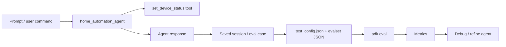

# Day 4b — Agent Evaluation: Cell-by-Cell Documentation

> **Notebook explained:** `agentic-ai-day-4b-agent-evaluation.ipynb`  
> **Course context:** Kaggle / Google 5-Day Agents Intensive — Day 4, Part 2  
> **Topic:** Interactive evaluation, regression testing, `adk eval`, response/tool metrics, evalset files, and optional user simulation  
> **Format:** GitHub-ready Markdown documentation

---

## Table of Contents

1. [What this notebook teaches](#what-this-notebook-teaches)
2. [Notebook statistics](#notebook-statistics)
3. [Core evaluation mental model](#core-evaluation-mental-model)
4. [Main components used](#main-components-used)
5. [Important files created](#important-files-created)
6. [Recommended execution order](#recommended-execution-order)
7. [Important note about the uploaded notebook state](#important-note-about-the-uploaded-notebook-state)
8. [Cell-by-cell documentation](#cell-by-cell-documentation)
   - [Cells 1–10: Intro, setup, and Kaggle proxy helper](#cells-110-intro-setup-and-kaggle-proxy-helper)
   - [Cells 11–18: Build the home automation agent and launch ADK Web](#cells-1118-build-the-home-automation-agent-and-launch-adk-web)
   - [Cells 19–26: Create and run interactive evaluations in the Web UI](#cells-1926-create-and-run-interactive-evaluations-in-the-web-ui)
   - [Cells 27–38: Move to systematic CLI-based evaluation](#cells-2738-move-to-systematic-cli-based-evaluation)
   - [Cells 39–42: Optional user simulation, wrap-up, and references](#cells-3942-optional-user-simulation-wrap-up-and-references)
9. [What the notebook is really teaching](#what-the-notebook-is-really-teaching)
10. [Common errors and fixes](#common-errors-and-fixes)
11. [Production-readiness notes](#production-readiness-notes)
12. [Learning checklist](#learning-checklist)
13. [References](#references)

---

## What this notebook teaches

This notebook is the **evaluation half of Day 4**.

Day 4a focused on **observability**: once something goes wrong, how do you inspect traces, logs, and events to understand the failure?

Day 4b adds the complementary discipline:

> **How do you catch quality regressions before users discover them for you?**

The notebook answers that question in two stages:

1. **Interactive evaluation in ADK Web**
   - Start with a working conversation.
   - Save that session as an evaluation case.
   - Re-run the case and compare the new behavior against the saved reference.

2. **Systematic regression testing with files + CLI**
   - Write an explicit evaluation configuration.
   - Write an explicit evalset JSON file.
   - Run `adk eval` so the same checks can be repeated automatically.

By the end, the learner should understand that evaluating an agent means measuring **both**:

- the **final response** shown to the user, and
- the **trajectory** the agent took to get there, especially tool calls and their arguments.

That distinction is the central teaching point of the notebook.

---

## Notebook statistics

| Item | Count |
|---|---:|
| Total cells | 42 |
| Markdown cells | 31 |
| Code cells | 11 |

### High-level notebook structure

| Section | Cell range | Purpose |
|---|---|---|
| Intro and setup | 1–10 | Define evaluation, set learning goals, load API key, and prepare Kaggle proxy support |
| Agent creation + Web UI launch | 11–18 | Scaffold a deliberately flawed home automation agent and start ADK Web |
| Interactive evaluation | 19–26 | Save sessions as eval cases, run them in the UI, and inspect failures |
| Systematic evaluation | 27–38 | Build `test_config.json` and `integration.evalset.json`, then run `adk eval` |
| Wrap-up | 39–42 | Introduce optional user simulation and provide final resources |

---

## Core evaluation mental model

The notebook teaches a very practical evaluation loop:



### What is being measured?

| Quality dimension | Notebook metric | What it checks |
|---|---|---|
| Did the agent call the correct tool with the correct arguments? | `tool_trajectory_avg_score` | Behavioral correctness of the tool path |
| Did the agent say the expected thing? | `response_match_score` | Similarity between actual and expected final response |

### Why this matters

A tool-using agent can fail in at least two different ways:

1. **Tool failure / planning failure**
   - Wrong tool
   - Wrong tool arguments
   - Wrong order of actions

2. **Communication failure**
   - Tool usage was correct, but the wording is misleading, rude, or too different from the desired response

The notebook deliberately shows how evaluation helps separate those failure modes instead of treating them as one generic “bad answer”.

---

## Main components used

| Component | Where it appears | Role in the notebook |
|---|---|---|
| `UserSecretsClient` | Cell 8 | Loads the Gemini API key from Kaggle secrets |
| `get_adk_proxy_url()` | Cell 10 | Builds a Kaggle-safe URL path for ADK Web |
| `adk create` | Cell 12 | Scaffolds the agent project directory |
| `LlmAgent` | Cell 14 | Defines the root agent |
| `Gemini` model wrapper | Cell 14 | Connects the root agent to Gemini |
| `set_device_status()` | Cell 14 | Simple function tool for smart-home control |
| `adk web` | Cell 18 | Starts the interactive evaluation UI |
| `test_config.json` | Cell 30 | Declares pass/fail thresholds |
| `integration.evalset.json` | Cells 32–34 | Stores the batch test cases |
| `adk eval` | Cell 36 | Runs systematic CLI-based regression tests |
| Optional User Simulation | Cell 39 | Introduces dynamic scenario-based evaluation |

---

## Important files created

| File | Created by | Purpose |
|---|---|---|
| `home_automation_agent/.env` | Cell 12 (`adk create`) | Environment scaffolding generated by ADK |
| `home_automation_agent/__init__.py` | Cell 12 | Makes the folder importable as a Python package |
| `home_automation_agent/agent.py` | Cell 14 | The actual agent implementation used for evaluation |
| `home_automation_agent/test_config.json` | Cell 30 | Evaluation thresholds and metric configuration |
| `home_automation_agent/integration.evalset.json` | Cells 32–34 | The evaluation dataset used by the CLI |

---

## Recommended execution order

If you want to run the notebook cleanly from top to bottom, this is the safest order:

1. Run **Cell 8** to load `GOOGLE_API_KEY`.
2. Run **Cell 10** to define the Kaggle proxy helper.
3. Run **Cell 12** to scaffold the agent folder.
4. Run **Cell 14** to overwrite `agent.py` with the notebook’s intentionally flawed agent.
5. Run **Cell 16** to generate the proxy URL.
6. Run **Cell 18** to start `adk web`.
7. In the Web UI, follow **Cells 19–24** to create and run interactive eval cases.
8. **Stop** the running `adk web` cell as instructed by **Cell 26**.
9. Run **Cells 30, 32, 34, 36, and 38** to build files, run CLI evaluation, and interpret results.
10. Read **Cell 39** if you want to explore dynamic evaluation with user simulation.

---

## Important note about the uploaded notebook state

The uploaded notebook is a **saved snapshot**, not a fully re-run notebook from start to finish.

### What was executed in the saved copy?

| Cell | Saved result | Meaning |
|---|---|---|
| 8 | Success | API key was available in that saved run |
| 10 | Success | Kaggle proxy helper function was defined |
| 12 | Success | `home_automation_agent` was scaffolded successfully |
| 14 | Success | `agent.py` was written successfully |
| 16 | Failure: `No running Jupyter servers found.` | The proxy helper could not inspect a live Jupyter server in the saved environment |
| 18, 30, 32, 34, 36, 38 | Not executed | The notebook snapshot stops before the full evaluation flow finishes |

### Why Cell 16 failed in the saved snapshot

`get_adk_proxy_url()` depends on Kaggle/Jupyter runtime metadata returned by `list_running_servers()`. In a static saved notebook snapshot or a non-Kaggle environment, that list may be empty, which causes the exception.

So this failure is **environmental**, not a logic flaw in the evaluation lesson itself.

### Small notebook inconsistency worth noticing

Cell 34 prints an “Expected results” summary mentioning labels such as:

- `basic_device_control`
- `wrong_tool_usage_test`
- `poor_response_quality_test`

But the actual JSON written in Cell 32 contains only two eval IDs:

- `living_room_light_on`
- `kitchen_on_off_sequence`

So that printed summary appears to be **leftover template text**, not a faithful summary of the JSON written by the notebook.

---

# Cell-by-Cell Documentation
## Cells 1–10: Intro, setup, and Kaggle proxy helper

### Cell 1 — Copyright notice

**Type:** Markdown

This cell contains the Google copyright statement for the notebook.

---

### Cell 2 — Notebook title and the reactive/proactive framing

**Type:** Markdown

This is the true conceptual introduction to the notebook.

It explains that:

- **Observability** is reactive: you use it after something goes wrong.
- **Evaluation** is proactive: you use it to catch regressions and quality drift earlier.

That framing matters because Day 4 is designed as a pair:

- **Day 4a:** see failures clearly
- **Day 4b:** prevent or detect failures systematically

---

### Cell 3 — Define agent evaluation

**Type:** Markdown

This cell gives the notebook’s plain-language definition:

> Agent evaluation is the systematic testing and measurement of how well an agent performs across scenarios and quality dimensions.

This is important because the notebook does **not** treat evaluation as simple unit testing. It treats evaluation as a broader quality discipline for non-deterministic systems.

---

### Cell 4 — The home-automation failure story

**Type:** Markdown

This is the motivating story.

The notebook introduces a fictional home automation agent that seemed fine during basic testing but failed in production-like situations:

- turning on the wrong device,
- failing in certain rooms,
- responding poorly when conditions were unusual.

#### What this cell is really teaching

This cell explains why traditional testing is insufficient for agents:

- Agents are **non-deterministic**
- User requests are **ambiguous**
- Small changes in prompts or context can shift behavior dramatically
- Tool calls are part of the behavior, not just the final sentence

The key lesson is:

> **Evaluation must measure both the final answer and the reasoning/action path.**

---

### Cell 5 — Learning objectives

**Type:** Markdown

This cell lists the intended outcomes of the notebook. By the end, the learner should be able to:

- understand what agent evaluation is,
- use ADK Web UI for evaluation,
- detect regressions,
- create the required evaluation files.

This cell is useful because it previews all later sections in one place.

---

### Cell 6 — Setup section intro

**Type:** Markdown

This cell starts the setup section and notes that Kaggle already includes a preinstalled ADK environment.

#### Why this matters

The notebook assumes:

- the Kaggle runtime already has the required ADK dependencies,
- you only need an API key and the notebook-specific setup,
- you do **not** need to install packages manually inside Kaggle.

It also shows the local-environment fallback:

```bash
pip install google-adk
```

---

### Cell 7 — Gemini API key instructions

**Type:** Markdown

This cell explains the full API-key setup workflow:

1. Create a Gemini API key in Google AI Studio.
2. Add it to Kaggle Secrets under the name `GOOGLE_API_KEY`.
3. Attach that secret to the notebook.
4. Run the next code cell to expose it as an environment variable.

This cell is entirely operational, but it is critical: the later `adk create` and agent model calls depend on the key being available.

---

### Cell 8 — Load the API key from Kaggle Secrets

**Type:** Code

```python
import os
from kaggle_secrets import UserSecretsClient

try:
    GOOGLE_API_KEY = UserSecretsClient().get_secret("GOOGLE_API_KEY")
    os.environ["GOOGLE_API_KEY"] = GOOGLE_API_KEY
    print("✅ Setup and authentication complete.")
except Exception as e:
    print(
        f"🔑 Authentication Error: Please make sure you have added 'GOOGLE_API_KEY' to your Kaggle secrets. Details: {e}"
    )
```

#### What this cell does

1. Imports `os`.
2. Imports `UserSecretsClient` from `kaggle_secrets`.
3. Attempts to read the secret named `GOOGLE_API_KEY`.
4. Stores it in the environment as `os.environ["GOOGLE_API_KEY"]`.
5. Prints a success message if everything works.
6. Prints a helpful troubleshooting message if anything fails.

#### Why this cell exists

ADK and the Gemini model wrapper expect the API key to be available to the runtime. This cell bridges the gap between:

- Kaggle’s secrets storage, and
- the environment variables used by the notebook process.

#### What successful output looks like

The saved notebook shows:

```text
✅ Setup and authentication complete.
```

#### Most common failure mode

If the secret does not exist or is not attached, the cell prints a friendly error telling the user to add `GOOGLE_API_KEY` to Kaggle Secrets.

---

### Cell 9 — Kaggle proxy/tunneling explanation

**Type:** Markdown

This cell explains that the next step is only required in **Kaggle**.

Why? Because `adk web` starts a local web server, and Kaggle notebooks cannot expose local ports directly. They need a proxy path.

If you are running the notebook locally on your own machine, you can skip the Kaggle-specific proxy logic and run `adk web` normally.

---

### Cell 10 — Define the Kaggle proxy helper

**Type:** Code

```python
from IPython.core.display import display, HTML
from jupyter_server.serverapp import list_running_servers


# Gets the proxied URL in the Kaggle Notebooks environment
def get_adk_proxy_url():
    PROXY_HOST = "https://kkb-production.jupyter-proxy.kaggle.net"
    ADK_PORT = "8000"

    servers = list(list_running_servers())
    if not servers:
        raise Exception("No running Jupyter servers found.")

    baseURL = servers[0]["base_url"]

    try:
        path_parts = baseURL.split("/")
        kernel = path_parts[2]
        token = path_parts[3]
    except IndexError:
        raise Exception(f"Could not parse kernel/token from base URL: {baseURL}")

    url_prefix = f"/k/{kernel}/{token}/proxy/proxy/{ADK_PORT}"
    url = f"{PROXY_HOST}{url_prefix}"

    styled_html = f"""
    <div style="padding: 15px; border: 2px solid #f0ad4e; border-radius: 8px; background-color: #fef9f0; margin: 20px 0;">
        <div style="font-family: sans-serif; margin-bottom: 12px; color: #333; font-size: 1.1em;">
            <strong>⚠️ IMPORTANT: Action Required</strong>
        </div>
        <div style="font-family: sans-serif; margin-bottom: 15px; color: #333; line-height: 1.5;">
            The ADK web UI is <strong>not running yet</strong>. You must start it in the next cell.
            <ol style="margin-top: 10px; padding-left: 20px;">
                <li style="margin-bottom: 5px;"><strong>Run the next cell</strong> (the one with <code>!adk web ...</code>) to start the ADK web UI.</li>
                <li style="margin-bottom: 5px;">Wait for that cell to show it is "Running" (it will not "complete").</li>
                <li>Once it's running, <strong>return to this button</strong> and click it to open the UI.</li>
            </ol>
            <em style="font-size: 0.9em; color: #555;">(If you click the button before running the next cell, you will get a 500 error.)</em>
        </div>
        <a href='{url}' target='_blank' style="
            display: inline-block; background-color: #1a73e8; color: white; padding: 10px 20px;
            text-decoration: none; border-radius: 25px; font-family: sans-serif; font-weight: 500;
            box-shadow: 0 2px 5px rgba(0,0,0,0.2); transition: all 0.2s ease;">
            Open ADK Web UI (after running cell below) ↗
        </a>
    </div>
    """

    display(HTML(styled_html))

    return url_prefix


print("✅ Helper functions defined.")
```

#### What this cell does

This is one of the most important infrastructure cells in the notebook.

It:

1. Imports `display`, `HTML`, and `list_running_servers`.
2. Defines `get_adk_proxy_url()`.
3. Hardcodes:
   - the Kaggle proxy host
   - the ADK web port (`8000`)
4. Reads the current notebook server metadata from `list_running_servers()`.
5. Extracts the kernel and token from the notebook server `base_url`.
6. Builds:
   - a `url_prefix` for `adk web`
   - a full proxied URL for the browser
7. Displays a styled HTML button that opens the UI in a new tab.
8. Returns the `url_prefix` string for later use.

#### Why this helper is needed

`adk web` normally serves a local web app.

Inside Kaggle, the notebook needs:

- a public Kaggle proxy URL for the browser, and
- a matching `--url_prefix` argument so the ADK server knows it is running behind a path prefix.

Without this helper, the Web UI would not open correctly from the notebook.

#### Why the HTML block is useful

The helper does not just compute a URL; it also teaches the learner how to use it safely:

- run the next cell first,
- wait until the server is actually running,
- then click the button,
- avoid clicking too early or you will hit a 500 error.

#### Why this is Kaggle-specific

The entire function relies on:

- Kaggle’s proxy host, and
- Jupyter server metadata being available in the notebook runtime.

That is why the notebook explicitly says local users do not need this path.

---
## Cells 11–18: Build the home automation agent and launch ADK Web

### Cell 11 — Start the “Create a Home Automation Agent” section

**Type:** Markdown

This cell transitions from setup to the first hands-on build step.

It explains that the notebook will create a smart-home agent that appears reasonable in simple cases but hides flaws that evaluation will reveal later.

That is an important pedagogical design choice: the notebook is not trying to build a good production agent yet. It is building an **evaluatable failure case**.

---

### Cell 12 — Scaffold the agent project with `adk create`

**Type:** Code

```python
!adk create home_automation_agent --model gemini-2.5-flash-lite --api_key $GOOGLE_API_KEY
```

#### What this cell does

It runs the ADK CLI to scaffold a new agent project named `home_automation_agent`.

The saved output shows that ADK generated:

- `.env`
- `__init__.py`
- `agent.py`

inside `/kaggle/working/home_automation_agent`.

#### Why this cell exists

Instead of writing the entire folder structure by hand, the notebook starts with ADK’s standard project scaffolding and then customizes the generated `agent.py` in the next cell.

#### Why the model and API key are passed here

The command includes:

- `--model gemini-2.5-flash-lite`
- `--api_key $GOOGLE_API_KEY`

This gives the scaffolded project a concrete model context and access to the configured API key.

#### Important nuance

This scaffold is **not** the final agent implementation. The next cell overwrites the generated `agent.py` with the notebook’s intentionally flawed version.

---

### Cell 13 — Explain the deliberately flawed design

**Type:** Markdown

This cell tells the learner what the next code cell is about to do.

It explicitly warns that:

- the agent uses only one tool: `set_device_status`
- the tool only toggles a device **ON** or **OFF**
- the instruction is deliberately overconfident
- the agent claims to control **all** smart devices and **any** device mentioned by the user

This is not a bug in the notebook. It is the teaching setup.

#### Why this matters

Evaluation is only meaningful when there is a concrete behavioral contract. Here, the notebook creates tension between:

- what the agent **claims** it can do, and
- what the tool setup actually supports

That mismatch is what later evaluations are meant to uncover.

---

### Cell 14 — Overwrite `agent.py` with the custom root agent

**Type:** Code

```python
%%writefile home_automation_agent/agent.py

from google.adk.agents import LlmAgent
from google.adk.models.google_llm import Gemini

from google.genai import types

# Configure Model Retry on errors
retry_config = types.HttpRetryOptions(
    attempts=5,  # Maximum retry attempts
    exp_base=7,  # Delay multiplier
    initial_delay=1,
    http_status_codes=[429, 500, 503, 504],  # Retry on these HTTP errors
)

def set_device_status(location: str, device_id: str, status: str) -> dict:
    """Sets the status of a smart home device.

    Args:
        location: The room where the device is located.
        device_id: The unique identifier for the device.
        status: The desired status, either 'ON' or 'OFF'.

    Returns:
        A dictionary confirming the action.
    """
    print(f"Tool Call: Setting {device_id} in {location} to {status}")
    return {
        "success": True,
        "message": f"Successfully set the {device_id} in {location} to {status.lower()}."
    }

# This agent has DELIBERATE FLAWS that we'll discover through evaluation!
root_agent = LlmAgent(
    model=Gemini(model="gemini-2.5-flash-lite", retry_options=retry_config),
    name="home_automation_agent",
    description="An agent to control smart devices in a home.",
    instruction="""You are a home automation assistant. You control ALL smart devices in the house.

    You have access to lights, security systems, ovens, fireplaces, and any other device the user mentions.
    Always try to be helpful and control whatever device the user asks for.

    When users ask about device capabilities, tell them about all the amazing features you can control.""",
    tools=[set_device_status],
)
```

#### What this cell does

This cell completely rewrites `home_automation_agent/agent.py`.

It defines:

1. the imports,
2. retry behavior for model calls,
3. a single tool function `set_device_status(...)`,
4. the `root_agent` itself.

#### Part 1: Imports

The cell imports:

- `LlmAgent`
- `Gemini`
- `types` from `google.genai`

These are used to define the agent and model retry options.

#### Part 2: Retry configuration

The notebook creates:

```python
retry_config = types.HttpRetryOptions(...)
```

with:

- `attempts=5`
- `exp_base=7`
- `initial_delay=1`
- retryable status codes: `429`, `500`, `503`, `504`

This means transient API failures are retried instead of immediately failing the run.

#### Part 3: The tool function

```python
def set_device_status(location: str, device_id: str, status: str) -> dict:
```

This is the only tool the agent gets.

It:

- prints a line showing the tool call,
- returns a success dictionary with a human-readable confirmation message.

#### Important limitation of the tool

The tool does **not**:

- validate whether the room exists,
- validate whether the device exists,
- validate whether the device is actually controllable,
- maintain any real device registry,
- perform real smart-home I/O.

It is a minimal mock tool.

#### Part 4: The root agent

The `root_agent` is an `LlmAgent` configured with:

- model: `Gemini(model="gemini-2.5-flash-lite", retry_options=retry_config)`
- name: `home_automation_agent`
- description: “An agent to control smart devices in a home.”
- instruction: an overconfident smart-home assistant prompt
- tools: `[set_device_status]`

#### The deliberate flaws in the instruction

The instruction says the agent controls:

- “ALL smart devices”
- lights, security systems, ovens, fireplaces, and anything else the user mentions
- all “amazing features” when asked

That is intentionally unsafe and unrealistic because the actual tool layer only supports a single generic ON/OFF operation.

#### Why this cell is the heart of the notebook

This cell creates the exact kind of mismatch that agent evaluation is supposed to expose:

| Layer | What it says |
|---|---|
| Prompt / instruction | “I can control almost anything.” |
| Actual tool capability | “I can call one mock function with location, device ID, and ON/OFF.” |

That gap is what makes the later tests meaningful.

---

### Cell 15 — Start the interactive ADK Web evaluation section

**Type:** Markdown

This cell introduces Section 3, which shifts from building the agent to interacting with it through the ADK Web UI.

The notebook now moves from code authoring into:

- manual conversations,
- saving sessions,
- turning those sessions into evaluation cases.

---

### Cell 16 — Generate the proxy URL prefix

**Type:** Code

```python
url_prefix = get_adk_proxy_url()
```

#### What this cell is supposed to do

It calls the helper defined in Cell 10 and stores the resulting path prefix in `url_prefix`.

In a working Kaggle runtime, it should:

- render the HTML “Open ADK Web UI” button,
- return the `url_prefix` string,
- prepare the next `adk web` command.

#### What happened in the uploaded notebook

The saved output shows:

```text
Exception: No running Jupyter servers found.
```

#### Why that happened

The proxy helper depends on runtime Jupyter server metadata. In the saved environment snapshot, `list_running_servers()` returned nothing, so the helper could not build the proxy URL.

#### What this means for you

- In a live Kaggle session, rerunning the notebook may fix this.
- In a local environment, skip the Kaggle proxy logic entirely and launch `adk web` directly.

---

### Cell 17 — Explain that the next cell will keep running

**Type:** Markdown

This cell warns the learner that the upcoming `adk web` command is a long-running process.

That warning is operationally important because notebook users often expect every cell to “finish”. Here, “not finishing” is correct behavior: the cell is serving the UI.

---

### Cell 18 — Start ADK Web

**Type:** Code

```python
!adk web --url_prefix {url_prefix}
```

#### What this cell does

It starts the ADK Web server with the computed URL prefix.

#### Why this cell blocks

`adk web` starts a live development server. The notebook cell stays active as long as the server is running.

That is why the notebook later tells you to **stop this cell manually** before moving on to the CLI-based evaluation section.

#### Security note

The notebook also warns not to share the proxied URL because it includes authentication-sensitive routing information.

#### Why the saved notebook did not execute this cell

Because Cell 16 failed to compute `url_prefix`, this cell was left unexecuted in the uploaded notebook snapshot.

---
## Cells 19–26: Create and run interactive evaluations in the Web UI

### Cell 19 — Security reminder before opening the Web UI

**Type:** Markdown

This cell reminds the learner that the proxy link should be treated as sensitive because it contains a tokenized route.

This is a small but important operational detail, especially in hosted notebook environments.

---

### Cell 20 — Create the first “perfect” test case

**Type:** Markdown

This cell provides the first guided Web UI exercise.

The learner is instructed to:

1. open the ADK Web UI,
2. choose `home_automation_agent`,
3. send a simple request like:
   - `Turn on the desk lamp in the office`
4. observe that the agent appears to behave correctly,
5. save the session into an eval set called `home_automation_tests`,
6. name the eval case `basic_device_control`.

#### Why this matters

This is teaching the most practical UI-based workflow:

> Start from a conversation that looks correct, then capture it as a regression test.

That is a strong pattern because it turns manual exploratory testing into reusable evaluation data.

---

### Cell 21 — GIF showing how to save the current session as an eval case

**Type:** Markdown (image)

This image cell is a visual walkthrough of Cell 20.

It demonstrates the UI sequence for:

- creating an eval set,
- adding the current session,
- saving the test case.

It is not new logic, but it reinforces the workflow for users who learn better visually.

---

### Cell 22 — Run the evaluation in the Web UI and intentionally create a failure

**Type:** Markdown

This is one of the most important teaching cells in the notebook.

It explains how to:

1. select the saved eval case,
2. click **Run Evaluation**,
3. accept the default metrics,
4. observe a **Pass** when the agent reproduces the saved behavior.

Then it introduces a second exercise:

1. edit the expected final response,
2. make it intentionally incorrect,
3. rerun the evaluation,
4. inspect the resulting **Fail**.

#### Why this is such a good exercise

It teaches evaluation through contrast:

- **Pass** means the behavior matches the reference.
- **Fail** means the new run diverges from the reference in a measurable way.

#### Metrics introduced here

The notebook explains two core scores:

- **Response Match Score**
  - compares the actual final response with the expected final response

- **Tool Trajectory Score**
  - compares the actual tool use path against the expected tool path

These are the same two metrics that later appear in the CLI config file.

#### Why the “edit expected response” trick is useful

It gives the learner an intentionally controlled failure. That is powerful because it helps them recognize that evaluation is not abstract — it produces concrete diffs and score drops they can inspect.

---

### Cell 23 — GIF showing the evaluation workflow

**Type:** Markdown (image)

This image visually reinforces Cell 22.

It demonstrates:

- selecting a case,
- running evaluation,
- viewing the result.

Again, the value here is instructional, not computational.

---

### Cell 24 — Optional challenge scenarios

**Type:** Markdown

This cell tells the learner to create more difficult conversations such as:

- ambiguous device references,
- invalid locations,
- complex multi-device requests.

#### What these scenarios are testing

These are not random prompts. Each one targets a specific failure class:

| Scenario type | What it probes |
|---|---|
| Ambiguous command | Whether the agent invents a device choice without clarification |
| Invalid location | Whether the agent pretends impossible devices/rooms are real |
| Complex command | Whether the agent overreaches beyond its actual tool capabilities |

#### Hidden lesson

The notebook emphasizes that a test can still “pass” while the underlying agent behavior is conceptually poor if the saved reference itself captured bad behavior.

That is an advanced but important idea:

> Evaluation is only as good as the quality of the eval cases you save.

---

### Cell 25 — Explain the limitation of UI-only testing

**Type:** Markdown

This cell introduces the core limitation of the Web UI approach:

- it is excellent for **interactive exploration**,
- but it does **not scale** if you want broad regression coverage or repeated automated testing.

This is the bridge between the notebook’s two halves:

- UI-driven evaluation authoring
- file/CLI-driven evaluation automation

---

### Cell 26 — Stop the running `adk web` server

**Type:** Markdown

This is an operational instruction cell.

Because `adk web` is a long-running server, it blocks further notebook execution until you stop it. The notebook explicitly tells the learner to stop that cell before continuing.

This is easy to ignore, but it is essential if you actually run the notebook.

---
## Cells 27–38: Move to systematic CLI-based evaluation

### Cell 27 — Introduce regression testing and the 4-step evaluation pipeline

**Type:** Markdown

This cell begins Section 4.

It reframes evaluation as a regression-testing workflow:

1. define evaluation criteria,
2. define test cases,
3. run the agent,
4. compare actual vs expected results.

It also notes that ADK supports two automated evaluation routes:

- `pytest`
- `adk eval`

The notebook chooses the CLI path because it is easier to demonstrate directly inside a notebook.

#### Why this section matters

This is the moment the notebook stops being a UI tour and becomes an engineering workflow.

---

### Cell 28 — Visual diagram of the evaluation pipeline

**Type:** Markdown (image)

This image illustrates the high-level process introduced in Cell 27.

It exists to reinforce the four-step mental model:

- config
- cases
- execution
- comparison

---

### Cell 29 — Introduce the evaluation config file

**Type:** Markdown

This cell explains the role of `test_config.json`.

The file is optional, but it lets you explicitly define pass/fail thresholds instead of relying on defaults.

That is useful for:

- clarity,
- reproducibility,
- version control,
- CI/CD.

---

### Cell 30 — Write `test_config.json`

**Type:** Code

```python
import json

# Create evaluation configuration with basic criteria
eval_config = {
    "criteria": {
        "tool_trajectory_avg_score": 1.0,  # Perfect tool usage required
        "response_match_score": 0.8,  # 80% text similarity threshold
    }
}

with open("home_automation_agent/test_config.json", "w") as f:
    json.dump(eval_config, f, indent=2)

print("✅ Evaluation configuration created!")
print("\n📊 Evaluation Criteria:")
print("• tool_trajectory_avg_score: 1.0 - Requires exact tool usage match")
print("• response_match_score: 0.8 - Requires 80% text similarity")
print("\n🎯 What this evaluation will catch:")
print("✅ Incorrect tool usage (wrong device, location, or status)")
print("✅ Poor response quality and communication")
print("✅ Deviations from expected behavior patterns")
```

#### What this cell does

It creates a Python dictionary named `eval_config` and writes it to:

```text
home_automation_agent/test_config.json
```

The config declares two criteria:

- `tool_trajectory_avg_score: 1.0`
- `response_match_score: 0.8`

It then prints a short explanation of what those thresholds are intended to catch.

#### Why these two metrics were chosen

They are the simplest and fastest pair for this notebook because they cover the two essential questions:

1. **Did the agent do the right thing?**
2. **Did the agent say the right thing?**

#### Important nuance

The current ADK evaluation docs say these two thresholds are also the default configuration if no explicit config file is provided. So in this notebook, the file is mainly useful because it makes the evaluation criteria **visible and explicit** rather than implicit.

#### Why explicit config is still a good idea

Even when the values match defaults, storing them in a file helps with:

- communicating intent to collaborators,
- keeping CI behavior stable,
- changing thresholds later without editing command lines.

---

### Cell 31 — Introduce evalset creation

**Type:** Markdown

This cell explains that the actual test cases live in `integration.evalset.json`.

It also points out two ways to get such a file:

1. write it manually / synthetically,
2. capture real sessions from the ADK Web UI and export them.

That connection is important because it ties the notebook’s interactive first half to the automated second half.

---

### Cell 32 — Build the evaluation dataset in Python

**Type:** Code

```python
# Create evaluation test cases that reveal tool usage and response quality problems
test_cases = {
    "eval_set_id": "home_automation_integration_suite",
    "eval_cases": [
        {
            "eval_id": "living_room_light_on",
            "conversation": [
                {
                    "user_content": {
                        "parts": [
                            {"text": "Please turn on the floor lamp in the living room"}
                        ]
                    },
                    "final_response": {
                        "parts": [
                            {
                                "text": "Successfully set the floor lamp in the living room to on."
                            }
                        ]
                    },
                    "intermediate_data": {
                        "tool_uses": [
                            {
                                "name": "set_device_status",
                                "args": {
                                    "location": "living room",
                                    "device_id": "floor lamp",
                                    "status": "ON",
                                },
                            }
                        ]
                    },
                }
            ],
        },
        {
            "eval_id": "kitchen_on_off_sequence",
            "conversation": [
                {
                    "user_content": {
                        "parts": [{"text": "Switch on the main light in the kitchen."}]
                    },
                    "final_response": {
                        "parts": [
                            {
                                "text": "Successfully set the main light in the kitchen to on."
                            }
                        ]
                    },
                    "intermediate_data": {
                        "tool_uses": [
                            {
                                "name": "set_device_status",
                                "args": {
                                    "location": "kitchen",
                                    "device_id": "main light",
                                    "status": "ON",
                                },
                            }
                        ]
                    },
                }
            ],
        },
    ],
}
```

#### What this cell does

This cell constructs an in-memory Python dictionary named `test_cases`.

It defines:

- an `eval_set_id`
- a list of `eval_cases`

Each eval case contains a one-turn conversation with:

- `user_content`
- `final_response`
- `intermediate_data.tool_uses`

#### Why this structure matters

This JSON captures a **behavior contract** for the agent:

- what the user says,
- what the final answer should be,
- what tool call(s) should happen internally.

That last part is what makes agent evaluation different from plain output snapshot testing.

#### The two cases in this notebook

| Eval ID | User request | Expected tool behavior | Expected response |
|---|---|---|---|
| `living_room_light_on` | “Please turn on the floor lamp in the living room” | Call `set_device_status(location="living room", device_id="floor lamp", status="ON")` | Confirm the floor lamp was turned on |
| `kitchen_on_off_sequence` | “Switch on the main light in the kitchen.” | Call `set_device_status(location="kitchen", device_id="main light", status="ON")` | Confirm the main light was turned on |

#### Why include `intermediate_data.tool_uses`

That field allows evaluation to inspect not just the final text but also whether the agent used the correct tool arguments internally.

#### Practical observation

The eval cases in this notebook are intentionally simple, single-turn, and deterministic. That is good for beginner-friendly regression testing, even though real agents eventually need broader and messier coverage.

#### Compatibility note

The current ADK docs indicate that manually maintained older-style eval files are still supported by `adk eval`, even as newer schema-backed workflows continue to evolve. That helps explain why this hand-authored JSON structure is still usable.

---

### Cell 33 — Prepare to write the evalset to disk

**Type:** Markdown

This is a transition cell that simply tells the learner to save the test cases into the agent directory.

It is short, but it clarifies where the file should live.

---

### Cell 34 — Write `integration.evalset.json`

**Type:** Code

```python
import json

with open("home_automation_agent/integration.evalset.json", "w") as f:
    json.dump(test_cases, f, indent=2)

print("✅ Evaluation test cases created")
print("\n🧪 Test scenarios:")
for case in test_cases["eval_cases"]:
    user_msg = case["conversation"][0]["user_content"]["parts"][0]["text"]
    print(f"• {case['eval_id']}: {user_msg}")

print("\n📊 Expected results:")
print("• basic_device_control: Should pass both criteria")
print(
    "• wrong_tool_usage_test: May fail tool_trajectory if agent uses wrong parameters"
)
print(
    "• poor_response_quality_test: May fail response_match if response differs too much"
)
```

#### What this cell does

It serializes the `test_cases` dictionary to:

```text
home_automation_agent/integration.evalset.json
```

Then it prints:

- a success message,
- the eval IDs it found,
- a short “expected results” summary.

#### What is good about this cell

It gives the learner immediate feedback that the JSON file was created and confirms which test IDs were written.

#### The inconsistency in this cell

The printed “Expected results” block mentions labels such as:

- `basic_device_control`
- `wrong_tool_usage_test`
- `poor_response_quality_test`

Those labels do **not** match the actual eval cases created in Cell 32.

So treat that part of the printout as **stale explanatory text**, not as a reliable description of the JSON file.

---

### Cell 35 — Introduce the CLI evaluation run

**Type:** Markdown

This cell explains what the next command is going to do:

- point ADK at the agent directory,
- supply the evalset,
- supply the config file,
- run evaluation.

It is a small cell, but it keeps the learner oriented.

---

### Cell 36 — Run `adk eval`

**Type:** Code

```python
print("🚀 Run this command to execute evaluation:")
!adk eval home_automation_agent home_automation_agent/integration.evalset.json --config_file_path=home_automation_agent/test_config.json --print_detailed_results
```

#### What this cell does

This cell prints a header line and then invokes the ADK evaluation CLI.

The command is:

```bash
adk eval home_automation_agent home_automation_agent/integration.evalset.json --config_file_path=home_automation_agent/test_config.json --print_detailed_results
```

#### Command breakdown

| Part | Meaning |
|---|---|
| `adk eval` | Start ADK evaluation |
| `home_automation_agent` | Agent module path |
| `home_automation_agent/integration.evalset.json` | Eval set file |
| `--config_file_path=home_automation_agent/test_config.json` | Evaluation criteria config |
| `--print_detailed_results` | Print verbose per-case results |

#### Why `--print_detailed_results` is useful

It turns the CLI from a simple pass/fail checker into a debugging aid by exposing richer per-case information.

#### Why this cell is important

This is the notebook’s “production-style” step.

Up to this point, evaluation has been interactive. Here, it becomes scriptable, repeatable, and suitable for automation.

---

### Cell 37 — Introduce result interpretation

**Type:** Markdown

This cell announces that the next step is result analysis, especially using the detailed output from the CLI.

It sets up the learner to think diagnostically, not just in terms of pass/fail counts.

---

### Cell 38 — Print a teaching example of result interpretation

**Type:** Code

```python
# Analyzing evaluation results - the data science approach
print("📊 Understanding Evaluation Results:")
print()
print("🔍 EXAMPLE ANALYSIS:")
print()
print("Test Case: living_room_light_on")
print("  ❌ response_match_score: 0.45/0.80")
print("  ✅ tool_trajectory_avg_score: 1.0/1.0")
print()
print("📈 What this tells us:")
print("• TOOL USAGE: Perfect - Agent used correct tool with correct parameters")
print("• RESPONSE QUALITY: Poor - Response text too different from expected")
print("• ROOT CAUSE: Agent's communication style, not functionality")
print()
print("🎯 ACTIONABLE INSIGHTS:")
print("1. Technical capability works (tool usage perfect)")
print("2. Communication needs improvement (response quality failed)")
print("3. Fix: Update agent instructions for clearer language or constrained response.")
print()
```

#### What this cell does

This is not a parser for real CLI output.

Instead, it prints a **didactic example** showing how to read evaluation results:

- `response_match_score` failed
- `tool_trajectory_avg_score` passed

#### Why that distinction is powerful

This example teaches the learner how to isolate the failure source:

| Observation | Interpretation |
|---|---|
| Tool trajectory perfect | Planning/tool usage is correct |
| Response match low | Natural-language phrasing is the weak point |

That is exactly the kind of reasoning evaluation is supposed to unlock.

#### Hidden lesson

A failing eval does not automatically mean the tool logic is broken. Sometimes the tool behavior is correct and only the wording, tone, specificity, or formatting is off.

This is one of the most valuable conceptual takeaways in the notebook.

---
## Cells 39–42: Optional user simulation, wrap-up, and references

### Cell 39 — Optional user simulation section

**Type:** Markdown

This cell introduces **User Simulation**.

Instead of relying on fixed prompts, user simulation lets a model generate dynamic user turns during evaluation based on a scenario definition and conversation plan.

#### Why this matters

Static eval cases are great for regression testing, but they are limited:

- they only test what you explicitly wrote,
- they may miss branching behavior,
- they are less realistic for long, adaptive conversations.

User simulation helps test:

- unpredictability,
- multi-turn robustness,
- context handling,
- more natural conversation paths.

#### Important conceptual difference from the earlier cells

Earlier in the notebook, the evaluation assumes a known expected response and known expected tool usage.

With user simulation, the conversation can unfold differently each time, so you often switch to different criteria and scenario-based judging rather than strict reference matching.

---

### Cell 40 — Congratulations / summary

**Type:** Markdown

This cell summarizes what the learner should now understand:

- interactive test creation in ADK Web
- response and tool metrics
- automated regression testing with `adk eval`
- interpreting evaluation failures

It also reminds the learner that there is no submission required.

---

### Cell 41 — Resource links and next steps

**Type:** Markdown

This cell provides the notebook’s resource links:

- ADK evaluation overview
- ADK evaluation criteria
- pytest-based evaluation
- advanced criteria
- a pointer toward Day 5

This is the bridge from the notebook into broader ADK documentation.

---

### Cell 42 — Closing divider and author credits

**Type:** Markdown

This final cell contains:

- a divider
- an author table

It closes the notebook cleanly and attributes the lesson authors.

---
## What the notebook is really teaching

Beyond the mechanics of ADK Web and `adk eval`, this notebook teaches five deeper lessons:

### 1. Manual testing is not enough for agents
A few successful conversations do not prove your agent is reliable.

### 2. The internal trajectory matters
Agent quality is not just the final response. Tool choice, tool arguments, and decision path matter too.

### 3. Eval cases are reusable behavioral contracts
A saved session becomes a regression test. That is how you convert exploration into engineering discipline.

### 4. Good evaluation separates failure modes
If the tool path passes but the response fails, you know the problem is language quality, not tool orchestration.

### 5. UI workflows and CLI workflows complement each other
Use the Web UI to:
- explore,
- author cases,
- inspect failures.

Use the CLI to:
- batch test,
- automate,
- run regressions repeatedly.

---

## Common errors and fixes

| Symptom | Likely cause | Fix |
|---|---|---|
| `GOOGLE_API_KEY` authentication error in Cell 8 | Secret missing or not attached | Add `GOOGLE_API_KEY` in Kaggle Secrets and attach it to the notebook |
| `No running Jupyter servers found.` in Cell 16 | Notebook snapshot or non-Kaggle runtime lacks Jupyter server metadata | Rerun in a live Kaggle session, restart the notebook, or skip proxy logic locally |
| `adk web` keeps the notebook cell running | Expected behavior | Leave it running while using the UI, then manually stop it before continuing |
| Later cells do not execute after starting `adk web` | The web server cell is still active | Stop the running server cell first |
| Eval file created but results do not match expectations | The saved reference response or tool calls are wrong | Reinspect the eval case and update the expected data |
| Confusion caused by Cell 34’s printed summary | Notebook text mismatch | Trust the JSON written in Cell 32, not the stale printed labels |

---

## Production-readiness notes

This notebook is intentionally simple, but it points toward real best practices.

### What you would improve before production

1. **Narrow the instruction**
   - Do not claim the agent controls “all smart devices”.
   - Explicitly describe supported devices and actions.

2. **Validate inputs**
   - Reject unknown rooms or devices.
   - Refuse unsupported operations instead of hallucinating capability.

3. **Expand the eval set**
   - Add negative cases.
   - Add ambiguous requests.
   - Add unsupported device types.
   - Add multi-turn clarification flows.

4. **Version-control eval assets**
   - Keep `test_config.json` and evalset files in Git.
   - Treat them like tests, not throwaway notebook artifacts.

5. **Automate `adk eval`**
   - Run it in CI after prompt or code changes.
   - Use it to guard against regressions.

### When to move beyond these two basic criteria

The notebook uses:
- `tool_trajectory_avg_score`
- `response_match_score`

That is a strong starting point for deterministic regression tests.

But as agents become more open-ended, you may want:
- semantic response matching,
- rubric-based quality criteria,
- safety checks,
- hallucination checks,
- user simulation for multi-turn scenarios.

---

## Learning checklist

After reading and running this notebook, you should be able to answer **yes** to all of these:

- [ ] I understand the difference between observability and evaluation.
- [ ] I can explain why agent evaluation must inspect both outputs and trajectories.
- [ ] I know how to load a Gemini API key from Kaggle Secrets.
- [ ] I understand why Kaggle needs a proxy path for `adk web`.
- [ ] I can explain what `adk create` generated and why `agent.py` was overwritten.
- [ ] I understand why the home automation agent is intentionally flawed.
- [ ] I know how to save a session as an eval case in ADK Web.
- [ ] I understand the difference between `response_match_score` and `tool_trajectory_avg_score`.
- [ ] I can read the structure of `integration.evalset.json`.
- [ ] I know what `test_config.json` controls.
- [ ] I can explain the `adk eval` command arguments.
- [ ] I understand why a tool pass plus response fail points to a communication issue.
- [ ] I know when fixed eval cases are insufficient and user simulation becomes useful.

---

## References

- [Kaggle — Day 4b: Agent Evaluation](https://www.kaggle.com/code/kaggle5daysofai/day-4b-agent-evaluation)
- [Kaggle — 5-Day AI Agents Intensive Course](https://www.kaggle.com/learn-guide/5-day-agents)
- [Google ADK — Why Evaluate Agents](https://adk.dev/evaluate/)
- [Google ADK — Evaluation Criteria](https://adk.dev/evaluate/criteria/)
- [Google ADK — User Simulation](https://adk.dev/evaluate/user-sim/)
- [Google ADK — CLI Reference (`adk eval`, `adk eval_set`, `adk web`)](https://adk.dev/api-reference/cli/)
- [Google ADK — Runtime overview](https://adk.dev/runtime/)
